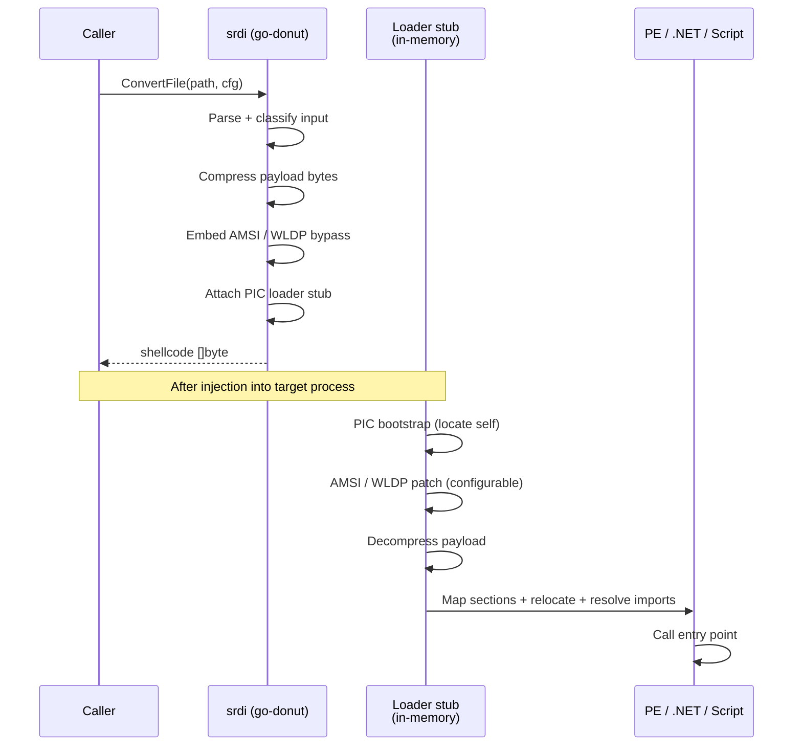

# PE-to-Shellcode (Donut)

[← pe index](README.md) · [docs/index](../../index.md)

## TL;DR

Convert a native EXE / DLL, .NET assembly, or scripting payload
(VBS / JS / XSL) into position-independent shellcode via the
Donut framework — flat byte buffer ready to feed any injection
primitive in `inject/`. Built-in AMSI / WLDP bypass + optional
dual-mode (x86 + x64) output. Pure Go, cross-compiles from Linux.

## Primer

Windows insists executables live on disk as `.exe` / `.dll`
files; you can't normally hand the loader a flat byte buffer and
say "run this PE". Donut wraps an arbitrary PE (or .NET assembly,
or script) with a small position-independent loader stub that
bootstraps PE headers in memory, applies relocations, resolves
imports, and calls the entry point — all from a flat byte buffer
the operator can pass to any injection primitive.

The technique works for native PEs, .NET assemblies (no managed
runtime needed on disk — Donut hosts the CLR in process), and
scripts (VBScript / JScript / XSL through a built-in
mshta-equivalent runner). Output is one buffer regardless of
input format, sized roughly +5–10 % over the original.

## How It Works



Generated shellcode layout:

```text
[ PIC Donut loader stub ]   ← position-independent x64 / x86 / x84
[ embedded config block ]   ← Arch, Bypass, Method, Class, Params
[ compressed payload ]      ← original PE / .NET / script bytes
```

### Input format matrix

| Format | `Type` constant | `Class` required | `Method` required |
|---|---|---|---|
| Native EXE | `ModuleEXE` | — | — |
| Native DLL | `ModuleDLL` | — | export name |
| .NET EXE | `ModuleNetEXE` | — | — |
| .NET DLL | `ModuleNetDLL` | yes | yes |
| VBScript | `ModuleVBS` | — | — |
| JScript | `ModuleJS` | — | — |
| XSL | `ModuleXSL` | — | — |

## API Reference

### `type Arch int` / `type ModuleType int`

[godoc](https://pkg.go.dev/github.com/oioio-space/maldev/pe/srdi#Arch)

| Arch | Meaning |
|---|---|
| `ArchX32` | 32-bit only |
| `ArchX64` | 64-bit only (default) |
| `ArchX84` | dual-mode (32 + 64) |

ModuleType values are listed in the matrix above.

### `type Config`

[godoc](https://pkg.go.dev/github.com/oioio-space/maldev/pe/srdi#Config)

| Field | Description |
|---|---|
| `Arch` | Target architecture (default `ArchX64`) |
| `Type` | Input format (0 = auto-detect from filename in `ConvertFile`) |
| `Class` | .NET class name (required for `ModuleNetDLL`) |
| `Method` | .NET method or native DLL export to call |
| `Parameters` | Command-line passed to the payload |
| `Bypass` | AMSI/WLDP: 1 skip · 2 abort on fail · 3 continue on fail |
| `Thread` | Run entry point in a new thread |

### `DefaultConfig() *Config`

`ArchX64` + `ModuleEXE` + `Bypass = 3`.

### `ConvertFile(path string, cfg *Config) ([]byte, error)`

Auto-detect module type from extension when `cfg.Type == 0`.

### `ConvertBytes(data []byte, cfg *Config) ([]byte, error)`

Convert in-memory PE / script bytes. `cfg.Type` must be set
explicitly.

### `ConvertDLL(path string, cfg *Config) ([]byte, error)` / `ConvertDLLBytes(data []byte, cfg *Config) ([]byte, error)`

Shorthand wrappers that pin `cfg.Type = ModuleDLL`.

## Examples

### Simple — convert a native EXE

```go
import "github.com/oioio-space/maldev/pe/srdi"

cfg := srdi.DefaultConfig()
shellcode, _ := srdi.ConvertFile("payload.exe", cfg)
```

### Composed — DLL with named export

```go
cfg := srdi.DefaultConfig()
cfg.Type = srdi.ModuleDLL
cfg.Method = "ReflectiveLoader"
shellcode, _ := srdi.ConvertDLL("payload.dll", cfg)
```

### Advanced — .NET DLL + dual-mode + remote injection

End-to-end: convert a .NET DLL to dual-mode shellcode, then hand
it to `inject.NewWindowsInjector` with indirect syscalls.

```go
import (
    "github.com/oioio-space/maldev/inject"
    "github.com/oioio-space/maldev/pe/srdi"
    wsyscall "github.com/oioio-space/maldev/win/syscall"
)

cfg := &srdi.Config{
    Arch:   srdi.ArchX84, // dual x86 + x64
    Type:   srdi.ModuleNetDLL,
    Class:  "Loader.Stub",
    Method: "Run",
    Bypass: 3,
}
sc, _ := srdi.ConvertFile("loader.dll", cfg)

icfg := inject.DefaultWindowsConfig(inject.MethodCreateRemoteThread, targetPID)
icfg.SyscallMethod = wsyscall.MethodIndirect

inj, _ := inject.NewWindowsInjector(icfg)
_ = inj.Inject(sc)
```

See [`ExampleConvertFile`](../../../pe/srdi/srdi_example_test.go)
+ [`ExampleConvertBytes`](../../../pe/srdi/srdi_example_test.go).

## OPSEC & Detection

| Artefact | Where defenders look |
|---|---|
| Donut loader stub byte signature | YARA / memory scanners — Defender, MDE, CrowdStrike all carry Donut signatures by default |
| RWX page allocation in target | Behavioural EDR — Donut's mini-loader writes then executes; RWX is the canonical "shellcode" tell |
| AMSI / WLDP patch ranges in lsass / current process | Microsoft-Windows-Threat-Intelligence ETW provider |
| .NET assembly load events without a corresponding `.exe` on disk | ETW Microsoft-Windows-DotNETRuntime; Defender flags managed runtime hosting from non-managed processes |
| Sustained `LoadLibraryW` / `GetProcAddress` from a freshly-allocated region | EDR API correlation |

**D3FEND counters:**

- [D3-PA](https://d3fend.mitre.org/technique/d3f:ProcessAnalysis/)
  — RWX + execute-from-allocation telemetry.
- [D3-FCA](https://d3fend.mitre.org/technique/d3f:FileContentAnalysis/)
  — YARA on the loader stub byte pattern.

**Hardening for the operator:**

- Encrypt the shellcode with [`crypto`](../crypto/README.md)
  before the injector writes it to RWX — the stub stays
  detectable but only after the implant has staged.
- Use `inject`'s sleep-mask + indirect syscall combination so
  the stub bytes are absent from memory between callbacks.
- Avoid `ArchX84` unless dual-mode is genuinely required — the
  larger blob carries both x86 + x64 signatures.

## MITRE ATT&CK

| T-ID | Name | Sub-coverage | D3FEND counter |
|---|---|---|---|
| [T1055.001](https://attack.mitre.org/techniques/T1055/001/) | Process Injection: Dynamic-link Library Injection | partial — produces shellcode for downstream injection (consumer side) | D3-PA |
| [T1620](https://attack.mitre.org/techniques/T1620/) | Reflective Code Loading | full — Donut loader stub is a textbook reflective loader | D3-FCA, D3-PA |

## Limitations

- **Detectable stub.** Donut's loader carries a known byte
  pattern; signature-based YARA + memory scans flag it.
- **RWX allocation.** The mini PE loader writes and then
  executes — RWX is the canonical shellcode tell.
- **No built-in obfuscation.** Stub bytes are not encrypted by
  default; pair with `crypto` + sleep masking.
- **Windows payloads only.** Shellcode generation runs
  cross-platform; the produced shellcode targets Windows.
- **+5–10% size overhead.** Donut compresses the input but adds
  the loader stub; expect modest growth.

## Credits

- [Binject/go-donut](https://github.com/Binject/go-donut) — pure-Go Donut port (vendored).
- [TheWover/donut](https://github.com/TheWover/donut) — original C reference.
- [monoxgas/sRDI](https://github.com/monoxgas/sRDI) — sRDI technique that inspired Donut.

## See also

- [`inject`](../injection/README.md) — execution surface for the
  produced shellcode.
- [`crypto`](../crypto/README.md) — payload encryption pre-conversion.
- [`evasion/sleepmask`](../evasion/sleep-mask.md) — hide the
  stub between callbacks.
- [Operator path](../../by-role/operator.md).
- [Detection eng path](../../by-role/detection-eng.md).
