# PE Sanitization

[<- Back to PE Overview](README.md)

**MITRE ATT&CK:** [T1027.002 - Obfuscated Files or Information: Software Packing](https://attack.mitre.org/techniques/T1027/002/)
**D3FEND:** [D3-SEA - Static Executable Analysis](https://d3fend.mitre.org/technique/d3f:StaticExecutableAnalysis/)

---

## Primer

Go binaries are uniquely identifiable. They contain a timestamp showing when they were compiled, a `pclntab` structure that tools like IDA's go_parser and GoReSym use to reconstruct function names, and section names like `.gopclntab` that immediately identify the binary as Go.

**Removing the "Made in Go" label from your binary.** PE sanitization erases or replaces these indicators so static analysis tools cannot trivially identify the binary as a Go executable or reconstruct its internal structure.

---

## How It Works

### Sanitization Pipeline


### What Each Step Does

```mermaid
graph TD
    subgraph "SetTimestamp"
        A1["PE Header offset 0x3C -> PE offset"] --> A2["COFF Header at PE+4"]
        A2 --> A3["TimeDateStamp at PE+8"]
        A3 --> A4["Overwrite with random Unix time"]
    end

    subgraph "WipePclntab"
        B1["Scan for magic bytes:\n0xFFFFFFF1 (Go 1.20+)\n0xFFFFFFF0 (Go 1.16+)"] --> B2["Zero 32 bytes\nat each match"]
        B2 --> B3["IDA go_parser,\nredress, GoReSym\nall fail"]
    end

    subgraph "RenameSections"
        C1["Parse COFF header\n-> section table"] --> C2["Match section name\nagainst rename map"]
        C2 --> C3["Overwrite 8-byte\nsection name field"]
    end
```



---

## Usage

### Quick Sanitize (Recommended)

```go
import (
    "os"
    "github.com/oioio-space/maldev/pe/strip"
)

data, _ := os.ReadFile("implant.exe")

// Apply all sanitizations with sensible defaults:
// - Random timestamp (2023-2024)
// - Pclntab wiped
// - Go sections renamed
data = strip.Sanitize(data)

os.WriteFile("implant-clean.exe", data, 0644)
```

### Individual Operations

```go
import (
    "time"
    "github.com/oioio-space/maldev/pe/strip"
)

data, _ := os.ReadFile("implant.exe")

// Set timestamp to a specific date
data = strip.SetTimestamp(data, time.Date(2024, 6, 15, 10, 30, 0, 0, time.UTC))

// Wipe pclntab magic bytes
data = strip.WipePclntab(data)

// Custom section renames
data = strip.RenameSections(data, map[string]string{
    ".gopclntab":    ".rdata",
    ".go.buildinfo": ".rsrc",
    ".text":         ".code",
})
```

---

## Combined Example: garble + pe/strip Pipeline

```go
package main

import (
    "fmt"
    "os"
    "os/exec"

    "github.com/oioio-space/maldev/pe/strip"
)

func main() {
    // Step 1: Build with garble (obfuscates Go symbols at compile time)
    cmd := exec.Command("garble", "-literals", "-tiny", "build",
        "-ldflags", "-s -w -H windowsgui",
        "-o", "implant-garbled.exe",
        "./cmd/implant",
    )
    if err := cmd.Run(); err != nil {
        fmt.Println("garble build failed:", err)
        return
    }

    // Step 2: Read the garbled binary
    data, err := os.ReadFile("implant-garbled.exe")
    if err != nil {
        fmt.Println("read failed:", err)
        return
    }

    // Step 3: Apply PE sanitization (timestamp, pclntab, sections)
    data = strip.Sanitize(data)

    // Step 4: Optionally UPX pack and morph
    // (run UPX externally, then morph the section names)
    // data, _ = morph.UPXMorph(data)

    // Step 5: Write final binary
    os.WriteFile("implant-final.exe", data, 0644)
    fmt.Println("Pipeline complete: implant-final.exe")
}
```

---

## Advantages & Limitations

### Advantages

- **Breaks Go analysis tools**: IDA go_parser, redress, and GoReSym fail after pclntab wipe
- **Removes compile timestamps**: Eliminates attribution via build time correlation
- **Section renaming**: Go-specific section names no longer trigger YARA rules
- **Composable**: Each function operates on `[]byte` -- chain freely with other PE tools
- **No external dependencies**: Pure Go byte manipulation, no PE parsing library needed

### Limitations

- **Not encryption**: The binary structure is still a valid PE -- behavioral analysis unaffected
- **pclntab patterns**: Wiping zeros only 32 bytes per match -- partial pclntab may remain
- **Section names are cosmetic**: Renaming `.gopclntab` to `.rdata2` does not change its contents
- **Complementary to garble**: `pe/strip` handles PE-level artifacts; garble handles Go symbol-level obfuscation
- **No code virtualization**: Does not transform instructions, only metadata

---

## API Reference

### Functions

```go
// Sanitize applies all sanitizations with sensible defaults.
func Sanitize(peData []byte) []byte

// SetTimestamp sets IMAGE_FILE_HEADER.TimeDateStamp.
func SetTimestamp(peData []byte, t time.Time) []byte

// WipePclntab zeros Go pclntab magic bytes (0xFFFFFFF1, 0xFFFFFFF0).
func WipePclntab(peData []byte) []byte

// RenameSections renames PE sections according to the provided map.
func RenameSections(peData []byte, renames map[string]string) []byte
```
