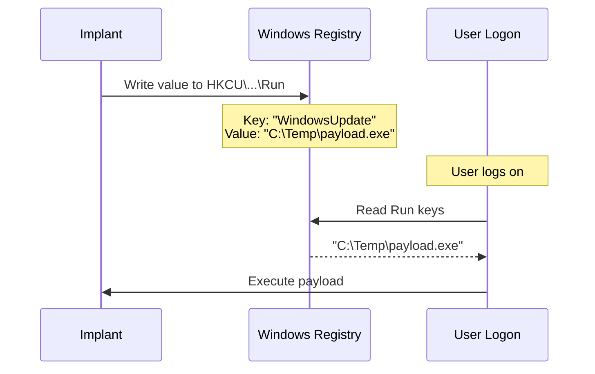

# Registry Run/RunOnce Persistence

[<- Back to Persistence Overview](README.md)

**MITRE ATT&CK:** [T1547.001 - Boot or Logon Autostart Execution: Registry Run Keys](https://attack.mitre.org/techniques/T1547/001/)
**Package:** `persistence/registry`
**Platform:** Windows
**Detection:** Medium

---

## For Beginners

Windows checks certain registry keys every time a user logs on. Any program path written to these keys is automatically executed. This is one of the most common persistence techniques — and one of the most monitored.

**Run** keys persist across reboots. **RunOnce** keys execute once then self-delete.

---

## How It Works



**Registry paths:**
- `HKCU\Software\Microsoft\Windows\CurrentVersion\Run` — per-user, no elevation
- `HKCU\Software\Microsoft\Windows\CurrentVersion\RunOnce` — per-user, one-shot
- `HKLM\Software\Microsoft\Windows\CurrentVersion\Run` — machine-wide, requires admin
- `HKLM\Software\Microsoft\Windows\CurrentVersion\RunOnce` — machine-wide, one-shot

---

## Usage

```go
import "github.com/oioio-space/maldev/persistence/registry"

// Install
err := registry.Set(registry.HiveCurrentUser, registry.KeyRun, "WindowsUpdate", `C:\Temp\payload.exe`)

// Check
exists, _ := registry.Exists(registry.HiveCurrentUser, registry.KeyRun, "WindowsUpdate")

// Remove
err = registry.Delete(registry.HiveCurrentUser, registry.KeyRun, "WindowsUpdate")

// Via Mechanism interface (composable)
m := registry.RunKey(registry.HiveCurrentUser, registry.KeyRun, "WindowsUpdate", `C:\Temp\payload.exe`)
m.Install()
```

---

## API Reference

See [persistence.md](../../persistence.md#persistenceregistry----registry-runrunonce-keys)
