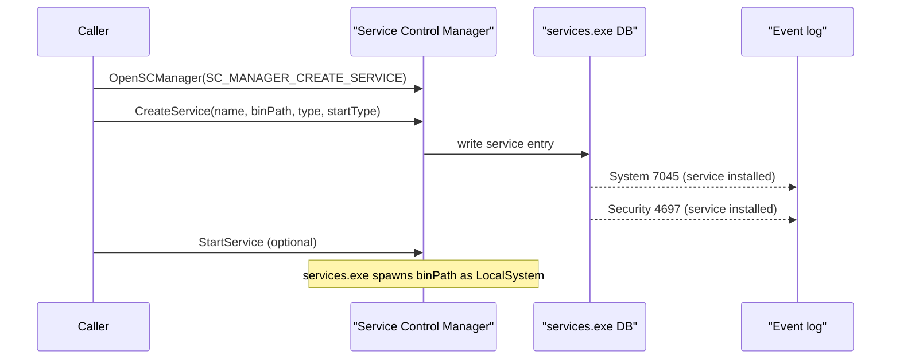

# Windows service persistence

[← persistence index](README.md) · [docs/index](../../index.md)

## TL;DR

Install a Windows service so the implant runs as `LocalSystem`
at every boot. Highest-trust persistence available; also the
loudest.

| Trait | Value |
|---|---|
| **Trigger** | Boot (or service start trigger) |
| **Privilege** | `LocalSystem` (highest non-kernel) |
| **Auto-restart on crash?** | Yes (configurable via SCM recovery actions) |
| **Admin required to install?** | Yes — `SeCreateServicePrivilege` or admin SCM access |
| **Telemetry signature** | System Event 7045 + Security Event 4697 every install |

What this DOES achieve:

- Survives reboots, user logoffs, AV cleanup sweeps that
  target user-scope artefacts (Run keys, StartUp folders).
- Runs as `LocalSystem` — full privilege, no UAC, can
  manipulate other services.
- Implements [`persistence.Mechanism`](https://pkg.go.dev/github.com/oioio-space/maldev/persistence)
  — composes via `InstallAll` for redundant persistence.

What this does NOT achieve:

- **Loudest persistence option** — every modern EDR alerts on
  service install. Pair with [`cleanup/service.Hide`](../cleanup/service.md)
  to remove from `services.msc` enumeration after install
  (still loud during install, quieter afterwards).
- **Doesn't bypass admin requirement** — you need to be admin
  to install. For non-admin persistence, see
  [`persistence/registry`](registry.md) (HKCU) or
  [`persistence/startup-folder`](startup-folder.md).
- **EDR remediation often targets services first** — defenders
  who notice see the service name + binary path, can stop +
  delete with one PowerShell command.
- **Service description is plaintext** — choose a name +
  description that blends with legitimate Windows services
  (e.g., "Windows Update Medic" variants), but ANY new
  service in `HKLM\SYSTEM\CurrentControlSet\Services` is
  inspectable.

## Primer

Services are the canonical Windows mechanism for "long-running
process started by the OS, restarted on failure, runs as
LocalSystem unless told otherwise". Once installed, the
implant survives reboots, user logoffs, and most cleanup
sweeps that target user-scope artefacts (Run keys, StartUp
folders).

Trade-off: SCM database changes are universally audited. Mature
EDR stacks correlate Event 7045 against the binary path
(user-writable = bad), the signer (unsigned = bad), and the
service description (suspicious keywords). Pair with
[`pe/masquerade`](../pe/masquerade.md) (svchost preset),
[`pe/cert`](../pe/certificate-theft.md), and a binary path
inside `%SystemRoot%\System32\` for the lowest-noise install
operationally available.

## How It Works



The implementation uses `golang.org/x/sys/windows/svc/mgr`
under the hood — the standard svc.mgr package — to keep
the SCM interaction contract well-tested and conventional.
`Mechanism.Install` chains `Install` + (optionally)
`StartService`; `Mechanism.Uninstall` is `StopService` +
`DeleteService` with cleanup-pause semantics.

## API Reference

### `type StartType uint32`

[godoc](https://pkg.go.dev/github.com/oioio-space/maldev/persistence/service#StartType)

Service start mode.

- `StartAuto` — `SERVICE_AUTO_START`; launched at boot post-network
  init.
- `StartDelayed` — auto-start with the delayed-auto-start flag set
  via a separate `ChangeServiceConfig2` after creation.
- `StartManual` — `SERVICE_DEMAND_START`; operator triggers via
  `sc start` / `Start`.

`StartBoot` / `StartSystem` (kernel-driver-only) and
`StartDisabled` are NOT exposed by this package.

**Platform:** Windows-only.

### `type Config struct`

[godoc](https://pkg.go.dev/github.com/oioio-space/maldev/persistence/service#Config)

Describes a service to install.

- `Name` — service short name (`HKLM\SYSTEM\CurrentControlSet\Services\<Name>`).
- `DisplayName` — UI label (services.msc).
- `Description` — long description.
- `BinPath` — full path to the executable.
- `Args` — command-line; whitespace-split into argv entries.
- `StartType` — one of the constants above.
- `Account` — optional service-account override. Empty →
  `LocalSystem` (default). Accepted forms: `.\<user>` /
  `<host>\<user>` (local), `<DOMAIN>\<user>` (domain),
  `NT AUTHORITY\NetworkService` / `NT AUTHORITY\LocalService`
  (built-in low-priv).
- `Password` — plaintext password. Ignored for built-in
  `NT AUTHORITY\*` principals.

> [!IMPORTANT]
> When `Account` is a normal local/domain user the account MUST
> hold `SeServiceLogonRight`. Call
> [`GrantSeServiceLogonRight`](#grantseservicelogonrightaccount-string-error)
> before [`Install`](#installcfg-config-error). Built-in
> `NT AUTHORITY\NetworkService` / `LocalService` already hold the
> right and need no password.

**Platform:** Windows-only.

### `Install(cfg *Config) error`

[godoc](https://pkg.go.dev/github.com/oioio-space/maldev/persistence/service#Install)

Connect to SCM (`mgr.Connect`) and `CreateService` from `cfg`.
Applies the delayed-auto-start flag separately when
`StartType == StartDelayed`.

**Parameters:** `cfg.Name` and `cfg.BinPath` mandatory; the rest
optional.

**Returns:** wrapped error (`fmt.Errorf` against the empty-field
guards or `mapError` against SCM errors).

**Side effects:** SCM database write under `HKLM\SYSTEM\…\Services\<Name>`;
emits System 7045 + Security 4697.

**OPSEC:** universally audited; correlation against unsigned
binary path / user-writable directory is the high-fidelity SIEM
pattern.

**Required privileges:** local admin (SCM `SC_MANAGER_CREATE_SERVICE`).

**Platform:** Windows-only.

### `Uninstall(name string) error`

[godoc](https://pkg.go.dev/github.com/oioio-space/maldev/persistence/service#Uninstall)

Open + best-effort `Stop` + `DeleteService`.

**Parameters:** `name` service short name.

**Returns:** error from open / delete (stop is best-effort).

**Side effects:** SCM delete; the service binary is unlinked
from SCM but the file on disk is untouched.

**OPSEC:** delete is audited (Security 4699 / 4700 depending on
audit policy).

**Required privileges:** local admin.

**Platform:** Windows-only.

### `Service(cfg *Config) *Mechanism`

[godoc](https://pkg.go.dev/github.com/oioio-space/maldev/persistence/service#Service)

Constructor for the `persistence.Mechanism` adapter (duck-typed —
no parent-package import). The returned `*Mechanism` exposes
`Name() string` (`"service:<Name>"`), `Install() error` (=
`Install(cfg)`), `Uninstall() error` (= `Uninstall(cfg.Name)`),
`Installed() (bool, error)` (= `Exists(cfg.Name)`).

**Side effects:** none until `Install`.

**Platform:** Windows-only.

### `type Mechanism struct`

[godoc](https://pkg.go.dev/github.com/oioio-space/maldev/persistence/service#Mechanism)

Returned by `Service(cfg)`. See above for method surface.

**Platform:** Windows-only.

### `Exists(name string) bool`

[godoc](https://pkg.go.dev/github.com/oioio-space/maldev/persistence/service#Exists)

SCM probe: `OpenSCManager` + `OpenService`. Closes both handles
before return.

**Returns:** true iff the service exists.

**Side effects:** none audited beyond the SCM open.

**OPSEC:** silent.

**Required privileges:** SCM read (default for any user).

**Platform:** Windows-only.

### `IsRunning(name string) bool`

[godoc](https://pkg.go.dev/github.com/oioio-space/maldev/persistence/service#IsRunning)

Probe via `QueryServiceStatusEx`. Returns true iff state is
`SERVICE_RUNNING`.

**Side effects:** none audited.

**OPSEC:** silent.

**Required privileges:** SCM read.

**Platform:** Windows-only.

### `Start(name string) error`

[godoc](https://pkg.go.dev/github.com/oioio-space/maldev/persistence/service#Start)

`StartService` — services.exe spawns the binary as the
configured account.

**Returns:** error from open / `StartService`.

**Side effects:** Security 4688 (process created) under
services.exe; ETW
`Microsoft-Windows-Services/Operational` 7036.

**OPSEC:** start lineage is `services.exe → BinPath`; pair the
binary with `pe/masquerade` to clone svchost identity.

**Required privileges:** SCM `SERVICE_START`; admin in practice
for installed services.

**Platform:** Windows-only.

### `Stop(name string) error`

[godoc](https://pkg.go.dev/github.com/oioio-space/maldev/persistence/service#Stop)

`ControlService SERVICE_CONTROL_STOP` then poll up to ~10 s for
`SERVICE_STOPPED`.

**Returns:** error from `ControlService` / mapped to wrapped form.

**Side effects:** the targeted service receives the stop control;
ETW services event.

**Required privileges:** SCM `SERVICE_STOP`.

**Platform:** Windows-only.

### `GrantSeServiceLogonRight(account string) error`

[godoc](https://pkg.go.dev/github.com/oioio-space/maldev/persistence/service#GrantSeServiceLogonRight)

`LsaOpenPolicy(POLICY_CREATE_ACCOUNT|POLICY_LOOKUP_NAMES)` +
`LsaAddAccountRights("SeServiceLogonRight")`. Idempotent —
granting an already-held right returns nil. Built-in
`NT AUTHORITY\NetworkService` / `LocalService` already hold it.

**Parameters:** `account` SAM-form name (resolved via
`LookupAccountName`).

**Returns:** wrapped error from LSA / lookup; rejects empty
`account`.

**Side effects:** LSA policy DB write — Security 4717 (rights
assigned to account).

**OPSEC:** loud — `SeServiceLogonRight` grant is correlated with
service-creation in mature SIEM rules.

**Required privileges:** `SeSecurityPrivilege` (typical for
elevated admin shells).

**Platform:** Windows-only.

### `var ErrLsaCallFailed`

[godoc](https://pkg.go.dev/github.com/oioio-space/maldev/persistence/service#pkg-variables)

Sentinel wrapped by every LSA-call failure
(`ntStatusErr` / `modifyAccountRights`). `errors.Is` against it
to detect LSA-pathway problems vs name-lookup / argument issues.

### `const SeServiceLogonRight = "SeServiceLogonRight"`

[godoc](https://pkg.go.dev/github.com/oioio-space/maldev/persistence/service#pkg-constants)

The right name granted by `GrantSeServiceLogonRight`. Exposed for
callers that want to call `LsaAddAccountRights` themselves.

## Examples

### Simple — install + start

```go
import "github.com/oioio-space/maldev/persistence/service"

err := service.Install(&service.Config{
    Name:        "WinUpdateNotifier",
    DisplayName: "Windows Update Notification Center",
    Description: "Provides update notifications.",
    BinPath:     `C:\ProgramData\Microsoft\winupdate.exe`,
    StartType:   service.StartAuto,
})
if err != nil {
    panic(err)
}
_ = service.Start("WinUpdateNotifier")
```

### Composed — Mechanism + InstallAll redundancy

Pair with a Run-key fallback so loss of either mechanism does
not lose persistence.

```go
import (
    "github.com/oioio-space/maldev/persistence"
    "github.com/oioio-space/maldev/persistence/registry"
    "github.com/oioio-space/maldev/persistence/service"
)

mechs := []persistence.Mechanism{
    service.Service(&service.Config{
        Name:      "WinUpdate",
        BinPath:   `C:\ProgramData\Microsoft\winupdate.exe`,
        StartType: service.StartAuto,
    }),
    registry.RunKey(registry.HiveLocalMachine, registry.KeyRun,
        "WinUpdateBackup",
        `C:\ProgramData\Microsoft\winupdate.exe`),
}
errs := persistence.InstallAll(mechs)
for _, e := range errs {
    if e != nil {
        // partial install — verify which fired
    }
}
```

### Advanced — masqueraded binary in System32

The full-stealth recipe: emit a binary that masquerades as a
real svchost service host, drop it under `System32`, install
under a plausible service name.

```go
// At build time:
//   import _ "github.com/oioio-space/maldev/pe/masquerade/preset/svchost"
//   go build -o svc-update.exe ./cmd/implant

// On target (assumes admin):
import (
    "io"
    "os"

    "github.com/oioio-space/maldev/persistence/service"
)

const target = `C:\Windows\System32\svc-update.exe`

src, _ := os.Open("svc-update.exe")
dst, _ := os.Create(target)
_, _ = io.Copy(dst, src)
_ = src.Close()
_ = dst.Close()

_ = service.Install(&service.Config{
    Name:        "SvcUpdate",
    DisplayName: "Service Update Helper",
    Description: "Coordinates background service updates.",
    BinPath:     target,
    StartType:   service.StartAuto,
})
```

See [`ExampleService`](../../../persistence/service/service_example_test.go).

### Advanced — service-account override

When `LocalSystem` is too noisy, pin the service to a built-in
low-priv principal (no password needed) or to a normal user
that already holds `SeServiceLogonRight`.

```go
// 1. Built-in NT AUTHORITY\NetworkService — no password.
//    Already holds SeServiceLogonRight.
_ = service.Install(&service.Config{
    Name:        "WinUpdateNetCheck",
    DisplayName: "Windows Update Network Check",
    BinPath:     `C:\ProgramData\Microsoft\winupdate.exe`,
    StartType:   service.StartAuto,
    Account:     `NT AUTHORITY\NetworkService`,
})

// 2. Domain account. Account MUST already hold
//    SeServiceLogonRight (granted via secedit / GPO / LsaAddAccountRights).
_ = service.Install(&service.Config{
    Name:      "WinUpdateContext",
    BinPath:   `C:\ProgramData\Microsoft\winupdate.exe`,
    StartType: service.StartManual,
    Account:   `CORP\svc-winupdate`,
    Password:  os.Getenv("MALDEV_SVC_PWD"),
})
```

## OPSEC & Detection

| Artefact | Where defenders look |
|---|---|
| System Event 7045 (service installed) | Universal; high-fidelity SIEM rule when correlated against unsigned binary or user-writable path |
| Security Event 4697 (service installed) | Audit log; same population as 7045 |
| `services.msc` / `sc query` listing | Operator review; service description is the human-readable fingerprint |
| `autoruns.exe` highlight | Sysinternals Autoruns flags unsigned services in red |
| `HKLM\SYSTEM\CurrentControlSet\Services\<Name>` registry write | Sysmon Event 13 (registry value set); forensic timeline |
| Service binary path under `%TEMP%`, `%APPDATA%`, `%PROGRAMDATA%` | Defender heuristic; legitimate services live under `Program Files` or `System32` |
| Service running as `LocalSystem` with outbound HTTPS to non-MS endpoint | Behavioural EDR — outbound profile mismatch with claimed identity |
| Service with empty `DisplayName` / `Description` | Defender heuristic — legitimate services document themselves |

**D3FEND counters:**

- [D3-PSA](https://d3fend.mitre.org/technique/d3f:ProcessSpawnAnalysis/)
  — services.exe spawning unsigned binaries.
- [D3-SICA](https://d3fend.mitre.org/technique/d3f:SystemConfigurationDatabaseAnalysis/)
  — SCM database registry monitoring.

**Hardening for the operator:**

- Pair with [`pe/masquerade/preset/svchost`](../pe/masquerade.md)
  so the binary's PE metadata matches a real Microsoft service
  host.
- Pair with [`pe/cert.Copy`](../pe/certificate-theft.md) to
  graft an Authenticode blob (passes presence checks).
- Drop the binary under `%SystemRoot%\System32\` (admin
  required) — services in `Program Files` or `System32` draw
  less default scrutiny than ones under `%PROGRAMDATA%`.
- Populate `DisplayName` + `Description` with text that
  matches the cloned identity.
- Avoid this technique on hosts with strict service-creation
  audit (Microsoft LAPS-protected, enterprise SOC-monitored).

## MITRE ATT&CK

| T-ID | Name | Sub-coverage | D3FEND counter |
|---|---|---|---|
| [T1543.003](https://attack.mitre.org/techniques/T1543/003/) | Create or Modify System Process: Windows Service | full | D3-PSA, D3-SICA |

## Limitations

- **Admin required.** SCM `CreateService` needs
  `SC_MANAGER_CREATE_SERVICE` which is admin-gated.
- **Service binary contract.** The launched binary must
  implement the SCM control protocol (respond to
  `ServiceMain` start, `SERVICE_CONTROL_STOP` etc.) or it
  will be killed within ~30 s. Implants that don't implement
  the contract should run as `StartManual` + a separate
  trigger, or wrap the implant binary with the
  `golang.org/x/sys/windows/svc` runner.
- **Service-account override is one-shot.** `Config.Account` +
  `Config.Password` propagate through to `mgr.CreateService` so
  non-LocalSystem services install fine. Pair with
  [`GrantSeServiceLogonRight(account)`](https://pkg.go.dev/github.com/oioio-space/maldev/persistence/service#GrantSeServiceLogonRight)
  for user-account services where the principal doesn't already
  hold the right. Built-in `NT AUTHORITY\NetworkService` /
  `LocalService` need neither the grant nor a password.
- **Boot/System start types.** `StartBoot` / `StartSystem`
  are kernel-driver-only; userland binaries with these
  start types are rejected by SCM.
- **Pre-Vista compatibility.** Some legacy options
  (interactive desktop, etc.) are not exposed.

## See also

- [`pe/masquerade`](../pe/masquerade.md) — clone svchost
  identity for the service binary.
- [`pe/cert`](../pe/certificate-theft.md) — graft
  Authenticode signature.
- [`persistence/registry`](registry.md) — sibling lower-noise
  persistence to pair as a fallback.
- [`persistence/scheduler`](task-scheduler.md) — sibling
  lower-noise SYSTEM-scope persistence.
- [`cleanup`](../cleanup/README.md) — remove the service
  post-op.
- [Operator path](../../by-role/operator.md).
- [Detection eng path](../../by-role/detection-eng.md).
