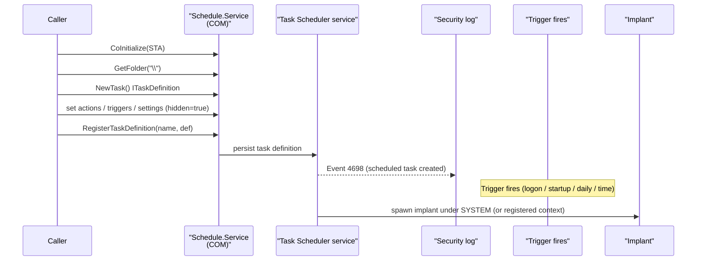

# Scheduled task persistence

[← persistence index](README.md) · [docs/index](../../index.md)

## TL;DR

Create, list, run, and delete Windows scheduled tasks via the
COM `ITaskService` API — no `schtasks.exe` child process.
Supports logon, startup, daily, and one-shot time triggers, plus
a `Hidden` flag. Implements [`persistence.Mechanism`](https://pkg.go.dev/github.com/oioio-space/maldev/persistence).
Trade-off vs `persistence/service`: same SYSTEM-scope reach with
broader trigger options and lower direct-spawn telemetry, but
Event 4698 still emits.

## Primer

The Task Scheduler is the most flexible Windows persistence
mechanism. Triggers go beyond logon (Run keys, StartUp folder)
and boot (services): tasks can fire on a schedule, on idle, on
session lock/unlock, on event-log entries, on system events.

Most operators use `schtasks.exe` to register tasks — which
spawns a visible child process under the implant's lineage.
This package skips `schtasks.exe` entirely by talking to the
`Schedule.Service` COM object directly via go-ole. The audit
event (4698) still fires regardless of registration path; the
process-creation telemetry vanishes.

## How It Works



Triggers supported by this package:

| Constructor | Trigger |
|---|---|
| `WithTriggerLogon()` | Any user logon |
| `WithTriggerStartup()` | Boot — runs as SYSTEM by default |
| `WithTriggerDaily(intervalDays)` | Every N days |
| `WithTriggerTime(t)` | One-shot at `t` |

Task names must start with `\` — `\TaskName` for the root
folder, `\Folder\TaskName` for sub-folders.

## API Reference

Task names must start with `\` — `\TaskName` for the root folder,
`\Folder\TaskName` for sub-folders.

### `type Task struct`

[godoc](https://pkg.go.dev/github.com/oioio-space/maldev/persistence/scheduler#Task)

Surface form returned by [`List`](#list-task-error).

- `Name` — leaf name.
- `Path` — full task path (`\Folder\TaskName`).
- `Enabled` — task's `Enabled` flag.

`LastRun` / `NextRun` / `State` are NOT exposed — extend the
struct + `List` if needed.

**Platform:** Windows-only.

### `type Option func(*options)`

[godoc](https://pkg.go.dev/github.com/oioio-space/maldev/persistence/scheduler#Option)

Functional-options token applied to internal `options` by
[`Create`](#createname-string-opts-option-error). Construct via
the `With*` factories below.

**Platform:** Windows-only.

### `WithAction(path string, args ...string) Option`

[godoc](https://pkg.go.dev/github.com/oioio-space/maldev/persistence/scheduler#WithAction)

Required — the binary + variadic args to launch (`args` is
space-joined into a single `Arguments` string for `IExecAction`).

**Side effects:** none.

**Platform:** Windows-only.

### `WithTriggerLogon() Option`

[godoc](https://pkg.go.dev/github.com/oioio-space/maldev/persistence/scheduler#WithTriggerLogon)

Fires at any-user logon (TASK_TRIGGER_LOGON).

**Required privileges:** elevation in practice — registering
logon triggers without admin is silently downgraded by Task
Scheduler.

**Platform:** Windows-only.

### `WithTriggerStartup() Option`

[godoc](https://pkg.go.dev/github.com/oioio-space/maldev/persistence/scheduler#WithTriggerStartup)

Fires at system boot (TASK_TRIGGER_BOOT). Task runs as SYSTEM by
default.

**Required privileges:** local admin.

**Platform:** Windows-only.

### `WithTriggerDaily(interval int) Option`

[godoc](https://pkg.go.dev/github.com/oioio-space/maldev/persistence/scheduler#WithTriggerDaily)

Fires every `interval` days (TASK_TRIGGER_DAILY). `StartBoundary`
defaults to "now" at registration time.

**Platform:** Windows-only.

### `WithTriggerTime(t time.Time) Option`

[godoc](https://pkg.go.dev/github.com/oioio-space/maldev/persistence/scheduler#WithTriggerTime)

One-shot at `t` (TASK_TRIGGER_TIME). `StartBoundary` is the
formatted form of `t`.

**Platform:** Windows-only.

### `WithHidden() Option`

[godoc](https://pkg.go.dev/github.com/oioio-space/maldev/persistence/scheduler#WithHidden)

Sets the task's `Hidden` flag — `taskschd.msc` must "Show Hidden
Tasks" to surface it. Cosmetic only; `schtasks /query /xml` and
`Get-ScheduledTask` still surface hidden tasks.

**Platform:** Windows-only.

### `Create(name string, opts ...Option) error`

[godoc](https://pkg.go.dev/github.com/oioio-space/maldev/persistence/scheduler#Create)

Register a task via the COM `Schedule.Service`
(`ITaskService.Connect` →
`ITaskFolder.RegisterTaskDefinition`). Default trigger is
`TASK_TRIGGER_DAILY` with interval=1 if no `WithTrigger*` is
supplied. Logon mode is `TASK_LOGON_INTERACTIVE_TOKEN`. Always
sets `Settings.StartWhenAvailable = true` and
`RegistrationInfo.Description = "System maintenance task"`.

**Parameters:** `name` task path (must start with `\`); `opts`
including a mandatory `WithAction`.

**Returns:** error from COM init / RegisterTaskDefinition; rejects
empty action with `"WithAction is required"`.

**Side effects:** writes task XML to
`%SystemRoot%\System32\Tasks\<path>\<name>`; emits Security 4698
(scheduled task created); ETW
`Microsoft-Windows-TaskScheduler/Operational`.

**OPSEC:** 4698 fires regardless of registration path; the win
over `schtasks.exe` is the absent child-process telemetry, not
audit suppression.

**Required privileges:** none for current-user logon triggers;
admin for boot/startup triggers and SYSTEM-scope tasks.

**Platform:** Windows-only.

### `Delete(name string) error`

[godoc](https://pkg.go.dev/github.com/oioio-space/maldev/persistence/scheduler#Delete)

`ITaskFolder.DeleteTask` against the (folder, leaf) split of
`name`.

**Returns:** error from `GetFolder` / `DeleteTask`.

**Side effects:** task XML deleted; Security 4699.

**Required privileges:** as `Create`.

**Platform:** Windows-only.

### `Exists(name string) (bool, error)`

[godoc](https://pkg.go.dev/github.com/oioio-space/maldev/persistence/scheduler#Exists)

`GetTask` probe; treats `GetTask` failure as "not found"
(returns `(false, nil)`). Errors from earlier COM stages
(`GetFolder` etc.) propagate.

**Returns:** presence flag; error only on COM failure.

**Side effects:** none audited.

**OPSEC:** silent.

**Platform:** Windows-only.

### `List() ([]Task, error)`

[godoc](https://pkg.go.dev/github.com/oioio-space/maldev/persistence/scheduler#List)

Enumerate the root folder (`\`) only — does NOT descend into
sub-folders. (The TL;DR claim of "recursive sub-folders" was
historically aspirational; current implementation only lists
root.)

**Returns:** populated `[]Task`; error from any COM stage.

**Side effects:** none audited.

**OPSEC:** silent.

**Platform:** Windows-only.

### `Actions(name string) ([]string, error)`

[godoc](https://pkg.go.dev/github.com/oioio-space/maldev/persistence/scheduler#Actions)

Read back binary paths for `IExecAction` entries on a registered
task. COM/email/message actions have no `Path` and are skipped.
Iteration is bounded at 64 to avoid unbounded enum on weakly-typed
COM collections.

**Returns:** slice of action paths (possibly empty); error from
`GetTask` / `Definition` / `Actions`.

**Side effects:** none audited.

**OPSEC:** silent.

**Platform:** Windows-only.

### `Run(name string) error`

[godoc](https://pkg.go.dev/github.com/oioio-space/maldev/persistence/scheduler#Run)

`IRegisteredTask.RunEx` for an immediate launch — does NOT wait
for the action to complete.

**Returns:** error from `GetTask` / `RunEx`.

**Side effects:** spawns the action under the task's logon
context.

**OPSEC:** services.exe-style spawn under
`svchost.exe -k netsvcs` lineage (Task Scheduler service); not
attributed to the caller.

**Required privileges:** `Schedule.Service` connect default
allows current-user manual run; admin required to run
SYSTEM-scoped tasks.

**Platform:** Windows-only.

### `ScheduledTask(name string, opts ...Option) *TaskMechanism`

[godoc](https://pkg.go.dev/github.com/oioio-space/maldev/persistence/scheduler#ScheduledTask)

Constructor for the `persistence.Mechanism` adapter.

**Side effects:** none until `Install`.

**Platform:** Windows-only.

### `type TaskMechanism struct`

[godoc](https://pkg.go.dev/github.com/oioio-space/maldev/persistence/scheduler#TaskMechanism)

Duck-typed `persistence.Mechanism`:
`Name()` returns `"scheduler:<name>"`,
`Install()` delegates to [`Create`](#createname-string-opts-option-error),
`Uninstall()` to [`Delete`](#deletename-string-error),
`Installed()` to [`Exists`](#existsname-string-bool-error).

**Platform:** Windows-only.

## Examples

### Simple — logon trigger, hidden

```go
import "github.com/oioio-space/maldev/persistence/scheduler"

_ = scheduler.Create(`\IntelGraphicsRefresh`,
    scheduler.WithAction(`C:\ProgramData\Microsoft\winupdate.exe`),
    scheduler.WithTriggerLogon(),
    scheduler.WithHidden(),
)
defer scheduler.Delete(`\IntelGraphicsRefresh`)
```

### Composed — Mechanism + boot trigger

```go
m := scheduler.ScheduledTask(`\Microsoft\Windows\WinUpdate\Refresh`,
    scheduler.WithAction(`C:\ProgramData\Microsoft\winupdate.exe`),
    scheduler.WithTriggerStartup(),
    scheduler.WithHidden(),
)
_ = m.Install() // runs as SYSTEM at boot — admin required
```

### Advanced — daily + one-shot on the same task chain

```go
import "time"

// Daily refresh: every day at the implant's chosen interval.
_ = scheduler.Create(`\IntelGraphicsRefresh`,
    scheduler.WithAction(`C:\ProgramData\Microsoft\winupdate.exe`),
    scheduler.WithTriggerDaily(1),
    scheduler.WithHidden(),
)

// One-shot recovery at a specific time (e.g. fire-and-forget
// 2 hours from now to retry a failed C2 callback).
recovery := time.Now().Add(2 * time.Hour)
_ = scheduler.Create(`\IntelGraphicsRefreshRecovery`,
    scheduler.WithAction(`C:\ProgramData\Microsoft\winupdate.exe`,
        "--recovery"),
    scheduler.WithTriggerTime(recovery),
    scheduler.WithHidden(),
)
```

### Pipeline — task + Run-key dual persistence

```go
import (
    "github.com/oioio-space/maldev/persistence"
    "github.com/oioio-space/maldev/persistence/registry"
    "github.com/oioio-space/maldev/persistence/scheduler"
)

const bin = `C:\ProgramData\Microsoft\winupdate.exe`

mechs := []persistence.Mechanism{
    scheduler.ScheduledTask(`\Microsoft\Windows\WinUpdate\Refresh`,
        scheduler.WithAction(bin),
        scheduler.WithTriggerStartup(),
        scheduler.WithHidden()),
    registry.RunKey(registry.HiveCurrentUser, registry.KeyRun,
        "WinUpdateBackup", bin),
}
_ = persistence.InstallAll(mechs)
```

See [`ExampleCreate`](../../../persistence/scheduler/scheduler_example_test.go).

## OPSEC & Detection

| Artefact | Where defenders look |
|---|---|
| Security Event 4698 (scheduled task created) | Universal audit; SIEM rules correlate against task-name patterns and binary paths |
| Microsoft-Windows-TaskScheduler/Operational ETW provider | Per-task creation events |
| `schtasks /query` / `Get-ScheduledTask` listing | Operator review; `Hidden` flag requires "Show Hidden" toggle in `taskschd.msc` but `schtasks /query /xml` shows everything |
| Task XML stored at `%SystemRoot%\System32\Tasks\<path>\<name>` | File-creation telemetry on the XML drop |
| Task-name patterns mimicking Microsoft (`\Microsoft\Windows\…`) | EDR rules flag custom tasks under the `\Microsoft\Windows\` prefix because legitimate Microsoft tasks ship via WIM, not runtime registration |
| `schtasks.exe` child process | **Absent here** — COM path bypasses Sysmon Event 1 / child-process EDR rules |
| `Hidden` task with non-Microsoft author | Defender heuristic flags hidden tasks created by non-Microsoft processes |

**D3FEND counters:**

- [D3-SCA](https://d3fend.mitre.org/technique/d3f:ScheduledJobAnalysis/)
  — task-creation event auditing.
- [D3-SICA](https://d3fend.mitre.org/technique/d3f:SystemConfigurationDatabaseAnalysis/)
  — task XML monitoring on disk.

**Hardening for the operator:**

- Match the task path + name to a plausible Microsoft idiom
  (`\Microsoft\Windows\<Component>\<Task>`) — but be aware
  some EDRs flag non-Microsoft authors at exactly that path
  prefix.
- Use `WithHidden()` to keep the task out of casual
  `taskschd.msc` browsing, but don't rely on it as a stealth
  primitive — `schtasks /query /xml` and `Get-ScheduledTask`
  still surface it.
- Prefer `WithTriggerStartup` over `WithTriggerLogon` for
  pre-logon callbacks; the SYSTEM context is broader and the
  task fires before the user is logged in.
- Pair with [`pe/masquerade`](../pe/masquerade.md) for binary
  identity match.
- Avoid hosts with strict task-creation auditing
  (Microsoft-Windows-TaskScheduler/Operational forwarded to
  enterprise SIEM).

## MITRE ATT&CK

| T-ID | Name | Sub-coverage | D3FEND counter |
|---|---|---|---|
| [T1053.005](https://attack.mitre.org/techniques/T1053/005/) | Scheduled Task/Job: Scheduled Task | full — COM-based registration, all common triggers | D3-SCA, D3-SICA |

## Limitations

- **Audit cannot be skipped.** Event 4698 fires at registration
  regardless of how the task is created.
- **Trigger options trimmed.** This package supports the
  common triggers (logon, startup, daily, one-shot time).
  Other COM triggers (idle, session lock/unlock, event-log
  match) are not exposed — extend `options` to add.
- **Startup/logon triggers require admin.** Boot/startup tasks
  registered without admin are silently downgraded to "any
  user logon" or rejected.
- **Hidden flag is cosmetic.** `taskschd.msc` hides the task
  from default view; every other tooling surfaces it.
- **No principal override.** Tasks run as the registered
  user (or SYSTEM for startup/boot). Specifying a different
  principal (`RunAs`) requires the password and is out of
  scope for this package.

## See also

- [`persistence/service`](service.md) — sibling SYSTEM-scope
  persistence with stronger SCM telemetry.
- [`persistence/registry`](registry.md) — sibling logon-only
  persistence with lighter audit.
- [`pe/masquerade`](../pe/masquerade.md) — match binary
  identity to the cloned trigger lineage.
- [`cleanup`](../cleanup/README.md) — remove the task post-op.
- [Operator path](../../by-role/operator.md).
- [Detection eng path](../../by-role/detection-eng.md).
