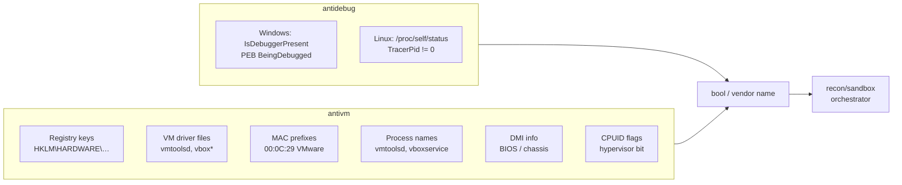

# Anti-analysis (debugger + VM detection)

[← recon index](README.md) · [docs/index](../../index.md)

## TL;DR

Cross-platform debugger detection ([`antidebug`](https://pkg.go.dev/github.com/oioio-space/maldev/recon/antidebug))
+ multi-vendor VM/hypervisor detection ([`antivm`](https://pkg.go.dev/github.com/oioio-space/maldev/recon/antivm)).
Single-shot primitives the implant runs at startup; bail if a
debugger is attached or the host fingerprints as VirtualBox /
VMware / Hyper-V / Parallels / Xen / QEMU / Docker / WSL.

## Primer

Sandboxes are virtual machines. Analysts attach debuggers. If
the implant exits before either can capture a behavioural trace,
the analysis pipeline goes home with empty hands. `antidebug` +
`antivm` are the two cheapest "is this an analysis environment?"
primitives — both bail in microseconds.

`antidebug` reads the PEB BeingDebugged flag (Windows) or
`/proc/self/status TracerPid` (Linux). `antivm` runs configurable
checks across 7 dimensions (registry, files, NIC MAC prefixes,
processes, CPUID/BIOS, DMI info) keyed against vendor-specific
fingerprints. Pair both with [`recon/sandbox`](sandbox.md) for
the multi-factor orchestrator.

## How It Works



## API Reference

### `antidebug.IsDebuggerPresent() bool`

[godoc](https://pkg.go.dev/github.com/oioio-space/maldev/recon/antidebug#IsDebuggerPresent)

Returns true when a debugger is attached. Cross-platform.

### `antivm.Detect(cfg) (string, error)` / `DetectAll(cfg) ([]string, error)`

[godoc](https://pkg.go.dev/github.com/oioio-space/maldev/recon/antivm#Detect)

Returns the first / every matching vendor name across the
configured check dimensions.

### `antivm.Config` + `Vendor` + `CheckType`

| Constant | Bit |
|---|---|
| `CheckRegistry` | registry-key probe |
| `CheckFiles` | driver-file existence |
| `CheckNIC` | MAC-prefix match |
| `CheckProcesses` | analysis-tool process names |
| `CheckDMI` | `/sys/class/dmi/` (Linux) |
| `CheckCPUID` | hypervisor leaf |

`DefaultConfig()` enables all dimensions; `DefaultVendors`
covers Hyper-V, Parallels, VirtualBox, VMware, Xen, QEMU,
Proxmox, Docker, WSL.

## Examples

### Simple — bail on detection

```go
import (
    "os"

    "github.com/oioio-space/maldev/recon/antidebug"
    "github.com/oioio-space/maldev/recon/antivm"
)

if antidebug.IsDebuggerPresent() {
    os.Exit(0)
}
if name, _ := antivm.Detect(antivm.DefaultConfig()); name != "" {
    os.Exit(0)
}
```

### Composed — narrow vendor + dimension

```go
cfg := antivm.Config{
    Vendors: []antivm.Vendor{
        {Name: "VMware", Nic: []string{"00:0C:29"}, Files: []string{`C:\windows\system32\drivers\vmtoolsd.sys`}},
    },
    Checks: antivm.CheckNIC | antivm.CheckFiles,
}
if name, _ := antivm.Detect(cfg); name != "" {
    return
}
```

### Advanced — orchestrator integration

See [`recon/sandbox`](sandbox.md) for the multi-factor
[`Checker.IsSandboxed`](https://pkg.go.dev/github.com/oioio-space/maldev/recon/sandbox) — debugger +
VM detection are two of the seven dimensions it composes.

## OPSEC & Detection

| Artefact | Where defenders look |
|---|---|
| `IsDebuggerPresent` Win32 call | Universal — invisible |
| `/proc/self/status` read | Linux: invisible |
| Registry probes against VM driver keys | EDR usually invisible; some sandbox-aware AV may flag patterns |
| MAC-prefix interface enumeration | Universally invisible |
| CPUID `0x40000000` (hypervisor leaf) | Invisible to user-mode telemetry |
| Behavioural correlation: many checks then early exit | Sandboxes time-out themselves; correlation is post-fact |

**D3FEND counters:**

- [D3-EI](https://d3fend.mitre.org/technique/d3f:ExecutionIsolation/)
  — sandbox executor design.

**Hardening for the operator:**

- Pair `antidebug` + `antivm` with timing-based evasion
  ([`recon/timing`](timing.md)) — sandboxes time out before a
  multi-second BusyWait completes.
- Use [`recon/sandbox`](sandbox.md) for the multi-factor
  pipeline rather than calling primitives independently.

## MITRE ATT&CK

| T-ID | Name | Sub-coverage | D3FEND counter |
|---|---|---|---|
| [T1622](https://attack.mitre.org/techniques/T1622/) | Debugger Evasion | full — `antidebug.IsDebuggerPresent` | D3-EI |
| [T1497.001](https://attack.mitre.org/techniques/T1497/001/) | Virtualization/Sandbox Evasion: System Checks | full — `antivm` 7 dimensions | D3-EI |

## Limitations

- **PEB-only on Windows.** Sophisticated debuggers can clear
  the `BeingDebugged` flag — ScyllaHide and similar harden it.
- **No anti-VMI.** Bare-metal VMI (Volatility-on-host) defeats
  every userland check.
- **Static fingerprints.** Vendors who customise OEM strings
  in DMI / registry can defeat default fingerprints; supply
  custom `Vendor` lists for hostile environments.
- **WSL detection is loose.** WSL2 looks very VM-like; expect
  false positives if WSL is a legitimate target.

## See also

- [Sandbox orchestrator](sandbox.md) — multi-factor pipeline.
- [Time-based evasion](timing.md) — pair to defeat sandbox
  fast-forward.
- [Operator path](../../by-role/operator.md).
- [Detection eng path](../../by-role/detection-eng.md).
