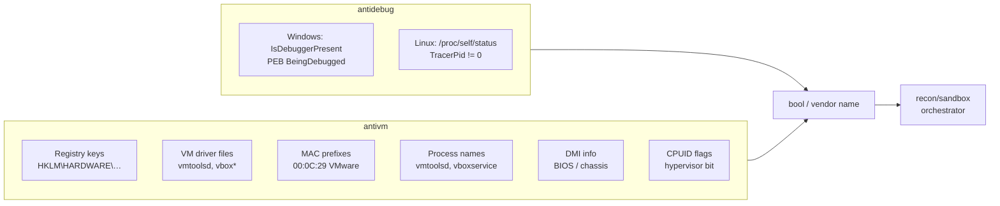

# Anti-analysis (debugger + VM detection)

[← recon index](README.md) · [docs/index](../../index.md)

## TL;DR

Before doing anything risky, ask the host: "am I being
analysed?" Two cheap checks run in microseconds and let your
implant bail before the analyst's pipeline records anything
useful.

Pick the right check based on what you want to detect:

| You want to detect… | Use | Cost | Strength |
|---|---|---|---|
| Live debugger attached | [`antidebug.IsDebuggerPresent`](#func-isdebuggerpresent-bool) | 1 syscall | Bulletproof for default debuggers; defeated by anti-anti-debug plugins (ScyllaHide etc.) |
| Common sandbox VMs (VirtualBox, VMware, Hyper-V, QEMU, Parallels, Xen, Docker, WSL) | [`antivm.RunChecks`](#func-runchecksopts-checkoptions-result) | <100ms | Multi-dimensional (registry + files + NICs + processes + DMI). Checks are vendor-fingerprintable. |
| Modern HVCI/hardware-virt-aware hypervisors | [`antivm.HypervisorPresent`](#func-hypervisorpresent-bool) | 1 CPUID | Detects ANY hypervisor (including Hyper-V on a "real" Win11 machine). Use as a soft signal, not a hard bail. |
| Comprehensive scoring across all signals | [`recon/sandbox`](sandbox.md) | varies | Orchestrator combining the above + idle time + drive count + uptime. |

Recommended startup pattern: bail on debugger immediately
(very-low false-positive), score on VM signals (sandbox vs
real machine is fuzzy), let `recon/sandbox` arbitrate.

## Primer — vocabulary

Five terms recur on this page:

> **Sandbox** — a managed analysis environment (Cuckoo, ANY.RUN,
> AV vendor labs) that runs your sample in a VM, traces every
> syscall + network packet, then writes a report. Sandboxes
> are usually VMs, so VM detection catches most of them.
>
> **PEB (Process Environment Block)** — Windows per-process
> structure containing the `BeingDebugged` byte at offset
> 0x02. Set by the kernel when a debugger attaches.
> `IsDebuggerPresent` reads this flag.
>
> **CPUID** — x86 instruction the CPU answers with its
> capabilities. The hypervisor-present bit (leaf 1, ECX bit 31)
> is set by EVERY hypervisor (VMware, KVM, Hyper-V, Xen…) —
> the hypervisor cannot lie about it without breaking the OS
> running inside.
>
> **DMI (Desktop Management Interface)** — a small database
> the BIOS exposes (manufacturer, product name, chassis type,
> BIOS vendor). VMs have characteristic DMI strings ("VMware,
> Inc.", "innotek GmbH" for VirtualBox, "Microsoft Corporation"
> for Hyper-V) that don't appear on physical machines.
>
> **Indicator dimension** — a category of fingerprint signal:
> registry keys (Windows), file paths, NIC MAC prefixes,
> running process names, BIOS/DMI info, CPUID flags. `antivm`
> runs configurable subsets via `CheckOptions`.

## How It Works



## API Reference

Two packages: `recon/antidebug` (single-shot debugger probe) +
`recon/antivm` (configurable multi-dimension hypervisor probe).

### Package `recon/antidebug`

#### `func IsDebuggerPresent() bool`

[godoc](https://pkg.go.dev/github.com/oioio-space/maldev/recon/antidebug#IsDebuggerPresent)

Returns `true` when a debugger is attached to the calling process.
Windows path calls `kernel32!IsDebuggerPresent` (PEB
`BeingDebugged` read); Linux path scans
`/proc/self/status` for a non-zero `TracerPid`.

**Returns:** `true` if a debugger is present; `false` on any read
or parse failure (fail-open).

**OPSEC:** the Win32 call is universal and unhooked on every
EDR — no signature; the Linux read of `/proc/self/status` is
similarly invisible.

**Required privileges:** none — self-process only.

**Platform:** cross-platform (Windows / Linux).

### Package `recon/antivm`

#### `type Vendor`

[godoc](https://pkg.go.dev/github.com/oioio-space/maldev/recon/antivm#Vendor)

Per-platform record of indicators. Windows: `Name`, `Keys`
(`[]RegKey`), `Files`, `Nic`, `Proc`. Linux: `Name`, `Files`,
`Nic`, `Proc`, `DMI`. Constructed inline by callers or pulled
from `DefaultVendors`.

**Platform:** cross-platform (struct shape varies by build tag).

#### `type RegKey struct { Hive registry.Key; Path string; ExpectedValue string }`

[godoc](https://pkg.go.dev/github.com/oioio-space/maldev/recon/antivm#RegKey)

Registry-key indicator. Empty `ExpectedValue` matches existence
only.

**Platform:** Windows-only.

#### `var DefaultVendors []Vendor`

[godoc](https://pkg.go.dev/github.com/oioio-space/maldev/recon/antivm#DefaultVendors)

Built-in indicator list — Hyper-V, Parallels, VirtualBox,
VirtualPC, VMware, Xen, QEMU, Proxmox, KVM, Docker, WSL. Used
when `Config.Vendors` is nil.

**Platform:** cross-platform (entries differ by build tag).

#### `type CheckType uint`

[godoc](https://pkg.go.dev/github.com/oioio-space/maldev/recon/antivm#CheckType)

Bitmask selecting detection dimensions. Constants:
`CheckRegistry` (Windows-only, skipped on Linux), `CheckFiles`,
`CheckNIC`, `CheckProcess`, `CheckCPUID`, and the union
`CheckAll`.

**Platform:** cross-platform.

#### `type Config struct { Vendors []Vendor; Checks CheckType }`

[godoc](https://pkg.go.dev/github.com/oioio-space/maldev/recon/antivm#Config)

Detection configuration. Nil `Vendors` falls back to
`DefaultVendors`; zero `Checks` falls back to `CheckAll`.

**Platform:** cross-platform.

#### `func DefaultConfig() Config`

[godoc](https://pkg.go.dev/github.com/oioio-space/maldev/recon/antivm#DefaultConfig)

Returns a zero-value `Config` (nil `Vendors`, zero `Checks`) —
which expands to `DefaultVendors` + `CheckAll` at runtime.

**Returns:** zero `Config`.

**Platform:** cross-platform.

#### `func Detect(cfg Config) (string, error)`

[godoc](https://pkg.go.dev/github.com/oioio-space/maldev/recon/antivm#Detect)

Runs the configured checks against each vendor in order and
returns the first matching vendor name.

**Parameters:** `cfg` — vendor list + check bitmask.

**Returns:** vendor name on first match (e.g. `"VMware"`); empty
string if no vendor matched; error from any check that failed
to execute.

**OPSEC:** registry probes / NIC enumeration / file `Stat` are
all universal user-mode operations — no individual signature.
Behavioural correlation of "many vendor probes then early
exit" is post-fact.

**Required privileges:** none — most checks open `HKLM\SOFTWARE`
keys readable by every authenticated user.

**Platform:** cross-platform.

#### `func DetectAll(cfg Config) ([]string, error)`

[godoc](https://pkg.go.dev/github.com/oioio-space/maldev/recon/antivm#DetectAll)

Like `Detect`, but iterates every vendor and returns the full
list of matches.

**Returns:** sorted-by-config-order slice of matching vendor
names; error from any failing check.

**Platform:** cross-platform.

#### `func DetectVM() string`

[godoc](https://pkg.go.dev/github.com/oioio-space/maldev/recon/antivm#DetectVM)

Convenience wrapper around `Detect(DefaultConfig())`. Returns
the vendor name or empty string; swallows errors.

**Platform:** cross-platform.

#### `func IsRunningInVM() bool`

[godoc](https://pkg.go.dev/github.com/oioio-space/maldev/recon/antivm#IsRunningInVM)

Boolean shorthand for `DetectVM() != ""`.

**Platform:** cross-platform.

#### `func DetectNic(macPrefixes []string) (bool, string, error)`

[godoc](https://pkg.go.dev/github.com/oioio-space/maldev/recon/antivm#DetectNic)

Walks `net.Interfaces` and returns the first NIC whose MAC
starts with any prefix in `macPrefixes`.

**Parameters:** `macPrefixes` — uppercase, colon-separated OUI
prefixes (e.g. `"00:0C:29"` for VMware).

**Returns:** `(true, "<MAC>:<ifname>", nil)` on match; empty
string with `false` otherwise; error from interface
enumeration.

**Platform:** cross-platform.

#### `func DetectFiles(files []string) (bool, string)`

[godoc](https://pkg.go.dev/github.com/oioio-space/maldev/recon/antivm#DetectFiles)

`os.Stat` each path; return on first hit.

**Returns:** `(true, path)` on first existing file; `(false, "")`
otherwise.

**Platform:** cross-platform.

#### `func DetectProcess(procNames []string) (bool, string, error)`

[godoc](https://pkg.go.dev/github.com/oioio-space/maldev/recon/antivm#DetectProcess)

Iterates running processes (Toolhelp32 on Windows, `/proc` on
Linux) and matches against `procNames`.

**Returns:** `(true, processName, nil)` on first match; error
from the process snapshot.

**Required privileges:** none beyond default process-list visibility.

**Platform:** cross-platform.

#### `func DetectRegKey(keys []RegKey) (bool, RegKey, error)`

[godoc](https://pkg.go.dev/github.com/oioio-space/maldev/recon/antivm#DetectRegKey)

Probes each `RegKey` for existence (and optional value match).

**Returns:** `(true, matchedKey, nil)` on first hit.

**Platform:** Windows-only.

#### `func DetectDMI() (bool, string)`

[godoc](https://pkg.go.dev/github.com/oioio-space/maldev/recon/antivm#DetectDMI)

Reads `/sys/class/dmi/id/*` files (sys_vendor, product_name,
board_vendor, …) and matches against well-known hypervisor
strings.

**Returns:** `(true, "<dmiPath>:<keyword>")` on first match.

**Platform:** Linux-only.

#### `func DetectCPUID() (bool, string)`

[godoc](https://pkg.go.dev/github.com/oioio-space/maldev/recon/antivm#DetectCPUID)

Despite the name, this helper does NOT execute the `CPUID`
instruction — it reads `HKLM\HARDWARE\DESCRIPTION\System\BIOS`
SystemProductName on Windows, and parses `/proc/cpuinfo` for
the kernel-exposed `hypervisor` flag on Linux. Use it when the
implant should match on the BIOS vendor string the hypervisor
chose to expose.

For the real `CPUID` instruction probes that work uniformly
across OSes (and that the operator cannot evade by editing the
registry / proc), use [HypervisorPresent] / [HypervisorVendor]
below.

**Returns:** `(true, vendorString)` on match.

**OPSEC:** invisible to user-mode telemetry. Both the registry
read and the `/proc/cpuinfo` parse are universally common.

**Required privileges:** unprivileged.

**Platform:** cross-platform.

#### `func HypervisorPresent() bool`

[godoc](https://pkg.go.dev/github.com/oioio-space/maldev/recon/antivm#HypervisorPresent)

Issues `CPUID.1` and reports `ECX[31]` — the hypervisor-present
bit. Intel/AMD reserve this bit for hypervisor self-disclosure;
every commercial hypervisor (KVM, Xen, VMware, Hyper-V, modern
QEMU/TCG, VirtualBox HVM, Parallels) sets it unconditionally.
Bare-metal CPUs always clear it. Cheaper and more reliable than
the registry / DMI / process checks because the operator cannot
evade it without modifying hypervisor source.

**Returns:** `true` when the bit is set; `false` on bare metal
or non-amd64 hosts (the stub returns `false`).

**OPSEC:** very-quiet — `CPUID` is executed billions of times
in ordinary userland (Go runtime, libc, every JIT). Stack walk
shows a normal call site; no kernel transition.

**Required privileges:** unprivileged.

**Platform:** amd64 (Windows + Linux + macOS). Stub on other
arches returns `false`.

#### `func HypervisorVendor() string`

[godoc](https://pkg.go.dev/github.com/oioio-space/maldev/recon/antivm#HypervisorVendor)

Reads the 12-byte ASCII vendor signature hypervisors expose at
`CPUID.40000000h` (`EBX:ECX:EDX`). Returns `""` when no
hypervisor is present (bit clear), the leaf is unsupported, or
the host is non-amd64.

**Returns:** the raw 12-byte signature ("VMwareVMware",
"Microsoft Hv", "KVMKVMKVM\\0\\0\\0", …) or `""`. Pass through
[HypervisorVendorName] for a friendly label.

**OPSEC / Required privileges / Platform:** as
[HypervisorPresent].

#### `func HypervisorVendorName(sig string) string`

[godoc](https://pkg.go.dev/github.com/oioio-space/maldev/recon/antivm#HypervisorVendorName)

Maps a raw [HypervisorVendor] signature to a friendly product
label ("VMware", "KVM", "Hyper-V", …). Returns `""` for
unrecognised signatures so callers can distinguish "I have a
signature but don't recognise it" from "no hypervisor". The
table covers the 11 major hypervisors as of 2026 (see
`hypervisor.go` for the list).

**Returns:** friendly product name, or `""` when sig is empty
or not on the recognised list.

**OPSEC:** offline lookup — no syscall, no I/O.

**Required privileges:** unprivileged.

**Platform:** cross-platform — the same table is shared between
the amd64 build and the stub.

#### `func RDTSCDelta(samples int) uint64`

[godoc](https://pkg.go.dev/github.com/oioio-space/maldev/recon/antivm#RDTSCDelta)

Returns the median cycle delta of `samples` repeated CPUID-bracketed
RDTSC reads. CPUID forces a VMEXIT under every modern HVM
(VMware, KVM, Xen, Hyper-V, VirtualBox HVM); the VMEXIT + VMM
emulation + VMENTER round-trip costs 500-3000+ cycles, vs. ~30-50
cycles on bare metal. The median (rather than mean) filters
scheduler-induced spikes from context switches between the two
RDTSC reads.

**Parameters:** `samples` — number of CPUID-bracketed RDTSC reads
(use 9 for stability; 1 for hot-path use).

**Returns:** median cycle delta. `0` if samples ≤ 0 or on
non-amd64 (the stub returns 0).

**OPSEC:** invisible — RDTSC is unprivileged and CPUID is
ubiquitous. Both run billions of times per second in ordinary
userland. No kernel transition.

**Required privileges:** unprivileged.

**Platform:** amd64 (Windows + Linux + macOS). Stub returns 0
on other arches.

#### `func LikelyVirtualizedByTiming(threshold uint64) bool`

[godoc](https://pkg.go.dev/github.com/oioio-space/maldev/recon/antivm#LikelyVirtualizedByTiming)

Returns `true` if `RDTSCDelta(9) > threshold`. Pass
`DefaultRDTSCThreshold` (1000) for the canonical cut-off; lower
values catch lighter virtualisation (nested KVM with PV-CPUID
hints) at the cost of more false positives on noisy hosts.

The strongest signal CPUID-evading hypervisors leave behind —
even when the VMM clears `CPUID.1:ECX[31]`, it cannot hide the
VMEXIT cost without trapping RDTSC itself, which most production
hypervisors don't do because of the per-call overhead it would
impose on every guest.

**Returns:** `true` when virtualised by timing signal; `false`
otherwise (and always `false` on non-amd64).

**OPSEC / Required privileges / Platform:** as `RDTSCDelta`.

#### `const DefaultRDTSCThreshold uint64 = 1000`

The cycle threshold separating bare-metal CPUID latency
(~30-50 cycles) from VMEXIT-augmented CPUID latency
(500-3000+ cycles). Picked conservatively at 1000 — well above
any observed bare-metal upper bound, well below any observed VM
lower bound. Cross-platform constant; identical across builds.

#### `type HypervisorReport struct { ... }` + `func Hypervisor() HypervisorReport`

[godoc](https://pkg.go.dev/github.com/oioio-space/maldev/recon/antivm#Hypervisor)

`Hypervisor()` runs all CPUID/timing-based probes (3 CPUID +
9 RDTSC-bracketed CPUIDs) and returns the aggregated report.
Sub-microsecond on bare metal, sub-100µs under HVM. Safe from
any goroutine.

```go
type HypervisorReport struct {
    Present     bool   // CPUID.1:ECX[31]
    VendorSig   string // raw 12-byte signature, "" when not present
    VendorName  string // friendly name, "" when sig is unknown
    TimingDelta uint64 // median CPUID-bracketed RDTSC cycles
    LikelyVM    bool   // OR of all positive signals
}

```

**Returns:** populated struct. On non-amd64, every numeric/string
field is zero/empty and `LikelyVM` is `false`.

**OPSEC:** invisible — composes at most 11 unprivileged
CPUID/RDTSC instructions over <100µs (1 CPUID for the present bit
+ 1 conditional CPUID for the vendor + 9 RDTSC-bracketed CPUIDs
for the timing). No syscall, no kernel transition.

**Required privileges:** unprivileged.

**Platform:** cross-platform with degraded coverage on non-amd64
(zero report, falls back to `Detect`/`DetectAll` for the
registry/file/NIC dimensions).

#### `func SIDT() (base uint64, limit uint16)` / `SGDT()` / `SLDT() uint16`

[godoc](https://pkg.go.dev/github.com/oioio-space/maldev/recon/antivm#SIDT)

Joanna Rutkowska's 2004 "Red Pill" primitives. Each instruction
is unprivileged in CPL3 (user mode) and stores the kernel
descriptor-table register at a caller-supplied buffer; a guest
sandbox that relocates its IDT/GDT outside the canonical
kernel-half range (`0xffff8000_00000000` upward) leaks itself
through the read-back base.

**Returns:** the descriptor-table base + limit (`SIDT`/`SGDT`)
or the LDT segment selector (`SLDT`).

**Side effects:** none — pure CPU op, no syscall, no allocation.

**OPSEC:** invisible at the Win32 / NT API surface; behavioural
EDRs do not hook descriptor-table reads. Some kernels enable
`CR4.UMIP` (Linux ≥ 5.4 and recent Windows server SKUs), which
turns the instruction into a `#GP` for userland — operators
should defensively recover from a panic.

**Required privileges:** none.

**Platform:** amd64 only. Returns 0 on every other architecture.
Largely historical against modern VT-x / AMD-V guests; pair with
[Hypervisor] for a stronger composite signal.

#### `type RedpillReport struct { ... }` + `func Probe() RedpillReport`

[godoc](https://pkg.go.dev/github.com/oioio-space/maldev/recon/antivm#Probe)

Aggregates the [SIDT] + [SGDT] + [SLDT] readings into a single
`RedpillReport`:

```go
type RedpillReport struct {
    IDTBase, GDTBase                          uint64
    IDTLimit, GDTLimit, LDT                   uint16
    IDTSuspect, GDTSuspect, LDTSuspect, LikelyVM bool
}
```

`LikelyVM` is the OR of the three suspect flags. The IDT/GDT
flags fire when the base falls outside the canonical kernel
half; the LDT flag fires on any non-zero selector (modern Windows
/ Linux leave LDT empty).

**Returns:** the populated report. Zero-valued (all fields 0,
`LikelyVM=false`) on non-amd64.

**Side effects:** three user-mode CPU ops, no syscall.

**OPSEC:** invisible — same surface as the underlying
SIDT/SGDT/SLDT primitives.

**Required privileges:** none.

**Platform:** amd64 only behaviour; safe to call on any GOARCH.
Largely historical against modern HVM; the recommended use is
to OR `Probe().LikelyVM` into the same bail-out as
`Hypervisor().LikelyVM` (catches the rare "old emulator" case
where CPUID looks bare-metal but the descriptor tables don't).

## Examples

### Quick start — startup bail-out triplet

The canonical "is this safe to run?" check at implant startup.
Three calls in order: debugger first (cheapest, hard fail),
hypervisor probe second (1 CPUID, scoring), full VM scan last
(most expensive, hard fail on known-sandbox vendors).

```go
package main

import (
    "log"
    "os"

    "github.com/oioio-space/maldev/recon/antidebug"
    "github.com/oioio-space/maldev/recon/antivm"
)

func safeToRun() bool {
    // Step 1: hard fail on attached debugger. Cheapest check
    //         (~one syscall on Windows, one file read on Linux).
    if antidebug.IsDebuggerPresent() {
        log.Println("debugger attached — bailing")
        return false
    }

    // Step 2: cheap CPUID-based hypervisor probe. Detects ANY
    //         hypervisor — including Hyper-V on a real Win11
    //         laptop, so use as a SOFT signal (log + lower
    //         threshold for further checks), not a hard bail.
    if antivm.HypervisorPresent() {
        vendor := antivm.HypervisorVendorName()
        log.Printf("hypervisor present: %s — running cautiously", vendor)
        // continue, but maybe skip the loudest payloads
    }

    // Step 3: full VM detection across registry / files / NICs /
    //         processes / DMI. Returns "" when no known sandbox
    //         fingerprint matches. Hard bail when it does.
    if name, _ := antivm.Detect(antivm.DefaultConfig()); name != "" {
        log.Printf("sandbox detected: %s — bailing", name)
        return false
    }

    return true
}

func main() {
    if !safeToRun() {
        os.Exit(0)
    }
    // ... real implant logic ...
}
```

What this DOES catch:

- ScyllaHide-free debuggers (x64dbg, Visual Studio, WinDbg
  out-of-the-box).
- Known sandboxes (Cuckoo, ANY.RUN, JoeSandbox) — they all run
  on detectable VM stacks.
- VirtualBox / VMware default installs.

What this does NOT catch:

- Hardware-level sandboxes running on bare metal with snapshot
  rollback. Rare but exist.
- Anti-anti-debug plugins (ScyllaHide, TitanHide) — patch the
  PEB byte before your check runs.
- Newer sandboxes that scrub VM artefacts (registry / DMI
  cleanup, MAC randomisation). The CPUID hypervisor bit can
  still be hidden by some hypervisors via VT-x manipulation.

For higher coverage, layer with [`recon/sandbox`](sandbox.md)
which adds idle-time + drive-count + uptime + recent-document
heuristics on top of these primitives.

### Simple — bail on detection

```go
import (
    "os"

    "github.com/oioio-space/maldev/recon/antidebug"
    "github.com/oioio-space/maldev/recon/antivm"
)

if antidebug.IsDebuggerPresent() {
    os.Exit(0)
}
if name, _ := antivm.Detect(antivm.DefaultConfig()); name != "" {
    os.Exit(0)
}
```

### Composed — narrow vendor + dimension

```go
cfg := antivm.Config{
    Vendors: []antivm.Vendor{
        {Name: "VMware", Nic: []string{"00:0C:29"}, Files: []string{`C:\windows\system32\drivers\vmtoolsd.sys`}},
    },
    Checks: antivm.CheckNIC | antivm.CheckFiles,
}
if name, _ := antivm.Detect(cfg); name != "" {
    return
}
```

### Composed — CPUID hypervisor probe (recommended)

```go
import "github.com/oioio-space/maldev/recon/antivm"

// One call covers all three CPUID/timing signals.
// Strongest "am I in a VM" detection userland can produce;
// the timing dimension catches even hypervisors that mask the
// CPUID.1:ECX[31] bit because they cannot hide the VMEXIT cost.
if r := antivm.Hypervisor(); r.LikelyVM {
    log.Printf("VM detected: vendor=%q name=%q timing=%d cycles",
        r.VendorSig, r.VendorName, r.TimingDelta)
    os.Exit(0)
}
```

If you want finer control over which signals contribute, build
the report by hand:

```go
if antivm.HypervisorPresent() ||
    antivm.LikelyVirtualizedByTiming(antivm.DefaultRDTSCThreshold) {
    os.Exit(0)
}
```

### Advanced — orchestrator integration

See [`recon/sandbox`](sandbox.md) for the multi-factor
[`Checker.IsSandboxed`](https://pkg.go.dev/github.com/oioio-space/maldev/recon/sandbox) — debugger +
VM detection are two of the seven dimensions it composes.

## OPSEC & Detection

| Artefact | Where defenders look |
|---|---|
| `IsDebuggerPresent` Win32 call | Universal — invisible |
| `/proc/self/status` read | Linux: invisible |
| Registry probes against VM driver keys | EDR usually invisible; some sandbox-aware AV may flag patterns |
| MAC-prefix interface enumeration | Universally invisible |
| CPUID `0x40000000` (hypervisor leaf) | Invisible to user-mode telemetry |
| Behavioural correlation: many checks then early exit | Sandboxes time-out themselves; correlation is post-fact |

**D3FEND counters:**

- [D3-EI](https://d3fend.mitre.org/technique/d3f:ExecutionIsolation/)
  — sandbox executor design.

**Hardening for the operator:**

- Pair `antidebug` + `antivm` with timing-based evasion
  ([`recon/timing`](timing.md)) — sandboxes time out before a
  multi-second BusyWait completes.
- Use [`recon/sandbox`](sandbox.md) for the multi-factor
  pipeline rather than calling primitives independently.

## MITRE ATT&CK

| T-ID | Name | Sub-coverage | D3FEND counter |
|---|---|---|---|
| [T1622](https://attack.mitre.org/techniques/T1622/) | Debugger Evasion | full — `antidebug.IsDebuggerPresent` | D3-EI |
| [T1497.001](https://attack.mitre.org/techniques/T1497/001/) | Virtualization/Sandbox Evasion: System Checks | full — `antivm` 7 dimensions | D3-EI |

## Limitations

- **PEB-only on Windows.** Sophisticated debuggers can clear
  the `BeingDebugged` flag — ScyllaHide and similar harden it.
- **No anti-VMI.** Bare-metal VMI (Volatility-on-host) defeats
  every userland check.
- **Static fingerprints.** Vendors who customise OEM strings
  in DMI / registry can defeat default fingerprints; supply
  custom `Vendor` lists for hostile environments.
- **WSL detection is loose.** WSL2 looks very VM-like; expect
  false positives if WSL is a legitimate target.
- **CPUID timing — `DefaultRDTSCThreshold = 1000`.** Picked above
  any observed bare-metal CPUID baseline (~30-50 cycles) and
  below any observed HVM lower bound (~500-3000+). Hyper-V on
  modern Windows guests sits ~1000-1500 cycles, so the cut-off
  is tight at the bottom of the VM band — operators on KVM /
  VMware / Xen comfortably cross 1500. Lower the threshold for
  paranoid bail-on-any-signal flows; raise it on noisy bare-
  metal hosts (older CPUs, SMI storms) that occasionally spike
  past 1000.
- **CPUID timing — RDTSC traps defeat it.** A hypervisor that
  sets the VMCS "RDTSC exiting" control traps every RDTSC into
  a VMEXIT, hiding the CPUID-bracketed delta. Production HVMs
  rarely enable this (per-call cost imposed on every guest is
  prohibitive) but custom defensive hypervisors targeting
  malware analysis sometimes do — combine with
  [HypervisorPresent] / [HypervisorVendor] which reach the
  hypervisor through a different surface.
- **CPUID timing — non-amd64.** ARM64 / s390x have no RDTSC
  analogue exposed to userland; the stub returns 0 so
  `LikelyVirtualizedByTiming` always returns false. The
  CPUID-bit and vendor-string probes are likewise amd64-only.

## See also

- [Sandbox orchestrator](sandbox.md) — multi-factor pipeline.
- [Time-based evasion](timing.md) — pair to defeat sandbox
  fast-forward.
- [Operator path](../../by-role/operator.md).
- [Detection eng path](../../by-role/detection-eng.md).
