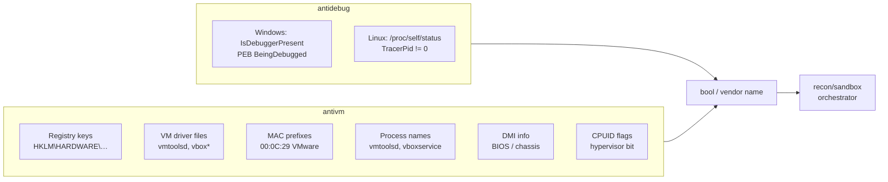

# Anti-analysis (debugger + VM detection)

[← recon index](README.md) · [docs/index](../../index.md)

## TL;DR

Cross-platform debugger detection ([`antidebug`](https://pkg.go.dev/github.com/oioio-space/maldev/recon/antidebug))
+ multi-vendor VM/hypervisor detection ([`antivm`](https://pkg.go.dev/github.com/oioio-space/maldev/recon/antivm)).
Single-shot primitives the implant runs at startup; bail if a
debugger is attached or the host fingerprints as VirtualBox /
VMware / Hyper-V / Parallels / Xen / QEMU / Docker / WSL.

## Primer

Sandboxes are virtual machines. Analysts attach debuggers. If
the implant exits before either can capture a behavioural trace,
the analysis pipeline goes home with empty hands. `antidebug` +
`antivm` are the two cheapest "is this an analysis environment?"
primitives — both bail in microseconds.

`antidebug` reads the PEB BeingDebugged flag (Windows) or
`/proc/self/status TracerPid` (Linux). `antivm` runs configurable
checks across 7 dimensions (registry, files, NIC MAC prefixes,
processes, CPUID/BIOS, DMI info) keyed against vendor-specific
fingerprints. Pair both with [`recon/sandbox`](sandbox.md) for
the multi-factor orchestrator.

## How It Works



## API Reference

Two packages: `recon/antidebug` (single-shot debugger probe) +
`recon/antivm` (configurable multi-dimension hypervisor probe).

### Package `recon/antidebug`

#### `func IsDebuggerPresent() bool`

[godoc](https://pkg.go.dev/github.com/oioio-space/maldev/recon/antidebug#IsDebuggerPresent)

Returns `true` when a debugger is attached to the calling process.
Windows path calls `kernel32!IsDebuggerPresent` (PEB
`BeingDebugged` read); Linux path scans
`/proc/self/status` for a non-zero `TracerPid`.

**Returns:** `true` if a debugger is present; `false` on any read
or parse failure (fail-open).

**OPSEC:** the Win32 call is universal and unhooked on every
EDR — no signature; the Linux read of `/proc/self/status` is
similarly invisible.

**Required privileges:** none — self-process only.

**Platform:** cross-platform (Windows / Linux).

### Package `recon/antivm`

#### `type Vendor`

[godoc](https://pkg.go.dev/github.com/oioio-space/maldev/recon/antivm#Vendor)

Per-platform record of indicators. Windows: `Name`, `Keys`
(`[]RegKey`), `Files`, `Nic`, `Proc`. Linux: `Name`, `Files`,
`Nic`, `Proc`, `DMI`. Constructed inline by callers or pulled
from `DefaultVendors`.

**Platform:** cross-platform (struct shape varies by build tag).

#### `type RegKey struct { Hive registry.Key; Path string; ExpectedValue string }`

[godoc](https://pkg.go.dev/github.com/oioio-space/maldev/recon/antivm#RegKey)

Registry-key indicator. Empty `ExpectedValue` matches existence
only.

**Platform:** Windows-only.

#### `var DefaultVendors []Vendor`

[godoc](https://pkg.go.dev/github.com/oioio-space/maldev/recon/antivm#DefaultVendors)

Built-in indicator list — Hyper-V, Parallels, VirtualBox,
VirtualPC, VMware, Xen, QEMU, Proxmox, KVM, Docker, WSL. Used
when `Config.Vendors` is nil.

**Platform:** cross-platform (entries differ by build tag).

#### `type CheckType uint`

[godoc](https://pkg.go.dev/github.com/oioio-space/maldev/recon/antivm#CheckType)

Bitmask selecting detection dimensions. Constants:
`CheckRegistry` (Windows-only, skipped on Linux), `CheckFiles`,
`CheckNIC`, `CheckProcess`, `CheckCPUID`, and the union
`CheckAll`.

**Platform:** cross-platform.

#### `type Config struct { Vendors []Vendor; Checks CheckType }`

[godoc](https://pkg.go.dev/github.com/oioio-space/maldev/recon/antivm#Config)

Detection configuration. Nil `Vendors` falls back to
`DefaultVendors`; zero `Checks` falls back to `CheckAll`.

**Platform:** cross-platform.

#### `func DefaultConfig() Config`

[godoc](https://pkg.go.dev/github.com/oioio-space/maldev/recon/antivm#DefaultConfig)

Returns a zero-value `Config` (nil `Vendors`, zero `Checks`) —
which expands to `DefaultVendors` + `CheckAll` at runtime.

**Returns:** zero `Config`.

**Platform:** cross-platform.

#### `func Detect(cfg Config) (string, error)`

[godoc](https://pkg.go.dev/github.com/oioio-space/maldev/recon/antivm#Detect)

Runs the configured checks against each vendor in order and
returns the first matching vendor name.

**Parameters:** `cfg` — vendor list + check bitmask.

**Returns:** vendor name on first match (e.g. `"VMware"`); empty
string if no vendor matched; error from any check that failed
to execute.

**OPSEC:** registry probes / NIC enumeration / file `Stat` are
all universal user-mode operations — no individual signature.
Behavioural correlation of "many vendor probes then early
exit" is post-fact.

**Required privileges:** none — most checks open `HKLM\SOFTWARE`
keys readable by every authenticated user.

**Platform:** cross-platform.

#### `func DetectAll(cfg Config) ([]string, error)`

[godoc](https://pkg.go.dev/github.com/oioio-space/maldev/recon/antivm#DetectAll)

Like `Detect`, but iterates every vendor and returns the full
list of matches.

**Returns:** sorted-by-config-order slice of matching vendor
names; error from any failing check.

**Platform:** cross-platform.

#### `func DetectVM() string`

[godoc](https://pkg.go.dev/github.com/oioio-space/maldev/recon/antivm#DetectVM)

Convenience wrapper around `Detect(DefaultConfig())`. Returns
the vendor name or empty string; swallows errors.

**Platform:** cross-platform.

#### `func IsRunningInVM() bool`

[godoc](https://pkg.go.dev/github.com/oioio-space/maldev/recon/antivm#IsRunningInVM)

Boolean shorthand for `DetectVM() != ""`.

**Platform:** cross-platform.

#### `func DetectNic(macPrefixes []string) (bool, string, error)`

[godoc](https://pkg.go.dev/github.com/oioio-space/maldev/recon/antivm#DetectNic)

Walks `net.Interfaces` and returns the first NIC whose MAC
starts with any prefix in `macPrefixes`.

**Parameters:** `macPrefixes` — uppercase, colon-separated OUI
prefixes (e.g. `"00:0C:29"` for VMware).

**Returns:** `(true, "<MAC>:<ifname>", nil)` on match; empty
string with `false` otherwise; error from interface
enumeration.

**Platform:** cross-platform.

#### `func DetectFiles(files []string) (bool, string)`

[godoc](https://pkg.go.dev/github.com/oioio-space/maldev/recon/antivm#DetectFiles)

`os.Stat` each path; return on first hit.

**Returns:** `(true, path)` on first existing file; `(false, "")`
otherwise.

**Platform:** cross-platform.

#### `func DetectProcess(procNames []string) (bool, string, error)`

[godoc](https://pkg.go.dev/github.com/oioio-space/maldev/recon/antivm#DetectProcess)

Iterates running processes (Toolhelp32 on Windows, `/proc` on
Linux) and matches against `procNames`.

**Returns:** `(true, processName, nil)` on first match; error
from the process snapshot.

**Required privileges:** none beyond default process-list visibility.

**Platform:** cross-platform.

#### `func DetectRegKey(keys []RegKey) (bool, RegKey, error)`

[godoc](https://pkg.go.dev/github.com/oioio-space/maldev/recon/antivm#DetectRegKey)

Probes each `RegKey` for existence (and optional value match).

**Returns:** `(true, matchedKey, nil)` on first hit.

**Platform:** Windows-only.

#### `func DetectDMI() (bool, string)`

[godoc](https://pkg.go.dev/github.com/oioio-space/maldev/recon/antivm#DetectDMI)

Reads `/sys/class/dmi/id/*` files (sys_vendor, product_name,
board_vendor, …) and matches against well-known hypervisor
strings.

**Returns:** `(true, "<dmiPath>:<keyword>")` on first match.

**Platform:** Linux-only.

#### `func DetectCPUID() (bool, string)`

[godoc](https://pkg.go.dev/github.com/oioio-space/maldev/recon/antivm#DetectCPUID)

Despite the name, this helper does NOT execute the `CPUID`
instruction — it reads `HKLM\HARDWARE\DESCRIPTION\System\BIOS`
SystemProductName on Windows, and parses `/proc/cpuinfo` for
the kernel-exposed `hypervisor` flag on Linux. Use it when the
implant should match on the BIOS vendor string the hypervisor
chose to expose.

For the real `CPUID` instruction probes that work uniformly
across OSes (and that the operator cannot evade by editing the
registry / proc), use [HypervisorPresent] / [HypervisorVendor]
below.

**Returns:** `(true, vendorString)` on match.

**OPSEC:** invisible to user-mode telemetry. Both the registry
read and the `/proc/cpuinfo` parse are universally common.

**Required privileges:** unprivileged.

**Platform:** cross-platform.

#### `func HypervisorPresent() bool`

[godoc](https://pkg.go.dev/github.com/oioio-space/maldev/recon/antivm#HypervisorPresent)

Issues `CPUID.1` and reports `ECX[31]` — the hypervisor-present
bit. Intel/AMD reserve this bit for hypervisor self-disclosure;
every commercial hypervisor (KVM, Xen, VMware, Hyper-V, modern
QEMU/TCG, VirtualBox HVM, Parallels) sets it unconditionally.
Bare-metal CPUs always clear it. Cheaper and more reliable than
the registry / DMI / process checks because the operator cannot
evade it without modifying hypervisor source.

**Returns:** `true` when the bit is set; `false` on bare metal
or non-amd64 hosts (the stub returns `false`).

**OPSEC:** very-quiet — `CPUID` is executed billions of times
in ordinary userland (Go runtime, libc, every JIT). Stack walk
shows a normal call site; no kernel transition.

**Required privileges:** unprivileged.

**Platform:** amd64 (Windows + Linux + macOS). Stub on other
arches returns `false`.

#### `func HypervisorVendor() string`

[godoc](https://pkg.go.dev/github.com/oioio-space/maldev/recon/antivm#HypervisorVendor)

Reads the 12-byte ASCII vendor signature hypervisors expose at
`CPUID.40000000h` (`EBX:ECX:EDX`). Returns `""` when no
hypervisor is present (bit clear), the leaf is unsupported, or
the host is non-amd64.

**Returns:** the raw 12-byte signature ("VMwareVMware",
"Microsoft Hv", "KVMKVMKVM\\0\\0\\0", …) or `""`. Pass through
[HypervisorVendorName] for a friendly label.

**OPSEC / Required privileges / Platform:** as
[HypervisorPresent].

#### `func HypervisorVendorName(sig string) string`

[godoc](https://pkg.go.dev/github.com/oioio-space/maldev/recon/antivm#HypervisorVendorName)

Maps a raw [HypervisorVendor] signature to a friendly product
label ("VMware", "KVM", "Hyper-V", …). Returns `""` for
unrecognised signatures so callers can distinguish "I have a
signature but don't recognise it" from "no hypervisor". The
table covers the 11 major hypervisors as of 2026 (see
`hypervisor.go` for the list).

**Returns:** friendly product name, or `""` when sig is empty
or not on the recognised list.

**OPSEC:** offline lookup — no syscall, no I/O.

**Required privileges:** unprivileged.

**Platform:** cross-platform — the same table is shared between
the amd64 build and the stub.

## Examples

### Simple — bail on detection

```go
import (
    "os"

    "github.com/oioio-space/maldev/recon/antidebug"
    "github.com/oioio-space/maldev/recon/antivm"
)

if antidebug.IsDebuggerPresent() {
    os.Exit(0)
}
if name, _ := antivm.Detect(antivm.DefaultConfig()); name != "" {
    os.Exit(0)
}
```

### Composed — narrow vendor + dimension

```go
cfg := antivm.Config{
    Vendors: []antivm.Vendor{
        {Name: "VMware", Nic: []string{"00:0C:29"}, Files: []string{`C:\windows\system32\drivers\vmtoolsd.sys`}},
    },
    Checks: antivm.CheckNIC | antivm.CheckFiles,
}
if name, _ := antivm.Detect(cfg); name != "" {
    return
}
```

### Composed — CPUID hypervisor probe (recommended)

```go
import "github.com/oioio-space/maldev/recon/antivm"

// Single CPUID instruction — the strongest "am I in a VM" signal
// userland can produce. Cannot be evaded by registry / file
// rewrites; the bit is set by the hypervisor itself.
if antivm.HypervisorPresent() {
    if vendor := antivm.HypervisorVendor(); vendor != "" {
        if name := antivm.HypervisorVendorName(vendor); name != "" {
            // Recognised: VMware / Hyper-V / KVM / Xen / VirtualBox / …
            log.Printf("guest of %s", name)
        } else {
            // Unknown vendor signature — surface raw bytes for forensics.
            log.Printf("unknown hypervisor signature: %q", vendor)
        }
    }
    os.Exit(0)
}
```

### Advanced — orchestrator integration

See [`recon/sandbox`](sandbox.md) for the multi-factor
[`Checker.IsSandboxed`](https://pkg.go.dev/github.com/oioio-space/maldev/recon/sandbox) — debugger +
VM detection are two of the seven dimensions it composes.

## OPSEC & Detection

| Artefact | Where defenders look |
|---|---|
| `IsDebuggerPresent` Win32 call | Universal — invisible |
| `/proc/self/status` read | Linux: invisible |
| Registry probes against VM driver keys | EDR usually invisible; some sandbox-aware AV may flag patterns |
| MAC-prefix interface enumeration | Universally invisible |
| CPUID `0x40000000` (hypervisor leaf) | Invisible to user-mode telemetry |
| Behavioural correlation: many checks then early exit | Sandboxes time-out themselves; correlation is post-fact |

**D3FEND counters:**

- [D3-EI](https://d3fend.mitre.org/technique/d3f:ExecutionIsolation/)
  — sandbox executor design.

**Hardening for the operator:**

- Pair `antidebug` + `antivm` with timing-based evasion
  ([`recon/timing`](timing.md)) — sandboxes time out before a
  multi-second BusyWait completes.
- Use [`recon/sandbox`](sandbox.md) for the multi-factor
  pipeline rather than calling primitives independently.

## MITRE ATT&CK

| T-ID | Name | Sub-coverage | D3FEND counter |
|---|---|---|---|
| [T1622](https://attack.mitre.org/techniques/T1622/) | Debugger Evasion | full — `antidebug.IsDebuggerPresent` | D3-EI |
| [T1497.001](https://attack.mitre.org/techniques/T1497/001/) | Virtualization/Sandbox Evasion: System Checks | full — `antivm` 7 dimensions | D3-EI |

## Limitations

- **PEB-only on Windows.** Sophisticated debuggers can clear
  the `BeingDebugged` flag — ScyllaHide and similar harden it.
- **No anti-VMI.** Bare-metal VMI (Volatility-on-host) defeats
  every userland check.
- **Static fingerprints.** Vendors who customise OEM strings
  in DMI / registry can defeat default fingerprints; supply
  custom `Vendor` lists for hostile environments.
- **WSL detection is loose.** WSL2 looks very VM-like; expect
  false positives if WSL is a legitimate target.

## See also

- [Sandbox orchestrator](sandbox.md) — multi-factor pipeline.
- [Time-based evasion](timing.md) — pair to defeat sandbox
  fast-forward.
- [Operator path](../../by-role/operator.md).
- [Detection eng path](../../by-role/detection-eng.md).
