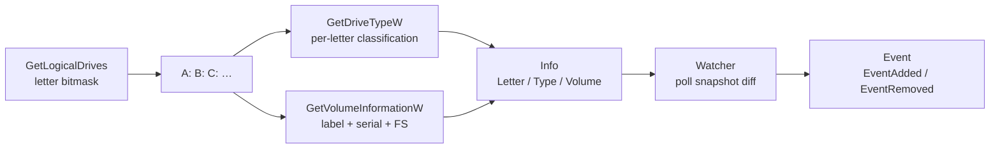

# Drive enumeration & monitoring

[← recon index](README.md) · [docs/index](../../index.md)

## TL;DR

Enumerate Windows logical drives ([`New`](../../../recon/drive)
+ [`LogicalDriveLetters`](../../../recon/drive)) and watch for
new drives ([`NewWatcher`](../../../recon/drive) + `Watch`). Each
[`Info`](../../../recon/drive) carries letter, type
(`TypeFixed` / `TypeRemovable` / `TypeNetwork` / …), and volume
metadata (label, serial, filesystem). Used for USB-insertion
triggers, SMB-share discovery, and removable-media data
staging.

## Primer

The Windows storage model exposes drives via single-letter
roots (`A:`-`Z:`). `GetLogicalDrives` returns a bitmask of
present letters; `GetDriveTypeW` classifies each (fixed /
removable / network / CD-ROM / RAM-disk); `GetVolumeInformationW`
returns label + serial + filesystem.

Operationally:

- **Initial discovery** — at startup, identify mounted shares,
  network drives, removable media for staging targets.
- **Watch loop** — long-running implants poll for new drives;
  USB key insert is a common data-staging trigger.

## How It Works



Watcher polling is configurable (default 200 ms). Snapshots
are diffed; new entries emit `EventAdded`, removed entries
emit `EventRemoved`. The `FilterFunc` lets callers narrow to
e.g. `TypeRemovable` only.

## API Reference

| Symbol | Description |
|---|---|
| [`type Info`](https://pkg.go.dev/github.com/oioio-space/maldev/recon/drive#Info) | Letter + Type + Volume metadata |
| [`type Type`](https://pkg.go.dev/github.com/oioio-space/maldev/recon/drive#Type) | `TypeFixed` / `TypeRemovable` / `TypeNetwork` / `TypeCDROM` / `TypeRAM` / `TypeUnknown` |
| [`type EventKind`](https://pkg.go.dev/github.com/oioio-space/maldev/recon/drive#EventKind) | `EventAdded` / `EventRemoved` |
| [`New(letter) (*Info, error)`](https://pkg.go.dev/github.com/oioio-space/maldev/recon/drive#New) | Resolve single drive |
| [`LogicalDriveLetters() ([]string, error)`](https://pkg.go.dev/github.com/oioio-space/maldev/recon/drive#LogicalDriveLetters) | Every present drive letter |
| [`TypeOf(root) Type`](https://pkg.go.dev/github.com/oioio-space/maldev/recon/drive#TypeOf) | Per-root classification |
| [`VolumeOf(root) (*VolumeInfo, error)`](https://pkg.go.dev/github.com/oioio-space/maldev/recon/drive#VolumeOf) | Volume label + serial + FS |
| [`NewWatcher(ctx, filter) *Watcher`](https://pkg.go.dev/github.com/oioio-space/maldev/recon/drive#NewWatcher) | Polling watcher |
| `(*Watcher).Watch(interval) (<-chan Event, error)` | Start polling, return event channel |
| `(*Watcher).Snapshot() ([]*Info, error)` | Current snapshot |

## Examples

### Simple — single-drive lookup

```go
import "github.com/oioio-space/maldev/recon/drive"

d, _ := drive.New("C:")
fmt.Printf("%s %s\n", d.Letter, d.Type)
```

### Composed — list all removables

```go
letters, _ := drive.LogicalDriveLetters()
for _, l := range letters {
    if drive.TypeOf(l+`\`) == drive.TypeRemovable {
        info, _ := drive.New(l)
        fmt.Println(info.Letter, info.Volume.Label)
    }
}
```

### Advanced — USB-insert trigger

```go
ctx, cancel := context.WithCancel(context.Background())
defer cancel()

w := drive.NewWatcher(ctx, func(d *drive.Info) bool {
    return d.Type == drive.TypeRemovable
})
ch, _ := w.Watch(500 * time.Millisecond)
for ev := range ch {
    if ev.Kind == drive.EventAdded {
        // stage data on the inserted USB
        stageData(ev.Drive.Letter)
    }
}
```

## OPSEC & Detection

| Artefact | Where defenders look |
|---|---|
| `GetLogicalDrives` polling | Universal API — invisible at user-mode |
| Sustained 200 ms polling on idle process | Behavioural EDR may flag CPU patterns; raise interval |
| Subsequent file writes to removable media | EDR file-write telemetry — high-fidelity for sensitive paths |

**D3FEND counters:**

- [D3-FCA](https://d3fend.mitre.org/technique/d3f:FileContentAnalysis/)
  — DLP scans on writes to removable media.

**Hardening for the operator:**

- Raise watch interval (1-2 s) on idle hosts.
- Don't write to removable media while polling — the
  correlation is the high-fidelity signal.

## MITRE ATT&CK

| T-ID | Name | Sub-coverage | D3FEND counter |
|---|---|---|---|
| [T1120](https://attack.mitre.org/techniques/T1120/) | Peripheral Device Discovery | full | D3-FCA |
| [T1083](https://attack.mitre.org/techniques/T1083/) | File and Directory Discovery | partial — drive enumeration is a sibling primitive | D3-FCA |

## Limitations

- **Polling, not event-driven.** Win32 `WM_DEVICECHANGE` is
  more efficient but requires a message pump; this package
  picks polling for simplicity + headless-process compatibility.
- **Volume serial may be 0.** Some virtual drives (RAM disks,
  some VPN drives) report serial 0.
- **Network drives cached.** Mapped network drives that drop
  off may take several poll cycles to surface as
  `EventRemoved`.
- **Windows only.** No Linux equivalent in this package; use
  `inotify` / `udev` directly.

## See also

- [`recon/folder`](folder.md) — sibling Windows special-folder
  resolution.
- [`recon/network`](network.md) — sibling network-interface
  enumeration (a UNC `\\server\share` "drive" is a network
  resource).
- [Operator path](../../by-role/operator.md).
- [Detection eng path](../../by-role/detection-eng.md).
