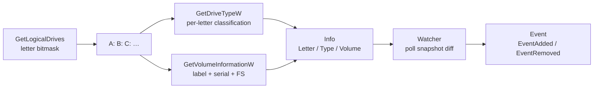

# Drive enumeration & monitoring

[← recon index](README.md) · [docs/index](../../index.md)

## TL;DR

Enumerate Windows logical drives ([`New`](https://pkg.go.dev/github.com/oioio-space/maldev/recon/drive)
+ [`LogicalDriveLetters`](https://pkg.go.dev/github.com/oioio-space/maldev/recon/drive)) and watch for
new drives ([`NewWatcher`](https://pkg.go.dev/github.com/oioio-space/maldev/recon/drive) + `Watch`). Each
[`Info`](https://pkg.go.dev/github.com/oioio-space/maldev/recon/drive) carries letter, type
(`TypeFixed` / `TypeRemovable` / `TypeNetwork` / …), and volume
metadata (label, serial, filesystem). Used for USB-insertion
triggers, SMB-share discovery, and removable-media data
staging.

## Primer

The Windows storage model exposes drives via single-letter
roots (`A:`-`Z:`). `GetLogicalDrives` returns a bitmask of
present letters; `GetDriveTypeW` classifies each (fixed /
removable / network / CD-ROM / RAM-disk); `GetVolumeInformationW`
returns label + serial + filesystem.

Operationally:

- **Initial discovery** — at startup, identify mounted shares,
  network drives, removable media for staging targets.
- **Watch loop** — long-running implants poll for new drives;
  USB key insert is a common data-staging trigger.

## How It Works



Watcher polling is configurable (default 200 ms). Snapshots
are diffed; new entries emit `EventAdded`, removed entries
emit `EventRemoved`. The `FilterFunc` lets callers narrow to
e.g. `TypeRemovable` only.

## API Reference

### `type Type uint32`

[godoc](https://pkg.go.dev/github.com/oioio-space/maldev/recon/drive#Type)

Windows `DRIVE_*` enum: `TypeUnknown`, `TypeNoRootDir`,
`TypeRemovable`, `TypeFixed`, `TypeRemote`, `TypeCDROM`,
`TypeRAMDisk`. `String()` returns the MSDN constant name.

**Platform:** Windows-only.

### `type VolumeInfo struct { Name, FileSystemName string; SerialNumber uint32 }`

[godoc](https://pkg.go.dev/github.com/oioio-space/maldev/recon/drive#VolumeInfo)

Volume metadata harvested via `GetVolumeInformationW`.

**Platform:** Windows-only.

### `type Info struct { Letter string; Type Type; Volume *VolumeInfo; GUID, DevicePath string }`

[godoc](https://pkg.go.dev/github.com/oioio-space/maldev/recon/drive#Info)

Per-drive descriptor. `GUID` (`\\?\Volume{...}\`) is the stable
identifier across reboots and letter reassignments;
`DevicePath` is the kernel device name
(`\Device\HarddiskVolumeN`).

**Platform:** Windows-only.

### `func New(letter string) (*Info, error)`

[godoc](https://pkg.go.dev/github.com/oioio-space/maldev/recon/drive#New)

Resolves a drive letter (e.g. `"C:\\"`) into a populated
`*Info`.

**Parameters:** `letter` — root path with trailing backslash.

**Returns:** populated `*Info`; error when the volume is
unreadable.

**Platform:** Windows-only.

### `func LogicalDriveLetters() ([]string, error)`

[godoc](https://pkg.go.dev/github.com/oioio-space/maldev/recon/drive#LogicalDriveLetters)

Wraps `GetLogicalDrives` and returns each present root path.

**Returns:** slice of `"X:\\"` strings; error from the API.

**Platform:** Windows-only.

### `func TypeOf(root string) Type`

[godoc](https://pkg.go.dev/github.com/oioio-space/maldev/recon/drive#TypeOf)

Wraps `GetDriveTypeW`. Returns `TypeUnknown` on failure.

**Platform:** Windows-only.

### `func VolumeOf(root string) (*VolumeInfo, error)`

[godoc](https://pkg.go.dev/github.com/oioio-space/maldev/recon/drive#VolumeOf)

Wraps `GetVolumeInformationW`.

**Returns:** populated `*VolumeInfo`; error on API failure.

**Platform:** Windows-only.

### `type FilterFunc func(d *Info) bool`

[godoc](https://pkg.go.dev/github.com/oioio-space/maldev/recon/drive#FilterFunc)

Predicate accepted by `NewWatcher` to narrow the watch set
(e.g. `TypeRemovable` only).

**Platform:** Windows-only.

### `type EventKind int`

[godoc](https://pkg.go.dev/github.com/oioio-space/maldev/recon/drive#EventKind)

Enum: `EventAdded`, `EventRemoved`. `String()` returns
`"added"` / `"removed"`.

**Platform:** Windows-only.

### `type Event struct { Kind EventKind; Drive *Info; Err error }`

[godoc](https://pkg.go.dev/github.com/oioio-space/maldev/recon/drive#Event)

Watcher-channel payload. `Drive` is non-nil for `Added` /
`Removed`; `Err` is non-nil on enumeration failure.

**Platform:** Windows-only.

### `type Watcher`

[godoc](https://pkg.go.dev/github.com/oioio-space/maldev/recon/drive#Watcher)

Stateful drive-change observer. Constructed via `NewWatcher`;
exposes `Snapshot`, `Watch`, `WatchEvents`.

**Platform:** Windows-only.

### `func NewWatcher(ctx context.Context, filter FilterFunc) *Watcher`

[godoc](https://pkg.go.dev/github.com/oioio-space/maldev/recon/drive#NewWatcher)

Constructs a Watcher whose lifetime is tied to `ctx`. `filter`
may be nil (matches every drive).

**Returns:** `*Watcher` — single-use; do not call both `Watch`
and `WatchEvents` on the same instance.

**Platform:** Windows-only.

### `func (w *Watcher) Snapshot() ([]*Info, error)`

[godoc](https://pkg.go.dev/github.com/oioio-space/maldev/recon/drive#Watcher.Snapshot)

Enumerates current drives matching the filter, populates the
internal known-drive map, and returns the slice. Used as the
baseline by both `Watch` and `WatchEvents`.

**Platform:** Windows-only.

### `func (w *Watcher) Watch(pollInterval time.Duration) (<-chan Event, error)`

[godoc](https://pkg.go.dev/github.com/oioio-space/maldev/recon/drive#Watcher.Watch)

Polling-mode watcher. Calls `Snapshot` once for the baseline,
then polls `GetLogicalDrives` every `pollInterval` (default
500 ms when zero) and diffs against the previous snapshot.

**Parameters:** `pollInterval` — tick duration; zero falls back
to 500 ms.

**Returns:** read-only event channel closed on `ctx.Done()`;
error from the baseline `Snapshot`.

**Side effects:** spawns one goroutine for the poll loop.

**OPSEC:** `GetLogicalDrives` is universal user-mode and
invisible; sustained 500 ms polling on an idle process is
the only behavioural fingerprint.

**Required privileges:** unprivileged.

**Platform:** Windows-only — works in headless / SYSTEM /
service contexts (no message pump required).

### `func (w *Watcher) WatchEvents(buffer int) (<-chan Event, error)`

[godoc](https://pkg.go.dev/github.com/oioio-space/maldev/recon/drive#Watcher.WatchEvents)

Event-driven watcher. Locks the goroutine to its OS thread,
registers a `WNDCLASSEXW`, creates a message-only window
(`HWND_MESSAGE`), and pumps `WM_DEVICECHANGE`. Each
`DBT_DEVICEARRIVAL` / `DBT_DEVICEREMOVECOMPLETE` triggers a
`Snapshot+diff` and emits the resulting `Added` / `Removed`
events. On `ctx.Done()` posts `WM_CLOSE`, lets the pump exit
through `WM_DESTROY → WM_QUIT`, destroys the window,
unregisters the class.

**Parameters:** `buffer` — channel capacity; `0` is synchronous;
`≥ 4` is recommended for burst-friendly consumers (USB hub
re-enumeration emits several `WM_DEVICECHANGE`s in quick
succession).

**Returns:** read-only event channel closed on cancel; error
when `RegisterClassExW` / `CreateWindowExW` fails before the
pump starts. Runtime errors mid-watch arrive on the channel as
`Event{Err: ...}`.

**Side effects:** registers a window class
(`MaldevDriveWatcher`) for the lifetime of the watcher; pins
one OS thread.

**OPSEC:** very quiet — message-only windows are absent from
`EnumWindows` and Spy++ defaults. Visible only to a debugger
walking the user-atom tables.

**Required privileges:** unprivileged.

**Platform:** Windows-only — requires an interactive session
(service / SYSTEM contexts receive no `WM_DEVICECHANGE`
broadcasts; use `Watch` there).

### When to pick which watcher

| Situation | Use |
|---|---|
| Headless / SYSTEM service / no interactive session | `Watch(interval)` |
| Foreground / interactive process | `WatchEvents(buffer)` |
| Simple semantics, idle CPU acceptable | `Watch(interval)` |
| Sub-second latency + zero idle CPU | `WatchEvents(buffer)` |

## Examples

### Simple — single-drive lookup

```go
import "github.com/oioio-space/maldev/recon/drive"

d, _ := drive.New("C:")
fmt.Printf("%s %s\n", d.Letter, d.Type)
```

### Composed — list all removables

```go
letters, _ := drive.LogicalDriveLetters()
for _, l := range letters {
    if drive.TypeOf(l+`\`) == drive.TypeRemovable {
        info, _ := drive.New(l)
        fmt.Println(info.Letter, info.Volume.Label)
    }
}
```

### Advanced — USB-insert trigger (polling)

```go
ctx, cancel := context.WithCancel(context.Background())
defer cancel()

w := drive.NewWatcher(ctx, func(d *drive.Info) bool {
    return d.Type == drive.TypeRemovable
})
ch, _ := w.Watch(500 * time.Millisecond)
for ev := range ch {
    if ev.Kind == drive.EventAdded {
        // stage data on the inserted USB
        stageData(ev.Drive.Letter)
    }
}
```

### Advanced — event-driven (`WM_DEVICECHANGE`)

Same use-case, zero-CPU at idle. Requires an interactive
session — use the polling variant on services / SYSTEM contexts
where `WM_DEVICECHANGE` doesn't broadcast.

```go
ctx, cancel := context.WithCancel(context.Background())
defer cancel()

w := drive.NewWatcher(ctx, func(d *drive.Info) bool {
    return d.Type == drive.TypeRemovable
})
ch, err := w.WatchEvents(4) // buffer 4 — USB hub re-enum bursts
if err != nil {
    return err // RegisterClassExW / CreateWindowExW failure
}
for ev := range ch {
    if ev.Kind == drive.EventAdded {
        stageData(ev.Drive.Letter)
    }
}
```

## OPSEC & Detection

| Artefact | Where defenders look |
|---|---|
| `GetLogicalDrives` polling | Universal API — invisible at user-mode |
| Sustained 200 ms polling on idle process | Behavioural EDR may flag CPU patterns; raise interval |
| Subsequent file writes to removable media | EDR file-write telemetry — high-fidelity for sensitive paths |

**D3FEND counters:**

- [D3-FCA](https://d3fend.mitre.org/technique/d3f:FileContentAnalysis/)
  — DLP scans on writes to removable media.

**Hardening for the operator:**

- Raise watch interval (1-2 s) on idle hosts.
- Don't write to removable media while polling — the
  correlation is the high-fidelity signal.

## MITRE ATT&CK

| T-ID | Name | Sub-coverage | D3FEND counter |
|---|---|---|---|
| [T1120](https://attack.mitre.org/techniques/T1120/) | Peripheral Device Discovery | full | D3-FCA |
| [T1083](https://attack.mitre.org/techniques/T1083/) | File and Directory Discovery | partial — drive enumeration is a sibling primitive | D3-FCA |

## Limitations

- **Two watcher modes, pick per session shape.** `Watch(interval)`
  polls and works headless / in services / under SYSTEM (any
  context with no message broadcast). `WatchEvents(buffer)`
  uses `WM_DEVICECHANGE` and needs an interactive session —
  service / SYSTEM contexts get no broadcast. Both modes share
  the same `Snapshot` + diff machinery, so swapping is one
  line.
- **`WatchEvents` requires an OS-thread-locked goroutine.** The
  Win32 message pump cannot migrate threads, so the pump
  goroutine `runtime.LockOSThread`s for its entire lifetime.
  This adds one OS thread to the implant for the duration of
  the watcher.
- **`WatchEvents` registers a window class.** The class
  (`MaldevDriveWatcher`) is a uint atom in the per-process
  user-atom table — invisible to `EnumWindows` but discoverable
  by a debugger walking atom tables.
- **Volume serial may be 0.** Some virtual drives (RAM disks,
  some VPN drives) report serial 0.
- **Network drives cached.** Mapped network drives that drop
  off may take several poll cycles to surface as
  `EventRemoved` under `Watch`. `WatchEvents` fires on
  `WM_DEVICECHANGE`, which DOES broadcast network-drive
  arrival / removal — better latency on this class.
- **Windows only.** No Linux equivalent in this package; use
  `inotify` / `udev` directly.

## See also

- [`recon/folder`](folder.md) — sibling Windows special-folder
  resolution.
- [`recon/network`](network.md) — sibling network-interface
  enumeration (a UNC `\\server\share` "drive" is a network
  resource).
- [Operator path](../../by-role/operator.md).
- [Detection eng path](../../by-role/detection-eng.md).
