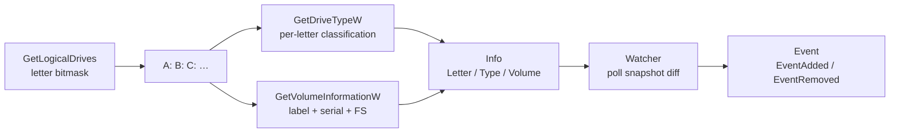

# Drive enumeration & monitoring

[← recon index](README.md) · [docs/index](../../index.md)

## TL;DR

Enumerate Windows logical drives ([`New`](https://pkg.go.dev/github.com/oioio-space/maldev/recon/drive)
+ [`LogicalDriveLetters`](https://pkg.go.dev/github.com/oioio-space/maldev/recon/drive)) and watch for
new drives ([`NewWatcher`](https://pkg.go.dev/github.com/oioio-space/maldev/recon/drive) + `Watch`). Each
[`Info`](https://pkg.go.dev/github.com/oioio-space/maldev/recon/drive) carries letter, type
(`TypeFixed` / `TypeRemovable` / `TypeNetwork` / …), and volume
metadata (label, serial, filesystem). Used for USB-insertion
triggers, SMB-share discovery, and removable-media data
staging.

## Primer

The Windows storage model exposes drives via single-letter
roots (`A:`-`Z:`). `GetLogicalDrives` returns a bitmask of
present letters; `GetDriveTypeW` classifies each (fixed /
removable / network / CD-ROM / RAM-disk); `GetVolumeInformationW`
returns label + serial + filesystem.

Operationally:

- **Initial discovery** — at startup, identify mounted shares,
  network drives, removable media for staging targets.
- **Watch loop** — long-running implants poll for new drives;
  USB key insert is a common data-staging trigger.

## How It Works



Watcher polling is configurable (default 200 ms). Snapshots
are diffed; new entries emit `EventAdded`, removed entries
emit `EventRemoved`. The `FilterFunc` lets callers narrow to
e.g. `TypeRemovable` only.

## API Reference

| Symbol | Description |
|---|---|
| [`type Info`](https://pkg.go.dev/github.com/oioio-space/maldev/recon/drive#Info) | Letter + Type + Volume metadata |
| [`type Type`](https://pkg.go.dev/github.com/oioio-space/maldev/recon/drive#Type) | `TypeFixed` / `TypeRemovable` / `TypeNetwork` / `TypeCDROM` / `TypeRAM` / `TypeUnknown` |
| [`type EventKind`](https://pkg.go.dev/github.com/oioio-space/maldev/recon/drive#EventKind) | `EventAdded` / `EventRemoved` |
| [`New(letter) (*Info, error)`](https://pkg.go.dev/github.com/oioio-space/maldev/recon/drive#New) | Resolve single drive |
| [`LogicalDriveLetters() ([]string, error)`](https://pkg.go.dev/github.com/oioio-space/maldev/recon/drive#LogicalDriveLetters) | Every present drive letter |
| [`TypeOf(root) Type`](https://pkg.go.dev/github.com/oioio-space/maldev/recon/drive#TypeOf) | Per-root classification |
| [`VolumeOf(root) (*VolumeInfo, error)`](https://pkg.go.dev/github.com/oioio-space/maldev/recon/drive#VolumeOf) | Volume label + serial + FS |
| [`NewWatcher(ctx, filter) *Watcher`](https://pkg.go.dev/github.com/oioio-space/maldev/recon/drive#NewWatcher) | Watcher (consumed by both watcher modes below) |
| `(*Watcher).Watch(interval) (<-chan Event, error)` | **Polling mode.** Re-enumerates drives every `interval`. Headless-process compatible — no message pump required. |
| `(*Watcher).WatchEvents(buffer) (<-chan Event, error)` | **Event mode (NEW).** Hidden message-only window subscribed to `WM_DEVICECHANGE`. Zero CPU at idle, ms-latency wake on `DBT_DEVICEARRIVAL` / `DBT_DEVICEREMOVECOMPLETE`. Requires an interactive session for the broadcast to land. |
| `(*Watcher).Snapshot() ([]*Info, error)` | Current snapshot |
| [`var ErrEventPumpFailed`](https://pkg.go.dev/github.com/oioio-space/maldev/recon/drive#ErrEventPumpFailed) | Sentinel returned by `WatchEvents` when `RegisterClassExW` / `CreateWindowExW` fails on startup. |

### `(*Watcher).WatchEvents(buffer int) (<-chan Event, error)`

[godoc](https://pkg.go.dev/github.com/oioio-space/maldev/recon/drive#Watcher.WatchEvents)

Event-driven watcher. Internally:

1. Locks the goroutine to its OS thread (mandatory — Win32 message
   pumps can't migrate).
2. Registers a `WNDCLASSEXW` and creates a message-only window
   (`HWND_MESSAGE`).
3. Receives `WM_DEVICECHANGE` and triggers `Snapshot+diff` on
   `DBT_DEVICEARRIVAL` / `DBT_DEVICEREMOVECOMPLETE`.
4. On `ctx.Done()`, posts `WM_CLOSE` so the pump exits via
   `WM_DESTROY → WM_QUIT`, destroys the window, unregisters the
   class, closes the channel.

**Parameters:**
- `buffer` — channel capacity. `0` is synchronous; `≥ 4` recommended
  for burst-friendly consumers (USB hub re-enumeration emits multiple
  `WM_DEVICECHANGE`s in quick succession).

**Returns:**
- `<-chan Event` — closed on `ctx` cancel.
- `error` — wraps `ErrEventPumpFailed` when the class registration or
  window creation fails before the pump starts.

**Side effects:** registers a window class on the calling
process for the lifetime of the watcher.

**OPSEC:** very-quiet — message-only windows aren't enumerated by
`EnumWindows` and don't appear in Spy++ default views. Visible only
to a debugger walking `User Atom Tables` for the registered class
name (`MaldevDriveWatcher`).

**Required privileges:** `unprivileged`.

**Platform:** `windows` (interactive session — service / SYSTEM
contexts receive no `WM_DEVICECHANGE` broadcasts).

When to pick which:

| Situation | Use |
|---|---|
| Headless / SYSTEM service / no interactive session | `Watch(interval)` (polling) |
| Foreground / interactive process | `WatchEvents(buffer)` (event-driven) |
| You don't care about CPU at idle and want simple semantics | `Watch(interval)` |
| You want sub-second latency and zero idle CPU | `WatchEvents(buffer)` |

## Examples

### Simple — single-drive lookup

```go
import "github.com/oioio-space/maldev/recon/drive"

d, _ := drive.New("C:")
fmt.Printf("%s %s\n", d.Letter, d.Type)
```

### Composed — list all removables

```go
letters, _ := drive.LogicalDriveLetters()
for _, l := range letters {
    if drive.TypeOf(l+`\`) == drive.TypeRemovable {
        info, _ := drive.New(l)
        fmt.Println(info.Letter, info.Volume.Label)
    }
}
```

### Advanced — USB-insert trigger (polling)

```go
ctx, cancel := context.WithCancel(context.Background())
defer cancel()

w := drive.NewWatcher(ctx, func(d *drive.Info) bool {
    return d.Type == drive.TypeRemovable
})
ch, _ := w.Watch(500 * time.Millisecond)
for ev := range ch {
    if ev.Kind == drive.EventAdded {
        // stage data on the inserted USB
        stageData(ev.Drive.Letter)
    }
}
```

### Advanced — event-driven (`WM_DEVICECHANGE`)

Same use-case, zero-CPU at idle. Requires an interactive
session — use the polling variant on services / SYSTEM contexts
where `WM_DEVICECHANGE` doesn't broadcast.

```go
ctx, cancel := context.WithCancel(context.Background())
defer cancel()

w := drive.NewWatcher(ctx, func(d *drive.Info) bool {
    return d.Type == drive.TypeRemovable
})
ch, err := w.WatchEvents(4) // buffer 4 — USB hub re-enum bursts
if err != nil {
    return err // ErrEventPumpFailed (wrapped) on RegisterClassExW / CreateWindowExW failure
}
for ev := range ch {
    if ev.Kind == drive.EventAdded {
        stageData(ev.Drive.Letter)
    }
}
```

## OPSEC & Detection

| Artefact | Where defenders look |
|---|---|
| `GetLogicalDrives` polling | Universal API — invisible at user-mode |
| Sustained 200 ms polling on idle process | Behavioural EDR may flag CPU patterns; raise interval |
| Subsequent file writes to removable media | EDR file-write telemetry — high-fidelity for sensitive paths |

**D3FEND counters:**

- [D3-FCA](https://d3fend.mitre.org/technique/d3f:FileContentAnalysis/)
  — DLP scans on writes to removable media.

**Hardening for the operator:**

- Raise watch interval (1-2 s) on idle hosts.
- Don't write to removable media while polling — the
  correlation is the high-fidelity signal.

## MITRE ATT&CK

| T-ID | Name | Sub-coverage | D3FEND counter |
|---|---|---|---|
| [T1120](https://attack.mitre.org/techniques/T1120/) | Peripheral Device Discovery | full | D3-FCA |
| [T1083](https://attack.mitre.org/techniques/T1083/) | File and Directory Discovery | partial — drive enumeration is a sibling primitive | D3-FCA |

## Limitations

- **Two watcher modes, pick per session shape.** `Watch(interval)`
  polls and works headless / in services / under SYSTEM (any
  context with no message broadcast). `WatchEvents(buffer)`
  uses `WM_DEVICECHANGE` and needs an interactive session —
  service / SYSTEM contexts get no broadcast. Both modes share
  the same `Snapshot` + diff machinery, so swapping is one
  line.
- **`WatchEvents` requires an OS-thread-locked goroutine.** The
  Win32 message pump cannot migrate threads, so the pump
  goroutine `runtime.LockOSThread`s for its entire lifetime.
  This adds one OS thread to the implant for the duration of
  the watcher.
- **`WatchEvents` registers a window class.** The class
  (`MaldevDriveWatcher`) is a uint atom in the per-process
  user-atom table — invisible to `EnumWindows` but discoverable
  by a debugger walking atom tables.
- **Volume serial may be 0.** Some virtual drives (RAM disks,
  some VPN drives) report serial 0.
- **Network drives cached.** Mapped network drives that drop
  off may take several poll cycles to surface as
  `EventRemoved` under `Watch`. `WatchEvents` fires on
  `WM_DEVICECHANGE`, which DOES broadcast network-drive
  arrival / removal — better latency on this class.
- **Windows only.** No Linux equivalent in this package; use
  `inotify` / `udev` directly.

## See also

- [`recon/folder`](folder.md) — sibling Windows special-folder
  resolution.
- [`recon/network`](network.md) — sibling network-interface
  enumeration (a UNC `\\server\share` "drive" is a network
  resource).
- [Operator path](../../by-role/operator.md).
- [Detection eng path](../../by-role/detection-eng.md).
