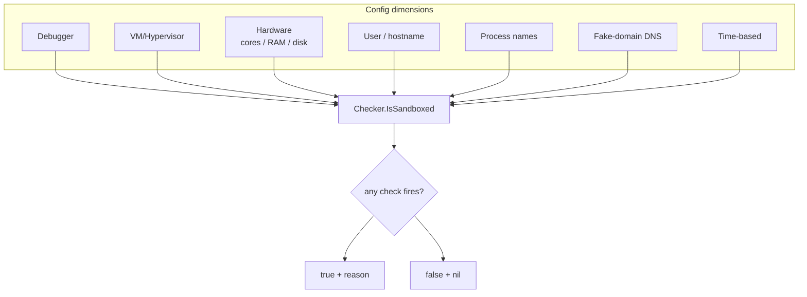

# Sandbox detection orchestrator

[← recon index](README.md) · [docs/index](../../index.md)

## TL;DR

Multi-factor sandbox / VM / analysis-environment detector.
Aggregates 7 check dimensions
([antidebug](anti-analysis.md), [antivm](anti-analysis.md),
hardware thresholds, suspicious user/host names, analysis-tool
processes, fake-domain DNS interception, time-based) into a
single [`Checker.IsSandboxed`](https://pkg.go.dev/github.com/oioio-space/maldev/recon/sandbox) result.
Returns `(true, reason, err)` so callers can bail and log
why.

## Primer

No single signal is conclusive. CPU core count alone won't tell
you Cuckoo from a low-end laptop; VM detection alone misses
bare-metal forensic workstations. The orchestrator stacks
indicators across orthogonal dimensions so high-confidence
sandboxes (Cuckoo, Joe Sandbox, ANY.RUN, hybrid-analysis) light
up across multiple checks while real targets light up across
zero or one.

The default configuration is calibrated against the canonical
public sandbox baselines: 2 cores, 4 GB RAM, 60 GB disk,
generic usernames (`admin`, `user`, `sandbox`, `malware`),
analysis tools (`procmon`, `wireshark`, `fiddler`,
`x32dbg`/`x64dbg`).

## How It Works



Per-dimension tunables in `Config`: each check has a threshold
and an enable flag. `DefaultConfig` ships defender-baseline
values; operators harden against specific targets by tightening
or relaxing.

## API Reference

### `type Config struct { ... }`

[godoc](https://pkg.go.dev/github.com/oioio-space/maldev/recon/sandbox#Config)

Per-dimension thresholds + indicator lists. Fields:
`MinDiskGB`, `MinRAMGB`, `MinCPUCores`, `BadUsernames`,
`BadHostnames`, `BadProcesses`, `FakeDomain`, `DiskPath`,
`MinProcesses`, `ConnectivityURL`, `RequestTimeout`,
`EvasionTimeout`, `StopOnFirst`. A zero-value `Config` runs
nothing useful — call `DefaultConfig()`.

**Platform:** cross-platform.

### `func DefaultConfig() Config`

[godoc](https://pkg.go.dev/github.com/oioio-space/maldev/recon/sandbox#DefaultConfig)

Returns the canonical defender-baseline configuration:
2 cores / 4 GB RAM / 64 GB disk minimum, generic-analyst
usernames + hostnames + analysis-tool process names,
`MinProcesses=15`, `ConnectivityURL=https://www.google.com`,
`RequestTimeout=5s`, `StopOnFirst=true`. `DiskPath` is `C:\`
on Windows and `/` elsewhere.

**Platform:** cross-platform.

### `type Result struct { Name string; Detected bool; Detail string; Err error }`

[godoc](https://pkg.go.dev/github.com/oioio-space/maldev/recon/sandbox#Result)

Per-check outcome emitted by `CheckAll`. `Name` matches one of
the `Check*` constants.

**Platform:** cross-platform.

### `const Check*`

[godoc](https://pkg.go.dev/github.com/oioio-space/maldev/recon/sandbox#CheckDebugger)

Canonical check-name constants used as `Result.Name` keys and
`Weights()` lookups: `CheckDebugger`, `CheckVM`, `CheckCPU`,
`CheckRAM`, `CheckDisk`, `CheckUsername`, `CheckHostname`,
`CheckDomain`, `CheckProcess`, `CheckProcessCount`,
`CheckConnectivity`.

**Platform:** cross-platform.

### `func Score(results []Result) int`

[godoc](https://pkg.go.dev/github.com/oioio-space/maldev/recon/sandbox#Score)

Aggregates `[]Result` into a single 0..100 confidence value
using the package's per-check weight table. Total is capped at
100; unknown `Result.Name` values contribute 0.

**Returns:** integer in `[0, 100]`.

**Platform:** cross-platform.

### `func Weights() map[string]int`

[godoc](https://pkg.go.dev/github.com/oioio-space/maldev/recon/sandbox#Weights)

Returns a copy of the per-check weight table for audit /
tuning. Mutating the returned map is safe.

**Platform:** cross-platform.

### `type Checker`

[godoc](https://pkg.go.dev/github.com/oioio-space/maldev/recon/sandbox#Checker)

Orchestrator wrapping a `Config`. All check methods are
attached to `*Checker`.

**Platform:** cross-platform (separate Windows / Linux
implementations under build tags).

### `func New(cfg Config) *Checker`

[godoc](https://pkg.go.dev/github.com/oioio-space/maldev/recon/sandbox#New)

Constructs a `Checker` bound to `cfg`.

**Returns:** `*Checker`.

**Platform:** cross-platform.

### `func (c *Checker) IsDebuggerPresent() bool`

[godoc](https://pkg.go.dev/github.com/oioio-space/maldev/recon/sandbox#Checker.IsDebuggerPresent)

Re-exports
[`antidebug.IsDebuggerPresent`](anti-analysis.md).

**Platform:** cross-platform.

### `func (c *Checker) IsRunningInVM() bool`

[godoc](https://pkg.go.dev/github.com/oioio-space/maldev/recon/sandbox#Checker.IsRunningInVM)

Re-exports
[`antivm.IsRunningInVM`](anti-analysis.md).

**Platform:** cross-platform.

### `func (c *Checker) BusyWait()`

[godoc](https://pkg.go.dev/github.com/oioio-space/maldev/recon/sandbox#Checker.BusyWait)

Calls [`timing.BusyWait(c.cfg.EvasionTimeout)`](timing.md).

**Platform:** cross-platform.

### `func (c *Checker) RAMBytes() (uint64, error)`

[godoc](https://pkg.go.dev/github.com/oioio-space/maldev/recon/sandbox#Checker.RAMBytes)

Total physical RAM in bytes (`GlobalMemoryStatusEx` /
`/proc/meminfo`).

**Platform:** cross-platform.

### `func (c *Checker) HasEnoughRAM() (bool, error)`

[godoc](https://pkg.go.dev/github.com/oioio-space/maldev/recon/sandbox#Checker.HasEnoughRAM)

Compares `RAMBytes()` against `cfg.MinRAMGB`.

**Platform:** cross-platform.

### `func (c *Checker) HasEnoughDisk() (bool, error)`

[godoc](https://pkg.go.dev/github.com/oioio-space/maldev/recon/sandbox#Checker.HasEnoughDisk)

Compares the total bytes of `cfg.DiskPath` against
`cfg.MinDiskGB`.

**Platform:** cross-platform.

### `func (c *Checker) HasEnoughCPU() bool`

[godoc](https://pkg.go.dev/github.com/oioio-space/maldev/recon/sandbox#Checker.HasEnoughCPU)

`runtime.NumCPU() >= cfg.MinCPUCores`.

**Platform:** cross-platform.

### `func (c *Checker) BadUsername() (bool, string, error)`

[godoc](https://pkg.go.dev/github.com/oioio-space/maldev/recon/sandbox#Checker.BadUsername)

Resolves the current username and matches against
`cfg.BadUsernames` (case-insensitive).

**Returns:** `(matched, username, err)`.

**Platform:** cross-platform.

### `func (c *Checker) BadHostname() (bool, string, error)`

[godoc](https://pkg.go.dev/github.com/oioio-space/maldev/recon/sandbox#Checker.BadHostname)

Same shape as `BadUsername`, against `cfg.BadHostnames`.

**Platform:** cross-platform.

### `func (c *Checker) CheckProcesses(ctx context.Context) (bool, string, error)`

[godoc](https://pkg.go.dev/github.com/oioio-space/maldev/recon/sandbox#Checker.CheckProcesses)

Iterates the running-process snapshot and matches against
`cfg.BadProcesses`.

**Returns:** `(matched, processName, err)`.

**Platform:** cross-platform.

### `func (c *Checker) FakeDomainReachable(ctx context.Context) (bool, int, error)`

[godoc](https://pkg.go.dev/github.com/oioio-space/maldev/recon/sandbox#Checker.FakeDomainReachable)

HTTPS HEAD against `cfg.FakeDomain`; sandboxes with broad
sinkholes resolve it.

**Returns:** `(reachable, statusCode, err)`.

**OPSEC:** the DNS query for the fake domain is itself a
fingerprint — operators must rotate per campaign.

**Platform:** cross-platform.

### `func (c *Checker) CheckProcessCount(ctx context.Context) (bool, string, error)`

[godoc](https://pkg.go.dev/github.com/oioio-space/maldev/recon/sandbox#Checker.CheckProcessCount)

Returns `(true, detail, err)` when the live process count is
below `cfg.MinProcesses`.

**Platform:** cross-platform.

### `func (c *Checker) CheckConnectivity(ctx context.Context) (bool, string, error)`

[godoc](https://pkg.go.dev/github.com/oioio-space/maldev/recon/sandbox#Checker.CheckConnectivity)

GET against `cfg.ConnectivityURL`; treats non-2xx / no-response
as "no real internet".

**Platform:** cross-platform.

### `func (c *Checker) CheckAll(ctx context.Context) []Result`

[godoc](https://pkg.go.dev/github.com/oioio-space/maldev/recon/sandbox#Checker.CheckAll)

Runs every dimension regardless of `cfg.StopOnFirst` and
returns the full `[]Result`. Feed into `Score` for an
aggregate verdict.

**Platform:** cross-platform.

### `func (c *Checker) IsSandboxed(ctx context.Context) (bool, string, error)`

[godoc](https://pkg.go.dev/github.com/oioio-space/maldev/recon/sandbox#Checker.IsSandboxed)

Binary verdict. With `cfg.StopOnFirst=true`, returns on the
first detection. Otherwise runs `CheckAll` and reports `true`
when any check fired.

**Returns:** `(detected, reason, err)` — `reason` is the first
matching `Result.Detail`.

**OPSEC:** running every check and bailing late is the
sandbox-self-flag pattern; consider score-based bail
(`CheckAll` + `Score`) for tunable noise.

**Platform:** cross-platform.

### `func DiskTotalBytes(p string) (uint64, error)`

[godoc](https://pkg.go.dev/github.com/oioio-space/maldev/recon/sandbox#DiskTotalBytes)

Standalone helper returning the total bytes of the volume
hosting `p` via `GetDiskFreeSpaceExW`.

**Platform:** Windows-only.

### Scoring weights

| Check | Weight | Rationale |
|---|---|---|
| `debugger` | 20 | active analyst attached |
| `vm` | 18 | virt detection probe matched |
| `domain` | 15 | sandbox DNS resolves a known-fake domain |
| `process` | 13 | analysis tool (procmon / wireshark / …) running |
| `username` | 12 | analyst-flavour user name |
| `hostname` | 12 | analyst-flavour hostname |
| `process_count` | 7 | unusually low PID population |
| `connectivity` | 6 | no real internet egress |
| `ram` | 5 | below `MinRAMGB` |
| `disk` | 5 | below `MinDiskGB` |
| `cpu` | 3 | below `MinCPUCores` |

Sum of all weights = 116. The aggregate is capped at 100 so a
"matched everything" outcome lands at the ceiling. Operators
pick a bail threshold (typically 50–70) per their tolerance for
false positives.

## Examples

### Simple — defender baseline

```go
import (
    "context"
    "os"

    "github.com/oioio-space/maldev/recon/sandbox"
)

c := sandbox.New(sandbox.DefaultConfig())
if hit, reason, _ := c.IsSandboxed(context.Background()); hit {
    fmt.Fprintf(os.Stderr, "bail: %s\n", reason)
    os.Exit(0)
}
```

### Composed — strict thresholds

Harden against a specific defender pipeline by raising
hardware thresholds and adding custom usernames.

```go
cfg := sandbox.DefaultConfig()
cfg.MinCPUCores = 4
cfg.MinRAMGB = 8
cfg.BadUsernames = append(cfg.BadUsernames,
    "test", "demo", "vagrant",
)
c := sandbox.New(cfg)
```

### Advanced — full audit + report

```go
results := c.CheckAll(ctx)
for _, r := range results {
    if r.Detected {
        fmt.Printf("%-15s %s\n", r.Name, r.Detail)
    }
}
```

### Advanced — score-based bail (recommended for tunable noise)

Replace the binary `IsSandboxed` verdict with a 0..100 score so
operators can tune the bail threshold per engagement.

```go
import "github.com/oioio-space/maldev/recon/sandbox"

c := sandbox.New(sandbox.DefaultConfig())
results := c.CheckAll(ctx)
score := sandbox.Score(results)
if score >= 60 {
    log.Printf("bail: sandbox score=%d", score)
    return
}
```

Audit / tune the weights:

```go
for name, w := range sandbox.Weights() {
    log.Printf("weight[%s] = %d", name, w)
}
```

## OPSEC & Detection

| Artefact | Where defenders look |
|---|---|
| Many checks then early exit | Sandboxes self-flag — they exhausted their analysis budget |
| Fake-domain DNS resolution | Sandboxes often sinkhole; the DNS query itself is logged |
| Analysis-tool process enumeration | Sandboxes know they run wireshark; the enumeration succeeds |
| BusyWait followed by exit | Time-based sandbox decoys |

**D3FEND counters:**

- [D3-EI](https://d3fend.mitre.org/technique/d3f:ExecutionIsolation/)
  — sandbox design itself.

**Hardening for the operator:**

- Calibrate thresholds against the actual target stack — too
  strict means false positives on real low-spec targets.
- Layer with [`timing`](timing.md) BusyWait; sandboxes time out
  before a 30-second wait completes.
- Run the full `IsSandboxed` once at startup, then cache —
  re-running on every callback is wasted effort.

## MITRE ATT&CK

| T-ID | Name | Sub-coverage | D3FEND counter |
|---|---|---|---|
| [T1497](https://attack.mitre.org/techniques/T1497/) | Virtualization/Sandbox Evasion | full — multi-factor orchestrator | D3-EI |

## Limitations

- **No bypass for VMI.** Bare-metal volatility analysis
  defeats every check.
- **False positives on low-spec real users.** Tightening
  hardware thresholds catches sandboxes but may catch real
  embedded / minimal-VM targets. The `Score` helper +
  operator-chosen threshold gives finer control than the
  binary `IsSandboxed`: a single hardware check failing on a
  real low-spec target only contributes 3-5 points; the
  operator's bail threshold (typically 50-70) absorbs that
  noise.
- **Score weights are static.** The current `detectionWeights`
  are tuned for "default-defender baseline" target shapes.
  Targets with unusual hardware (cheap VPS, dense Docker
  hosts) may need re-weighting via `Weights()` audit + a
  custom aggregator.
- **DNS check requires outbound resolution.** Air-gapped
  sandboxes that NXDOMAIN everything still defeat the
  fake-domain probe.
- **No rootkit awareness.** Hooks installed by sandbox kernel
  drivers are out of scope; pair with `evasion/unhook` +
  `recon/hwbp` for kernel-hook detection.

## See also

- [`antidebug` + `antivm`](anti-analysis.md) — primitives.
- [`recon/timing`](timing.md) — time-based evasion sub-check.
- [Operator path](../../by-role/operator.md).
- [Detection eng path](../../by-role/detection-eng.md).
