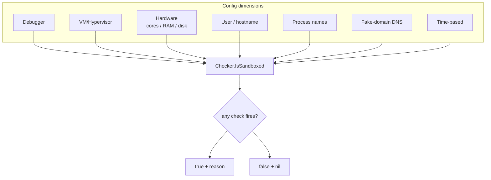

# Sandbox detection orchestrator

[← recon index](README.md) · [docs/index](../../index.md)

## TL;DR

Multi-factor sandbox / VM / analysis-environment detector.
Aggregates 7 check dimensions
([antidebug](anti-analysis.md), [antivm](anti-analysis.md),
hardware thresholds, suspicious user/host names, analysis-tool
processes, fake-domain DNS interception, time-based) into a
single [`Checker.IsSandboxed`](../../../recon/sandbox) result.
Returns `(true, reason, err)` so callers can bail and log
why.

## Primer

No single signal is conclusive. CPU core count alone won't tell
you Cuckoo from a low-end laptop; VM detection alone misses
bare-metal forensic workstations. The orchestrator stacks
indicators across orthogonal dimensions so high-confidence
sandboxes (Cuckoo, Joe Sandbox, ANY.RUN, hybrid-analysis) light
up across multiple checks while real targets light up across
zero or one.

The default configuration is calibrated against the canonical
public sandbox baselines: 2 cores, 4 GB RAM, 60 GB disk,
generic usernames (`admin`, `user`, `sandbox`, `malware`),
analysis tools (`procmon`, `wireshark`, `fiddler`,
`x32dbg`/`x64dbg`).

## How It Works



Per-dimension tunables in `Config`: each check has a threshold
and an enable flag. `DefaultConfig` ships defender-baseline
values; operators harden against specific targets by tightening
or relaxing.

## API Reference

| Symbol | Description |
|---|---|
| [`type Config`](https://pkg.go.dev/github.com/oioio-space/maldev/recon/sandbox#Config) | Per-dimension thresholds + enable flags |
| [`DefaultConfig() Config`](https://pkg.go.dev/github.com/oioio-space/maldev/recon/sandbox#DefaultConfig) | Defender-baseline calibration |
| [`type Checker`](https://pkg.go.dev/github.com/oioio-space/maldev/recon/sandbox#Checker) | Orchestrator instance |
| [`New(cfg) *Checker`](https://pkg.go.dev/github.com/oioio-space/maldev/recon/sandbox#New) | Build a checker |
| `Checker.IsSandboxed(ctx) (bool, string, error)` | Run all enabled checks; first match wins |
| `Checker.RunAll(ctx) ([]Result, error)` | Run every check; return all results |

## Examples

### Simple — defender baseline

```go
import (
    "context"
    "os"

    "github.com/oioio-space/maldev/recon/sandbox"
)

c := sandbox.New(sandbox.DefaultConfig())
if hit, reason, _ := c.IsSandboxed(context.Background()); hit {
    fmt.Fprintf(os.Stderr, "bail: %s\n", reason)
    os.Exit(0)
}
```

### Composed — strict thresholds

Harden against a specific defender pipeline by raising
hardware thresholds and adding custom usernames.

```go
cfg := sandbox.DefaultConfig()
cfg.MinCPUCores = 4
cfg.MinRAMGB = 8
cfg.SuspiciousUsernames = append(cfg.SuspiciousUsernames,
    "test", "demo", "vagrant",
)
c := sandbox.New(cfg)
```

### Advanced — full audit + report

```go
results, _ := c.RunAll(ctx)
for _, r := range results {
    if r.Hit {
        fmt.Printf("%-15s %s\n", r.Check, r.Reason)
    }
}
```

## OPSEC & Detection

| Artefact | Where defenders look |
|---|---|
| Many checks then early exit | Sandboxes self-flag — they exhausted their analysis budget |
| Fake-domain DNS resolution | Sandboxes often sinkhole; the DNS query itself is logged |
| Analysis-tool process enumeration | Sandboxes know they run wireshark; the enumeration succeeds |
| BusyWait followed by exit | Time-based sandbox decoys |

**D3FEND counters:**

- [D3-EI](https://d3fend.mitre.org/technique/d3f:ExecutionIsolation/)
  — sandbox design itself.

**Hardening for the operator:**

- Calibrate thresholds against the actual target stack — too
  strict means false positives on real low-spec targets.
- Layer with [`timing`](timing.md) BusyWait; sandboxes time out
  before a 30-second wait completes.
- Run the full `IsSandboxed` once at startup, then cache —
  re-running on every callback is wasted effort.

## MITRE ATT&CK

| T-ID | Name | Sub-coverage | D3FEND counter |
|---|---|---|---|
| [T1497](https://attack.mitre.org/techniques/T1497/) | Virtualization/Sandbox Evasion | full — multi-factor orchestrator | D3-EI |

## Limitations

- **No bypass for VMI.** Bare-metal volatility analysis
  defeats every check.
- **False positives on low-spec real users.** Tightening
  hardware thresholds catches sandboxes but may catch real
  embedded / minimal-VM targets.
- **DNS check requires outbound resolution.** Air-gapped
  sandboxes that NXDOMAIN everything still defeat the
  fake-domain probe.
- **No rootkit awareness.** Hooks installed by sandbox kernel
  drivers are out of scope; pair with `evasion/unhook` +
  `recon/hwbp` for kernel-hook detection.

## See also

- [`antidebug` + `antivm`](anti-analysis.md) — primitives.
- [`recon/timing`](timing.md) — time-based evasion sub-check.
- [Operator path](../../by-role/operator.md).
- [Detection eng path](../../by-role/detection-eng.md).
