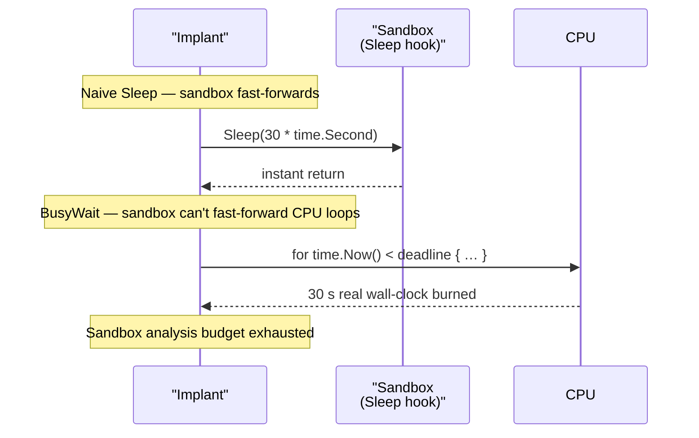

# Time-based sandbox evasion

[← recon index](README.md) · [docs/index](../../index.md)

## TL;DR

Burn CPU for a real wall-clock duration to defeat sandboxes
that fast-forward `Sleep()`. Two flavours: tight time-comparison
loop ([`BusyWait`](https://pkg.go.dev/github.com/oioio-space/maldev/recon/timing)) or primality-testing
loop ([`BusyWaitPrimality`](https://pkg.go.dev/github.com/oioio-space/maldev/recon/timing)) for a
math-like CPU pattern.

## Primer

Sandboxes commonly hook `Sleep` / `WaitForSingleObject` to skip
waits and observe what the implant does next. A 30-second
`Sleep()` becomes a no-op; a 30-second BusyWait does not. The
distinction is subtle but reliable — sandboxes have analysis
budgets, and a 30-second CPU burn forces them to either
fast-forward (impossible — there's no kernel hook for "spin
faster") or use up their budget.

Two implementations, both cross-platform:

- [`BusyWait`](https://pkg.go.dev/github.com/oioio-space/maldev/recon/timing) — repeatedly compares
  `time.Now()` to the deadline. Pinning one core at 100% in a
  tight comparison is cheap to fingerprint behaviourally.
- [`BusyWaitPrimality`](https://pkg.go.dev/github.com/oioio-space/maldev/recon/timing) — burns CPU via
  primality testing. Same wall-clock effect, more "math
  workload"-like CPU pattern.

## How It Works



## API Reference

### `func BusyWait(d time.Duration)`

[godoc](https://pkg.go.dev/github.com/oioio-space/maldev/recon/timing#BusyWait)

Spins on `time.Now()` until the deadline. Tightest possible
busy-wait — the loop body is empty.

**Parameters:** `d` — wall-clock duration to burn.

**Side effects:** pins one logical CPU at 100% for `d`.

**OPSEC:** behavioural EDR rarely flags CPU at 100% on its own;
some hypervisor-aware sandboxes do. The empty `time.Now()` loop
fingerprints as "spin-wait" against any CPU-pattern collector.

**Required privileges:** none.

**Platform:** cross-platform.

### `func BusyWaitTrig(d time.Duration)`

[godoc](https://pkg.go.dev/github.com/oioio-space/maldev/recon/timing#BusyWaitTrig)

Same wall-clock contract as `BusyWait` but the inner loop
performs `sin/cos` floating-point work — the CPU pattern
resembles legitimate scientific compute. The accumulator is
sunk into a package-level `var` to defeat dead-code
elimination.

**Parameters:** `d` — wall-clock duration to burn.

**Side effects:** pins one logical CPU at 100% for `d`; touches
the FPU.

**OPSEC:** harder to fingerprint than `BusyWait` against
CPU-pattern collectors.

**Platform:** cross-platform.

### `func BusyWaitPrimality()`

[godoc](https://pkg.go.dev/github.com/oioio-space/maldev/recon/timing#BusyWaitPrimality)

Calls `BusyWaitPrimalityN(500_000)` — ~200 ms of primality
testing on modern hardware.

**Side effects:** pins one logical CPU for the duration.

**Platform:** cross-platform.

### `func BusyWaitPrimalityN(iterations int)`

[godoc](https://pkg.go.dev/github.com/oioio-space/maldev/recon/timing#BusyWaitPrimalityN)

Tests integers for primality until `iterations` primes have
been found. Higher counts burn proportionally more CPU time.

**Parameters:** `iterations` — number of primes to discover
before returning (rough proxy for CPU duration).

**Side effects:** pins one logical CPU until the iteration
count is reached.

**OPSEC:** the integer-only inner loop fingerprints as
"prime-sieve workload" to CPU-pattern telemetry — harder to
reject than a `time.Now()` spin.

**Platform:** cross-platform.

## Examples

### Simple — 30-second burn at startup

```go
import (
    "time"

    "github.com/oioio-space/maldev/recon/timing"
)

timing.BusyWait(30 * time.Second)
// Sandbox analysis budget likely exhausted; continue.
```

### Composed — primality variant

```go
timing.BusyWaitPrimalityN(50_000_000)
// ~30 s on modern hardware; CPU pattern looks like prime sieving.
```

### Pipeline — sandbox bail + timing

```go
import (
    "context"
    "os"

    "github.com/oioio-space/maldev/recon/sandbox"
    "github.com/oioio-space/maldev/recon/timing"
)

if hit, _, _ := sandbox.New(sandbox.DefaultConfig()).IsSandboxed(context.Background()); hit {
    os.Exit(0)
}
timing.BusyWait(30 * time.Second) // catch sandboxes that bypassed dimension checks
```

## OPSEC & Detection

| Artefact | Where defenders look |
|---|---|
| 100% CPU on one core for sustained periods | Behavioural EDR rarely flags; some hypervisor-aware sandboxes do |
| Process at 100% CPU then transitions to network I/O | Pattern-matching EDR may correlate |
| `time.Now()` syscall storms | Per-call telemetry — invisible at user-mode |

**D3FEND counters:**

- [D3-EI](https://d3fend.mitre.org/technique/d3f:ExecutionIsolation/)
  — sandbox design itself.

**Hardening for the operator:**

- Use `BusyWaitPrimality` over `BusyWait` for less-fingerprintable
  CPU pattern.
- Stagger BusyWait calls between meaningful operations rather
  than one giant block at startup — looks more like a long-running
  workload, less like a sandbox-detection sentinel.

## MITRE ATT&CK

| T-ID | Name | Sub-coverage | D3FEND counter |
|---|---|---|---|
| [T1497.003](https://attack.mitre.org/techniques/T1497/003/) | Virtualization/Sandbox Evasion: Time Based Evasion | full — CPU-burn defeats Sleep hooks | D3-EI |

## Limitations

- **CPU spike.** 100% CPU on a target with idle expectations
  is itself a tell; calibrate duration against target's
  expected workload.
- **Doesn't help against real targets.** A 30-second startup
  delay is user-visible on real targets — only acceptable for
  background services / persistence binaries.
- **No defeat for live VM emulation.** Sandboxes running on
  bare-metal at full speed can still capture full behaviour;
  CPU-burn just prevents the trivial Sleep-hook bypass.

## See also

- [Sandbox orchestrator](sandbox.md) — multi-factor evasion.
- [`evasion/sleepmask`](../evasion/sleep-mask.md) — pair to
  hide payload at-rest during BusyWaits.
- [Operator path](../../by-role/operator.md).
- [Detection eng path](../../by-role/detection-eng.md).
