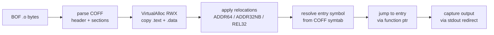

# BOF (Beacon Object File) loader

[← runtime index](README.md) · [docs/index](../../index.md)

## TL;DR

Load + execute a Cobalt Strike-style Beacon Object File (BOF) —
a compiled COFF object — entirely in process memory. Parses
COFF, applies relocations, resolves entry-point, jumps into
RWX memory. x64-only; no Beacon-API helpers (BOFs that call
`BeaconOutput` etc. crash).

## Primer

A BOF is a relocatable COFF (`.o`) object compiled by MSVC /
MinGW. The format is the same as Linux's `.o` but for Windows
PE-style relocations. BOFs were popularised by Cobalt Strike's
`inline-execute` command — a tactical execution primitive that
runs a small piece of native code inside the implant's process
without spawning a fresh process or writing a PE to disk.

Use cases:

- Run small Windows-API-heavy snippets (token enum, share
  enum, share scan) that don't need a full PE infrastructure.
- Distribute compiled techniques as a `.o` artefact rather
  than a full implant.
- Compose with the implant's runtime — the BOF runs in the
  caller's address space, so it can interact with implant
  state directly.

## How It Works



## API Reference

| Symbol | Description |
|---|---|
| [`type BOF`](https://pkg.go.dev/github.com/oioio-space/maldev/runtime/bof#BOF) | Loaded BOF instance |
| [`Load(data []byte) (*BOF, error)`](https://pkg.go.dev/github.com/oioio-space/maldev/runtime/bof#Load) | Parse + relocate + ready to execute |
| `(*BOF).Execute(args []byte) ([]byte, error)` | Run the entry point; return captured stdout |

## Examples

### Simple — load + execute

```go
import (
    "os"

    "github.com/oioio-space/maldev/runtime/bof"
)

data, _ := os.ReadFile("whoami.o")
b, err := bof.Load(data)
if err != nil {
    return
}
output, _ := b.Execute(nil)
fmt.Println(string(output))
```

### Composed — chain multiple BOFs

```go
for _, path := range []string{"whoami.o", "netstat.o", "tasklist.o"} {
    data, _ := os.ReadFile(path)
    b, err := bof.Load(data)
    if err != nil {
        continue
    }
    out, _ := b.Execute(nil)
    fmt.Printf("=== %s ===\n%s\n", path, out)
}
```

## OPSEC & Detection

| Artefact | Where defenders look |
|---|---|
| `VirtualAlloc(RWX)` followed by EXECUTE from the alloc | Behavioural EDR — high-fidelity reflective-loader signal |
| Module-load events for non-stack `.text` regions | ETW Microsoft-Windows-Threat-Intelligence |
| BOF entry-point execution from non-image memory | Defender for Endpoint MsSense |

**D3FEND counters:**

- [D3-PA](https://d3fend.mitre.org/technique/d3f:ProcessAnalysis/) — RWX execute-from-allocation telemetry.
- [D3-FCA](https://d3fend.mitre.org/technique/d3f:FileContentAnalysis/) — YARA on the loaded bytes.

**Hardening for the operator:**

- Allocate `RW` then `RX` via `VirtualProtect` instead of
  `RWX` — defeats the simplest RWX-watcher rules.
- Encrypt the BOF at rest via [`crypto`](../crypto/README.md);
  decrypt + load + immediately re-encrypt the source buffer.
- Pair with [`evasion/sleepmask`](../evasion/sleep-mask.md)
  for cleartext-at-rest mitigation.

## MITRE ATT&CK

| T-ID | Name | Sub-coverage | D3FEND counter |
|---|---|---|---|
| [T1059](https://attack.mitre.org/techniques/T1059/) | Command and Scripting Interpreter | partial — in-memory native code execution | D3-PA |
| [T1620](https://attack.mitre.org/techniques/T1620/) | Reflective Code Loading | full — COFF reflective load | D3-FCA, D3-PA |

## Limitations

- **Partial Beacon-API surface.** Implemented today:
  `BeaconPrintf` (format-string-only — varargs not expanded;
  see "Beacon-API limitations" below), `BeaconOutput`,
  `BeaconDataParse`, `BeaconDataInt`, `BeaconDataShort`,
  `BeaconDataLength`, `BeaconDataExtract`,
  `BeaconFormatAlloc` / `Reset` / `Free` / `Append` / `Int` /
  `ToString`. **Not yet implemented:** `BeaconFormatPrintf`
  (varargs unfeasible from a `syscall.NewCallback` thunk —
  same constraint as `BeaconPrintf`), `BeaconErrorD` /
  `ErrorDD` / `ErrorNA`, `BeaconGetSpawnTo`. BOFs that import
  any of the unimplemented symbols fail at relocation time
  with `unresolved external symbol __imp_BeaconXxx`.
- **`BeaconPrintf` / `BeaconFormatPrintf` varargs are not
  expanded.** `syscall.NewCallback` binds a fixed-arity Go
  function as a stdcall callback; Go cannot introspect cdecl
  varargs from inside the callback. We chose option **(a)**
  in the design discussion: forward the format string verbatim.
  BOFs that pass a literal format with no `%` directives
  behave correctly; BOFs relying on `printf`-style expansion
  see the format string raw.

  Two alternatives were considered and rejected for the default
  build:

  - **(b) Leave `__imp_BeaconPrintf` / `BeaconFormatPrintf`
    unresolved** so BOFs that depend on varargs fail at load
    time with a loud error. Honest but breaks compatibility
    with the large TrustedSec / Outflank corpus where
    `BeaconPrintf(CALLBACK_OUTPUT, "...")` is used as a
    no-args writer in 80% of cases.

  - **(c) Implement varargs via cgo.** A C wrapper around
    `vsnprintf` would expand the format and call back into Go
    with the rendered string. Requires:
      1. A C cross-compile toolchain in the build environment
         (mingw-w64 on Linux dev hosts, MSVC on Windows CI).
      2. CGO_ENABLED=1 — flips the entire library out of pure-Go
         mode, which the README sells as a hard guarantee.
      3. A different binary surface in `runtime/bof` for cgo vs.
         pure-Go builds, plus a build-tag matrix.

    The cost is steep relative to the gain (a minority of BOFs).
    Operators who need full vararg expansion can fork the
    package, drop a `bof_cgo_windows.go` file behind
    `//go:build windows && cgo && bof_cgo`, and supply a C-side
    `vsnprintf` wrapper they register via a hook hung off
    `resolveBeaconImport`. That extension point is intentionally
    left open; the default build prioritises pure-Go and
    accepts the verbatim-format trade-off.
- **External Win32 imports unresolved.** CS BOFs encode dynamic-link
  imports as `__imp_<DLLNAME>$<FuncName>` (e.g.
  `__imp_KERNEL32$LoadLibraryA`). The current resolver only
  handles `__imp_Beacon*`; any other external symbol fails
  with `unresolved external symbol …`. See backlog row P2.23
  (3rd row) for the planned `win/api.ResolveByHash`-backed
  resolver.
- **Concurrency: BOF execution is serialised package-wide.** The
  Beacon API stubs read a single `currentBOF` pointer guarded
  by `bofMu`. Concurrent `Execute` calls block on each other.
  This matches the CS-compatible loader convention (BOF
  execution is fundamentally single-threaded) but is worth
  knowing if a host program runs many BOFs in parallel.
- **x64 only.** `Machine == 0x8664` required.
- **Relocation coverage.** `IMAGE_REL_AMD64_ABSOLUTE` (no-op),
  `_ADDR64`, `_ADDR32` (errors out cleanly when target exceeds
  32-bit range), `_ADDR32NB`, `_REL32`, and the `_REL32_1`
  through `_REL32_5` bias variants. Exotic relocations (TLS, GOT,
  `_SECTION`, `_SECREL`) are not supported — the loader fails
  with `unsupported relocation type: 0xNN` so the failure mode
  is obvious instead of a silent corruption.
- **RWX allocation is loud.** Hardened EDRs flag RWX from any
  source; pair with sleep-mask + RW→RX flip.

## See also

- [`runtime/clr`](clr.md) — sibling reflective runtime (.NET).
- [`crypto`](../crypto/README.md) — encrypt BOF at rest.
- [`evasion/sleepmask`](../evasion/sleep-mask.md) — hide BOF
  bytes at rest.
- [Operator path](../../by-role/operator.md).
- [Detection eng path](../../by-role/detection-eng.md).
