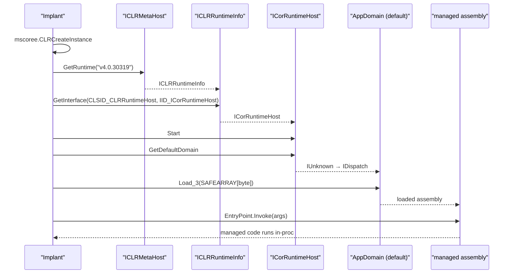

# CLR (.NET) in-process hosting

[← runtime index](README.md) · [docs/index](../../index.md)

## TL;DR

Host the .NET CLR in process via `ICLRMetaHost` /
`ICorRuntimeHost` COM and execute .NET assemblies from memory —
no `.exe` / `.dll` on disk. Equivalent to Cobalt Strike's
`execute-assembly`. Pair with `evasion/amsi.PatchAll` upstream —
AMSI v2 scans every assembly passed to `AppDomain.Load_3` and
will block flagged bytes (SharpHound, Rubeus, Seatbelt).

## Primer

The Common Language Runtime is the .NET execution engine. Any
process can host the CLR by importing `mscoree.dll` and calling
`CLRCreateInstance`. The hosting process gets a managed runtime
inside its address space and can load + invoke .NET assemblies
without spawning `dotnet.exe` / `powershell.exe`.

Operationally:

- Run SharpHound / Rubeus / Seatbelt / GhostPack tooling
  in-process from a Go implant — no separate `.exe` to drop, no
  process-tree anomaly.
- Side-step `dotnet.exe` / `powershell.exe` lineage rules.
- Bridge to the entire .NET ecosystem for credential dumping,
  token theft, AD enumeration.

The trade-offs are loud:

- Loading `clr.dll` + `mscoreei.dll` in a non-.NET process is
  itself a high-fidelity heuristic.
- AMSI v2 scans every `Load_3` call; without an AMSI patch most
  published tooling is blocked.
- ETW Microsoft-Windows-DotNETRuntime emits assembly-load events.

## How It Works



`Load(nil)` picks the preferred installed runtime
(v4 > legacy). For .NET 3.5 (legacy) targets call
[InstallRuntimeActivationPolicy] first to register the required
CLSID — disabled by default on modern Windows. The package
returns [ErrLegacyRuntimeUnavailable] when the legacy runtime
can't be activated.

## API Reference

Package: `runtime/clr` ([pkg.go.dev](https://pkg.go.dev/github.com/oioio-space/maldev/runtime/clr))

### `type Runtime`

- godoc: active CLR host instance — wraps the COM `ICorRuntimeHost` (.NET 3.5) or `ICLRRuntimeHost` (.NET 4+) interface, the AppDomain, the redirected stdout pipe, and the cleanup chain.
- Description: produced by `Load`. One Runtime corresponds to one CLR per process (the Windows ABI permits multiple CLRs in flight, but loading mscoree.dll is a per-process operation).
- Side effects: holds COM references for the runtime's lifetime; releases them on `Close`.
- OPSEC: `clr.dll` / `mscoree.dll` / `mscorlib.ni.dll` module-load events fire on `Load`. Behavioural EDRs flag the `clr.dll` load from a non-.NET parent process as suspicious.
- Required privileges: medium-IL is enough for in-process hosting.
- Platform: Windows. Stub build's `Runtime` returns `errUnsupported` from every method.

### `Load(caller *wsyscall.Caller) (*Runtime, error)`

- godoc: bring up the CLR — picks the preferred runtime (highest installed version), creates the AppDomain, redirects stdout / stderr into an in-memory pipe.
- Description: prefers .NET 4 / 4.x over 3.5 when both are present. The `caller` parameter is reserved for future EDR-bypass syscall routing; pass `nil` to use the standard kernel32 path. Returns `ErrLegacyRuntimeUnavailable` when only .NET 3.5 is installed and `InstallRuntimeActivationPolicy` has not been called.
- Parameters: `caller` — optional `*wsyscall.Caller` for syscall-method overrides. Pass `nil` for default WinAPI.
- Returns: `*Runtime` ready for `ExecuteAssembly` / `ExecuteDLL`; `error` for COM failure / CLR-not-installed / legacy-hosting-policy-not-set.
- Side effects: loads `mscoree.dll`, instantiates the CLR host, creates an AppDomain, opens a stdout-redirect pipe.
- OPSEC: noisy on first call (module loads). Subsequent calls hit the warm cache.
- Required privileges: medium-IL.
- Platform: Windows. Returns `errUnsupported` on the stub build.

### `(*Runtime).ExecuteAssembly(asm []byte, args []string) error`

- godoc: load `asm` (a .NET PE bytes buffer) and invoke its `Main` entry point with `args`.
- Description: the assembly never touches disk — bytes go straight into the AppDomain via `Load_3`. Stdout / stderr write through to the host's redirected pipe; the captured output is appended to the BOF's output buffer (TODO link).
- Parameters: `asm` — .NET assembly bytes (e.g. Seatbelt.exe, Rubeus.exe); `args` — argv as Go strings.
- Returns: `error` on Load_3 failure, missing entry point, or AppDomain-internal exception. The exception's stack trace is captured in the redirected stdout.
- Side effects: invokes managed code under the calling process's token. Anything the assembly does (file I/O, registry, network) appears as the host process.
- OPSEC: AMSI scans the assembly bytes when AntimalwareScanInterface is hooked. Pair with `evasion/amsi.PatchAll` before Load.
- Required privileges: whatever the assembly itself requires.
- Platform: Windows.

### `(*Runtime).ExecuteDLL(dll []byte, typeName, methodName, arg string) error`

- godoc: load `dll` (a .NET DLL bytes buffer) and invoke a specific static method via reflection.
- Description: alternative to `ExecuteAssembly` for libraries that lack a `Main` entry point — load the DLL into the AppDomain, locate `<typeName>` via `Assembly.GetType`, locate `<methodName>` via `Type.GetMethod`, invoke with a single string `arg`. Useful for SharpHound-style toolsuites that ship multiple methods per DLL.
- Parameters: `dll` — .NET DLL bytes; `typeName` — fully-qualified type (e.g. `"SharpHound.Program"`); `methodName` — static method name; `arg` — single-string argument the target method accepts.
- Returns: `error` on Load_3 failure, missing type, missing method, or in-method exception.
- Side effects: same as `ExecuteAssembly` (managed-code execution under the host token).
- OPSEC: same AMSI exposure as `ExecuteAssembly`.
- Required privileges: whatever the target method itself requires.
- Platform: Windows.

### `(*Runtime).Close()`

- godoc: tear down the AppDomain + release the COM references.
- Description: best-effort — every step runs even if earlier ones failed. Calling Close on a nil or already-closed Runtime is safe (no-op). After Close, further method calls return `errUnsupported`.
- Parameters: receiver only.
- Returns: nothing.
- Side effects: unloads the AppDomain, drops the CLR host's COM references, closes the stdout-redirect pipe.
- OPSEC: AppDomain unload is visible to ETW Microsoft-Windows-DotNETRuntime.
- Required privileges: none.
- Platform: Windows. No-op on the stub build.

### `InstalledRuntimes() ([]string, error)`

- godoc: enumerate installed .NET versions on the host.
- Description: walks `HKLM\SOFTWARE\Microsoft\NET Framework Setup\NDP` for v2.0, v3.0, v3.5, v4 family. Returns version strings like `"v2.0.50727"`, `"v4.0.30319"`. Useful pre-flight for `Load` — operators decide whether a .NET 3.5-only assembly will run before they call.
- Parameters: none.
- Returns: list of version strings (sorted ascending); `error` for registry-read failures.
- Side effects: reads the registry; no writes.
- OPSEC: registry reads from `HKLM\SOFTWARE\Microsoft\NET Framework Setup\NDP` are made by every .NET-aware installer at first launch — the access doesn't stand out.
- Required privileges: none.
- Platform: Windows. Returns `errUnsupported` on the stub build.

### `InstallRuntimeActivationPolicy() error`

- godoc: register the legacy-CLR activation policy so .NET 3.5 hosting via `ICorRuntimeHost` works on a host where only .NET 4+ is set as the default activation target.
- Description: sets `HKLM\SOFTWARE\Microsoft\.NETFramework\OnlyUseLatestCLR` to `0` so the CLR loader honours the legacy CLSID. Required when running .NET 2/3.5-targeted assemblies on a host that's been migrated to .NET 4 default.
- Parameters: none.
- Returns: `error` on registry write failure (typically when not running elevated).
- Side effects: writes to `HKLM\SOFTWARE\Microsoft\.NETFramework`.
- OPSEC: registry writes under HKLM are auditable. Defenders running registry-monitoring rules see the change.
- Required privileges: admin (`HKLM` write).
- Platform: Windows.

### `RemoveRuntimeActivationPolicy() error`

- godoc: reverse the registry change made by `InstallRuntimeActivationPolicy`.
- Description: deletes the `OnlyUseLatestCLR` value so CLR activation returns to default behaviour. Pair with the install for clean operator hygiene; leaving the value set after the operation is an unforced observability win for defenders.
- Parameters: none.
- Returns: `error` on registry-delete failure.
- Side effects: registry delete under HKLM.
- OPSEC: same audit-trail as the install — both writes are visible.
- Required privileges: admin.
- Platform: Windows.

### `var ErrLegacyRuntimeUnavailable`

- godoc: returned by `Load` when only .NET 3.5 is installed and `InstallRuntimeActivationPolicy` has not been called.
- Description: error sentinel used to gate caller logic — when the policy is missing, the caller can either abort or call `InstallRuntimeActivationPolicy` (admin required) and retry.
- Required privileges: none for the sentinel itself.
- Platform: Windows.

## Examples

### Simple — load + execute

```go
import (
    "os"

    "github.com/oioio-space/maldev/runtime/clr"
)

rt, err := clr.Load(nil)
if err != nil {
    return
}
defer rt.Close()

asm, _ := os.ReadFile("Seatbelt.exe")
_ = rt.ExecuteAssembly(asm, []string{"-group=system"})
```

### Composed — AMSI patch + ETW patch + execute

```go
import (
    "os"

    "github.com/oioio-space/maldev/evasion/amsi"
    "github.com/oioio-space/maldev/evasion/etw"
    "github.com/oioio-space/maldev/runtime/clr"
)

if err := amsi.PatchAll(); err != nil {
    return
}
_ = etw.PatchAll()

rt, _ := clr.Load(nil)
defer rt.Close()

asm, _ := os.ReadFile("Rubeus.exe")
_ = rt.ExecuteAssembly(asm, []string{"triage"})
```

### Advanced — list + pick runtime

```go
versions, _ := clr.InstalledRuntimes()
for _, v := range versions {
    fmt.Println("installed:", v)
}
```

## OPSEC & Detection

| Artefact | Where defenders look |
|---|---|
| `clr.dll` + `mscoreei.dll` module load in non-.NET host | High-fidelity heuristic — Defender for Endpoint, Elastic, S1 |
| `AmsiScanBuffer` flagging the assembly | AMSI v2 scans every `Load_3` — published tooling caught universally |
| Microsoft-Windows-DotNETRuntime ETW provider | Assembly-load events; without ETW patch every load is logged |
| `ICorRuntimeHost` COM activation from non-Microsoft process | EDR COM-activation telemetry |
| Process Hollowing-like behaviour: process metadata says non-.NET, runtime hosts CLR | Behavioural EDR rule |

**D3FEND counters:**

- [D3-PSA](https://d3fend.mitre.org/technique/d3f:ProcessSpawnAnalysis/) — module-load lineage.
- [D3-FCA](https://d3fend.mitre.org/technique/d3f:FileContentAnalysis/) — AMSI on assembly bytes.

**Hardening for the operator:**

- Always patch AMSI ([`evasion/amsi.PatchAll`](../evasion/amsi-bypass.md))
  before `ExecuteAssembly`.
- Pair with [`evasion/etw`](../evasion/etw-patching.md) for the
  .NET runtime ETW silencing.
- Run inside a process where `clr.dll` load is plausible
  (Office, browsers, managed-service hosts).
- Pair with [`pe/masquerade/preset/svchost`](../pe/masquerade.md)
  if running from a fresh process.

## MITRE ATT&CK

| T-ID | Name | Sub-coverage | D3FEND counter |
|---|---|---|---|
| [T1620](https://attack.mitre.org/techniques/T1620/) | Reflective Code Loading | full — CLR-hosted in-memory .NET | D3-FCA, D3-PSA |
| [T1059](https://attack.mitre.org/techniques/T1059/) | Command and Scripting Interpreter | partial — in-process .NET execution without dotnet.exe | D3-PSA |

## Limitations

- **AMSI / ETW upstream patches required for hostile assemblies.**
- **CLR lifecycle is global per-process.** Once started, a CLR
  cannot be cleanly unloaded; subsequent `Load` calls re-use
  the same instance.
- **Output capture.** Stdout / stderr from the assembly require
  redirection setup before `ExecuteAssembly`.
- **AppDomain isolation absent.** All assemblies share the
  default AppDomain; one exception can take down the runtime.
- **.NET 3.5 disabled-by-default on modern Windows.** Legacy
  runtime hosting needs the policy install.
- **`[STAThread]` requirement.** Some assemblies require an
  STA apartment; running without re-creating that apartment
  may fail for COM-heavy tooling.

## Credit

- ropnop/go-clr — canonical Go port; vendored upstream.

## See also

- [`runtime/bof`](bof-loader.md) — sibling reflective runtime
  (COFF / native code).
- [`evasion/amsi`](../evasion/amsi-bypass.md) — REQUIRED for
  hostile assemblies.
- [`evasion/etw`](../evasion/etw-patching.md) — silence .NET
  runtime ETW.
- [`pe/srdi`](../pe/pe-to-shellcode.md) — alternative path for
  .NET → shellcode via Donut.
- [Operator path](../../by-role/operator.md).
- [Detection eng path](../../by-role/detection-eng.md).
