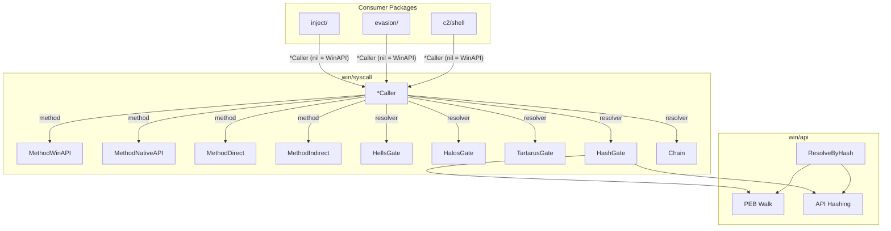

# Syscall Methods & SSN Resolvers

[<- Back to README](../../../README.md)

The `win/syscall` package provides four syscall invocation methods and five SSN resolvers. Together they allow any injection or evasion code to transparently switch between standard WinAPI calls and stealthy indirect syscalls that defeat EDR hooking.

---

## Architecture Overview

## Quick Reference

| Method | Hook Bypass | Stack Clean | Memory Clean | Stealth |
|--------|------------|-------------|-------------|---------|
| WinAPI | None | N/A | N/A | Lowest |
| NativeAPI | kernel32 | N/A | N/A | Low |
| Direct | All userland | No | No | Medium |
| Indirect | All userland | Yes | Yes | High (heap stub, RW↔RX cycle) |
| IndirectAsm | All userland | Yes | Yes | Highest (Go-asm stub, no writable code) |

| Resolver | Unhooked ntdll | JMP-hooked ntdll | Fully hooked ntdll | String-free |
|----------|---------------|------------------|-------------------|-------------|
| HellsGate | Yes | No | No | No |
| HalosGate | Yes | Yes (neighbor) | No | No |
| TartarusGate | Yes | Yes (trampoline) | Yes (neighbor fallback) | No |
| HashGate | Yes | No | No | Yes |
| Chain | Depends on composition | Depends on composition | Depends on composition | Depends |

## Quick decision tree

| You want to… | Use |
|---|---|
| …call a Windows API with no plaintext name in the binary | [api-hashing.md](api-hashing.md) (HashGate) |
| …skip kernel32-level hooks but stay in ntdll | [direct-indirect.md](direct-indirect.md) — `MethodNativeAPI` |
| …skip every userland hook (kernel32 + ntdll) | [direct-indirect.md](direct-indirect.md) — `MethodIndirect` / `MethodIndirectAsm` |
| …make the syscall return inside ntdll's `.text` (call-stack stealth) | [direct-indirect.md](direct-indirect.md) — `MethodIndirect` family |
| …avoid any writable code page in the implant | [direct-indirect.md](direct-indirect.md) — `MethodIndirectAsm` |
| …randomise the syscall return address per call | [direct-indirect.md](direct-indirect.md) — gadget pool |
| …auto-fall-back when the target stub is hooked | [ssn-resolvers.md](ssn-resolvers.md) — Halo's / Tartarus / Chain |
| …read the SSN even when the entire ntdll text section is hooked | [ssn-resolvers.md](ssn-resolvers.md) — TartarusGate |
| …swap in your own hash function (defeat ROR13 fingerprints) | `NewHashGateWith(fn)` + `Caller.WithHashFunc(fn)` |

## Documentation

| Document | Description |
|----------|-------------|
| [Direct & Indirect Syscalls](direct-indirect.md) | The five invocation methods (incl. Go-asm IndirectAsm) and when to use each |
| [API Hashing](api-hashing.md) | PEB walk + ROR13 hashing to eliminate plaintext strings |
| [SSN Resolvers](ssn-resolvers.md) | Hell's Gate, Halo's Gate, Tartarus Gate, HashGate |

## MITRE ATT&CK

| Technique | ID | Description |
|-----------|-----|-------------|
| Native API | [T1106](https://attack.mitre.org/techniques/T1106/) | Directly interact with the native OS API |

## D3FEND Countermeasures

| Countermeasure | ID | Description |
|----------------|-----|-------------|
| System Call Analysis | [D3-SCA](https://d3fend.mitre.org/technique/d3f:SystemCallAnalysis/) | Monitor syscall origins and patterns |
| Function Call Restriction | [D3-FCR](https://d3fend.mitre.org/technique/d3f:FunctionCallRestriction/) | Restrict dynamic function resolution |

## See also

- [`syscalls/api-hashing.md`](api-hashing.md) — string-free import resolution
- [`syscalls/direct-indirect.md`](direct-indirect.md) — calling-method matrix
- [`syscalls/ssn-resolvers.md`](ssn-resolvers.md) — Hells/Halos/Tartarus/HashGate
- [`tokens` techniques (index)](../tokens/README.md) — sibling Layer-1 OS-primitive area
