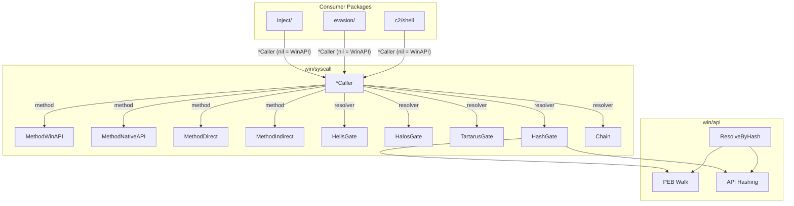

# Syscall Methods & SSN Resolvers

[<- Back to README](../../../README.md)

The `win/syscall` package provides four syscall invocation methods and five SSN resolvers. Together they allow any injection or evasion code to transparently switch between standard WinAPI calls and stealthy indirect syscalls that defeat EDR hooking.

---

## Architecture Overview

## Quick Reference

| Method | Hook Bypass | Stack Clean | Memory Clean | Stealth |
|--------|------------|-------------|-------------|---------|
| WinAPI | None | N/A | N/A | Lowest |
| NativeAPI | kernel32 | N/A | N/A | Low |
| Direct | All userland | No | No | Medium |
| Indirect | All userland | Yes | Yes | Highest |

| Resolver | Unhooked ntdll | JMP-hooked ntdll | Fully hooked ntdll | String-free |
|----------|---------------|------------------|-------------------|-------------|
| HellsGate | Yes | No | No | No |
| HalosGate | Yes | Yes (neighbor) | No | No |
| TartarusGate | Yes | Yes (trampoline) | Yes (neighbor fallback) | No |
| HashGate | Yes | No | No | Yes |
| Chain | Depends on composition | Depends on composition | Depends on composition | Depends |

## Documentation

| Document | Description |
|----------|-------------|
| [Direct & Indirect Syscalls](direct-indirect.md) | The four invocation methods and when to use each |
| [API Hashing](api-hashing.md) | PEB walk + ROR13 hashing to eliminate plaintext strings |
| [SSN Resolvers](ssn-resolvers.md) | Hell's Gate, Halo's Gate, Tartarus Gate, HashGate |

## MITRE ATT&CK

| Technique | ID | Description |
|-----------|-----|-------------|
| Native API | [T1106](https://attack.mitre.org/techniques/T1106/) | Directly interact with the native OS API |

## D3FEND Countermeasures

| Countermeasure | ID | Description |
|----------------|-----|-------------|
| System Call Analysis | [D3-SCA](https://d3fend.mitre.org/technique/d3f:SystemCallAnalysis/) | Monitor syscall origins and patterns |
| Function Call Restriction | [D3-FCR](https://d3fend.mitre.org/technique/d3f:FunctionCallRestriction/) | Restrict dynamic function resolution |
