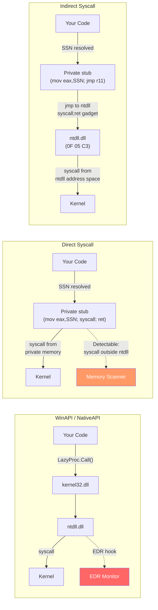
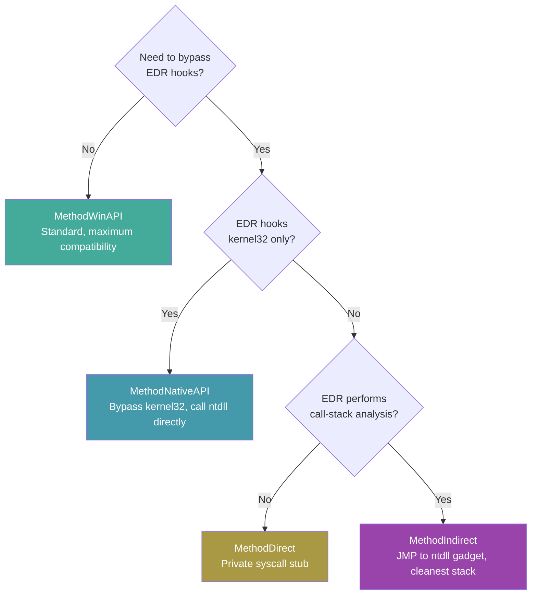

# Direct & Indirect Syscalls

[<- Back to Syscalls Overview](README.md)

**MITRE ATT&CK:** [T1106 - Native API](https://attack.mitre.org/techniques/T1106/)
**D3FEND:** [D3-SCA - System Call Analysis](https://d3fend.mitre.org/technique/d3f:SystemCallAnalysis/)

---

> **New to maldev syscalls?** Read the [syscalls/README.md
> vocabulary callout](README.md#primer--vocabulary) first
> (syscall, NTAPI, SSN, userland hook, direct/indirect,
> API hashing, gate-family resolvers).

## What direct/indirect syscalls is NOT

> [!IMPORTANT]
> Direct/indirect syscalls is **only** the calling-method axis
> (concern #1 in [README.md](README.md)). It answers "how do I
> *issue* the syscall — through kernel32, through ntdll, or
> straight from the implant's own page?".
>
> It does **not** decide:
>
> - **where the SSN comes from** — that's the SSN resolver
>   ([ssn-resolvers.md](ssn-resolvers.md)). `MethodDirect` /
>   `MethodIndirect` / `MethodIndirectAsm` all *consume* an SSN
>   they didn't compute themselves.
> - **how the Nt\* export is found** — that's
>   [api-hashing.md](api-hashing.md). The calling method is
>   identical whether the symbol came from a string lookup or a
>   ROR13 hash.
>
> Picking `MethodIndirectAsm` alone does not make your implant
> string-free or hook-resilient against pre-injection ntdll
> patches — pair it with `HashGate` (resolver) for the full
> stack.

## Primer

When your program needs Windows to do something (allocate memory, create a thread), it normally goes through the official front desk -- `kernel32.dll` and `ntdll.dll`. EDR products stand at this front desk, logging every request.

**Instead of going through the official front desk (which logs everything), you find a back door.** Direct syscalls build a tiny instruction that talks to the kernel directly, skipping the hooked ntdll code entirely. Indirect syscalls go one step further: they make it look like the call came from ntdll, even though your code initiated it -- like sneaking in the back door but leaving footprints that look like they came from the front.

---

## How It Works

Every NT function in ntdll follows the same x64 pattern:

```asm
mov r10, rcx         ; save first arg (kernel expects r10, not rcx)
mov eax, <SSN>       ; load the Syscall Service Number
syscall              ; transition to kernel mode
ret
```

The SSN is an index into the kernel's System Service Descriptor Table (SSDT). EDR products hook these functions by overwriting the prologue bytes with a JMP to their monitoring code.

The five methods in `win/syscall` differ in how they reach the `syscall` instruction:



### Method Comparison



| Method | Constant | Bypass kernel32 | Bypass ntdll | Survive memory scan | Survive stack analysis | Per-call VirtualProtect |
|--------|----------|-----------------|-------------|--------------------|-----------------------|-------------------------|
| WinAPI | `MethodWinAPI` | No | No | N/A | N/A | No |
| NativeAPI | `MethodNativeAPI` | Yes | No | N/A | N/A | No |
| Direct | `MethodDirect` | Yes | Yes | No | No | Yes (RW↔RX) |
| Indirect | `MethodIndirect` | Yes | Yes | Yes | Yes | Yes (RW↔RX) |
| IndirectAsm | `MethodIndirectAsm` | Yes | Yes | **Yes** | **Yes** | **No** |

### MethodIndirectAsm vs MethodIndirect

Both end the same way — `syscall` executes inside ntdll's `.text` from a randomly picked `syscall;ret` gadget — but the path to the gadget is different.

`MethodIndirect` builds a 21-byte stub (`mov r10,rcx; mov eax,SSN; mov r11,gadget; jmp r11`) into a heap page, flips the page `RW→RX→RW` around `SyscallN`, and returns. That heap page is writable code in the implant's address space, and the protection cycle calls `VirtualProtect` twice per syscall — both are classic EDR signals.

`MethodIndirectAsm` ships the same logic as Go assembly inside the binary's `.text` section. SSN and gadget address are passed as register arguments — no patching, no writable code page, no `VirtualProtect`. The trade-off is that the stub lives at a fixed RVA inside the implant binary, so a YARA rule could match its bytes; mitigate by morphing the function or stripping symbols.

The gadget address is drawn at random per call from the full pool of `0F 05 C3` triples in ntdll (`pickSyscallGadget`), so successive syscalls from the same caller don't all return to the same RVA.

---

## Usage

### Basic: WinAPI (Default Fallback)

When `*Caller` is `nil`, consumer packages fall back to standard WinAPI:

```go
import "github.com/oioio-space/maldev/inject"

// nil Caller = standard WinAPI path (no bypass)
pipe := inject.NewPipeline(nil)
```

### Direct Syscalls with Hell's Gate

```go
import (
    wsyscall "github.com/oioio-space/maldev/win/syscall"
)

caller := wsyscall.New(wsyscall.MethodDirect, wsyscall.NewHellsGate())
defer caller.Close()

// Call NtAllocateVirtualMemory directly -- bypasses all userland hooks
ret, err := caller.Call("NtAllocateVirtualMemory",
    uintptr(0xFFFFFFFFFFFFFFFF), // ProcessHandle (-1 = current)
    uintptr(unsafe.Pointer(&baseAddr)),
    0,
    uintptr(unsafe.Pointer(&regionSize)),
    windows.MEM_COMMIT|windows.MEM_RESERVE,
    windows.PAGE_READWRITE,
)
```

### Indirect Syscalls with Tartarus Gate

```go
import (
    wsyscall "github.com/oioio-space/maldev/win/syscall"
)

// Tartarus Gate handles JMP-hooked functions
caller := wsyscall.New(wsyscall.MethodIndirect, wsyscall.NewTartarus())
defer caller.Close()

ret, err := caller.Call("NtCreateThreadEx", /* args... */)
```

### IndirectAsm + custom hash function

```go
import wsyscall "github.com/oioio-space/maldev/win/syscall"

// Build-time hash function — every binary built with a different `key`
// produces different funcHash constants, so static signatures on the
// well-known ROR13 values stop matching.
fnv1a := func(s string) uint32 {
    h := uint32(2166136261)
    for i := 0; i < len(s); i++ {
        h ^= uint32(s[i])
        h *= 16777619
    }
    return h
}

caller := wsyscall.New(
    wsyscall.MethodIndirectAsm,
    wsyscall.NewHashGateWith(fnv1a),
).WithHashFunc(fnv1a)

// fnv1a("NtAllocateVirtualMemory") is computed at build-time by the
// optimizer when fed a string constant — no plaintext name in .rdata.
ret, err := caller.CallByHash(fnv1a("NtAllocateVirtualMemory"), /* args */)
```

Both ends MUST agree: `NewHashGateWith(fn)` for the resolver to walk the export table, `WithHashFunc(fn)` for `CallByHash` to do the same lookup. Pass `nil` (or call `NewHashGate()`) for the default ROR13 path.

### String-Free: CallByHash

```go
import (
    "github.com/oioio-space/maldev/win/api"
    wsyscall "github.com/oioio-space/maldev/win/syscall"
)

caller := wsyscall.New(wsyscall.MethodIndirect, wsyscall.NewHashGate())
defer caller.Close()

// No plaintext function name in the binary -- only a uint32 hash constant
ret, err := caller.CallByHash(api.HashNtAllocateVirtualMemory,
    uintptr(0xFFFFFFFFFFFFFFFF),
    uintptr(unsafe.Pointer(&baseAddr)),
    0,
    uintptr(unsafe.Pointer(&regionSize)),
    windows.MEM_COMMIT|windows.MEM_RESERVE,
    windows.PAGE_READWRITE,
)
```

---

## Combined Example: Injection + Evasion + Indirect Syscalls

```go
package main

import (
    "log"

    "github.com/oioio-space/maldev/crypto"
    "github.com/oioio-space/maldev/evasion"
    "github.com/oioio-space/maldev/evasion/amsi"
    "github.com/oioio-space/maldev/evasion/etw"
    "github.com/oioio-space/maldev/inject"
    wsyscall "github.com/oioio-space/maldev/win/syscall"
)

func main() {
    // 1. Create an indirect syscall caller with resilient SSN resolution
    caller := wsyscall.New(wsyscall.MethodIndirect,
        wsyscall.Chain(
            wsyscall.NewTartarus(),  // try JMP-hook trampoline first
            wsyscall.NewHalosGate(), // fall back to neighbor scanning
        ),
    )
    defer caller.Close()

    // 2. Apply evasion techniques through the same caller
    evasion.ApplyAll([]evasion.Technique{
        amsi.ScanBufferPatch(),
        etw.All(),
    }, caller)

    // 3. Decrypt payload
    key := []byte("your-32-byte-AES-key-here!!!!!!")
    encPayload := []byte{/* encrypted shellcode */}
    shellcode, _ := crypto.DecryptAESGCM(key, encPayload)

    // 4. Inject using indirect syscalls for all NT calls
    inj, err := inject.NewWindowsInjector(&inject.WindowsConfig{
        Config:        inject.Config{Method: inject.MethodCreateThread},
        SyscallMethod: wsyscall.MethodIndirect,
    })
    if err != nil { log.Fatal(err) }
    if err := inj.Inject(shellcode); err != nil { log.Fatal(err) }
}
```

---

## Advantages & Limitations

### Advantages

- **Transparent bypass**: Consumer packages pass `*Caller` -- same code works with WinAPI or indirect syscalls
- **RW/RX cycling**: Stub pages are allocated RW, cycled to RX for execution, then back to RW -- no permanent RWX
- **Pre-allocated stubs**: One VirtualAlloc per Caller lifetime, not per call -- reduces API call noise
- **Composable**: Chain resolvers for maximum resilience against partial hooking

### Limitations

- **Direct syscalls**: The `syscall` instruction at a non-ntdll address is trivially detectable by memory scanners
- **Indirect syscalls**: Still require a `jmp` gadget in ntdll -- if ntdll is entirely remapped, gadget scanning fails
- **SSN stability**: SSNs change between Windows versions -- resolvers must run at runtime, not compile time
- **x64 only**: The stub layouts and PEB offsets are hardcoded for x86-64

---

## API Reference

Package: `github.com/oioio-space/maldev/win/syscall`. The `Caller`
type is the seam every downstream maldev component consumes — pass a
`*Caller` (or `nil` for the WinAPI default) and the call site picks
up the operator's chosen evasion posture without rewriting business
logic. Caller stubs (Direct / Indirect) are pre-allocated as RW and
cycled to RX per call; **always defer Close** to free those pages.

### Method enum and `(Method).String()`

#### `type Method int` + 5 constants

- godoc: selects the syscall invocation strategy. Zero value (`MethodWinAPI`) is the safe default.
- Description: closed-set enum threaded through every `Caller`. The five tiers stack in increasing evasion strength and decreasing portability — see the "Method Comparison" table earlier on this page for the trade-off matrix.
- Constants:
  - `MethodWinAPI Method = iota` — `kernel32!Foo` / `advapi32!Foo`. Fully hookable. Safe default. The only mode that does not require an SSN resolver.
  - `MethodNativeAPI` — `ntdll!NtFoo` direct call. Skips kernel32-level hooks but the ntdll boundary is still hookable.
  - `MethodDirect` — in-process syscall stub written into a private RW→RX page. Bypasses all userland hooks but the `syscall` instruction executes outside ntdll's `.text`, which IOCs flag.
  - `MethodIndirect` — heap stub that does `mov eax, ssn; jmp ntdll_gadget`. The `syscall` instruction itself executes inside ntdll, so it looks like an ordinary ntdll-originated syscall to a stack walker. Default for stealth-conscious red-team work.
  - `MethodIndirectAsm` — Go-assembly stub jumps into the ntdll gadget. No heap stub, no per-call VirtualProtect cycle. amd64-only. Strictly stealthier than `MethodIndirect`.
- Side effects: none on the constants themselves.
- OPSEC: see Method Comparison table; the constants do not emit anything until passed to `New`.
- Required privileges: none.
- Platform: all five modes are Windows-only. `MethodIndirectAsm` is Windows + amd64.

#### `(Method).String() string`

- godoc: human-readable label — `"WinAPI"`, `"NativeAPI"`, `"Direct"`, `"Indirect"`, `"IndirectAsm"`, `"Unknown"`.
- Description: pure switch over the five constants. Unknown values return `"Unknown"` rather than panic. Used by the testutil `CallerMethods(t)` matrix to build subtest names.
- Parameters: receiver.
- Returns: ASCII string.
- Side effects: none.
- OPSEC: silent.
- Required privileges: none.
- Platform: Windows.

### `Caller`

#### `New(method Method, r SSNResolver) *Caller`

- godoc: build a Caller for the given method + resolver.
- Description: stores `method` and `resolver`, precomputes `ntdllHash` (ROR13 of `"ntdll.dll"`). For `MethodDirect` and `MethodIndirect`, pre-allocates two 64-byte RW pages via `windows.VirtualAlloc(MEM_COMMIT|MEM_RESERVE, PAGE_READWRITE)` for the direct + indirect stubs (cycled to RX per call to avoid permanent RWX). The resolver is only consulted in `MethodDirect`/`MethodIndirect`/`MethodIndirectAsm` paths.
- Parameters: `method` selects the call strategy; `r` is the SSN resolver (use `nil` for `MethodWinAPI`/`MethodNativeAPI`).
- Returns: `*Caller`. Never nil.
- Side effects: two `VirtualAlloc(64, RW)` calls when the method requires stubs. **Caller must `defer c.Close()`** to release them.
- OPSEC: the two RW allocations are tiny and short-lived but visible to memory-allocation-tracking EDR. The pages are cycled RW↔RX per call, never permanent RWX.
- Required privileges: none.
- Platform: Windows. Stub build returns a no-op `*Caller`.

#### `(*Caller).WithHashFunc(fn HashFunc) *Caller`

- godoc: install a non-default hash function for `CallByHash`'s ntdll export-table walk. Returns the receiver for fluent chaining.
- Description: stores `fn` and recomputes `ntdllHash` as `fn("ntdll.dll")` so the binary stops carrying the well-known ROR13 constant of `"ntdll.dll"`. Pass the **same** `fn` to `NewHashGateWith` so resolver and caller agree on the hash family. `nil` reverts to the package default (ROR13).
- Parameters: receiver; `fn` a `HashFunc` (signature `func(name string) uint32`) or nil.
- Returns: `*Caller` (the receiver). For chain expressions like `New(...).WithHashFunc(myFn).Call(...)`.
- Side effects: mutates Caller state.
- OPSEC: per-implant hash families remove the ROR13 fingerprint from `.rdata` — see [`syscalls/api-hashing.md`](api-hashing.md) for the seven shipped families and OPSEC scoring.
- Required privileges: none.
- Platform: Windows.

#### `(*Caller).Call(ntFuncName string, args ...uintptr) (uintptr, error)`

- godoc: execute the named NT function under the configured method.
- Description: dispatches on `c.method`. For `WinAPI`/`NativeAPI`, looks up the proc via the cached DLL handle in `win/api` and calls it. For `Direct`/`Indirect`/`IndirectAsm`, resolves the SSN via `c.resolver.Resolve(name)`, writes the appropriate stub bytes into the pre-allocated RW page, cycles to RX, and invokes it. The mutex on the Caller serialises stub rewrites so concurrent `Call`s on the same Caller are safe.
- Parameters: `ntFuncName` — the full NT name (e.g. `"NtAllocateVirtualMemory"`, not `"AllocateVirtualMemory"`). `args` — uintptr-coerced argument list, exactly as the kernel ABI expects (caller is responsible for layout, including the `Handle/CurrentProcess` first arg).
- Returns: the syscall's `eax` (NTSTATUS coerced to uintptr); `err` from resolver / stub allocation / proc lookup paths. NTSTATUS-failure is conveyed in the return value, not the error — caller should test against `STATUS_SUCCESS` directly.
- Side effects: rewrites the stub page (Direct/Indirect modes) — protects + executes + protects back. The `IndirectAsm` mode skips the stub-rewrite cycle entirely.
- OPSEC: `Direct` mode emits a `syscall` from a non-ntdll page (CallStack telemetry catches it). `Indirect`/`IndirectAsm` route through an ntdll-resident gadget so the stack walker sees a normal ntdll origin. `WinAPI`/`NativeAPI` paths follow the standard userland route.
- Required privileges: per-syscall (e.g. `SeDebugPrivilege` for `NtOpenProcess` against SYSTEM targets).
- Platform: Windows. Stub build returns "not implemented".

#### `(*Caller).CallByHash(funcHash uint32, args ...uintptr) (uintptr, error)`

- godoc: like `Call` but resolves the function from a pre-computed hash instead of a name string — the only artifact in the binary is a `uint32` constant.
- Description: walks ntdll's export table (located via PEB-walk using `c.ntdllHash`), hashes each export name with `c.hashFunc` (or ROR13 if unset), and matches against `funcHash`. For Direct/Indirect modes the SSN is then extracted from the export's prologue. For WinAPI/NativeAPI, the resolved address is called as a proc. Use `cmd/hashgen` to pre-compute the constants at build time.
- Parameters: `funcHash` — `c.hashFunc("NtAllocateVirtualMemory")` pre-computed at build; `args` as for `Call`.
- Returns: same shape as `Call`.
- Side effects: same as `Call`. The PEB walk happens in-process, no syscall.
- OPSEC: removes plaintext NT function names from `.rdata` — strings-based YARA rules looking for `"NtAllocateVirtualMemory"` etc. miss. See `syscalls/api-hashing.md` § "Why string-free".
- Required privileges: per-syscall.
- Platform: Windows.

#### `(*Caller).Close()`

- godoc: free the pre-allocated stub pages.
- Description: takes the Caller mutex and `VirtualFree(MEM_RELEASE)` on both stub addresses if non-zero, then zeroes the fields. Safe to call multiple times — second call is a no-op (zero check).
- Parameters: receiver.
- Returns: nothing.
- Side effects: releases two 64-byte virtual allocations (one each for direct + indirect). For `MethodWinAPI`/`MethodNativeAPI` Callers (no stubs allocated), this is a pure no-op.
- OPSEC: silent.
- Required privileges: none.
- Platform: Windows.

### `SSNResolver` and the four built-in resolvers

> Each resolver below is documented in stub form here — the canonical
> fielded coverage (when each strategy works, hooked-export fallback,
> CFG-friendliness) is in [`syscalls/ssn-resolvers.md`](ssn-resolvers.md).

#### `type SSNResolver interface { Resolve(ntFuncName string) (uint16, error) }`

- godoc: implementations return the system-service number for the named NT function, or an error if extraction failed (most commonly because the function is hooked and the prologue no longer holds the canonical `mov eax, ssn` pattern).
- Description: the seam between the Caller and the SSN-extraction strategy. Operators compose strategies via `Chain(...)` — see the chain example below.
- Side effects: implementations typically perform a PEB walk + ntdll export lookup; no syscalls.
- OPSEC: the PEB walk is invisible. Hooked-export fallback is what generates noise.
- Platform: Windows.

#### `NewHellsGate() *HellsGateResolver` + `(*HellsGateResolver).Resolve(name) (uint16, error)`

- Description: Hell's Gate — reads the SSN from the exported function's prologue (`mov eax, imm32`). Fails if the export is hooked (the trampoline overwrote the prologue). See [`syscalls/ssn-resolvers.md` § Hell's Gate](ssn-resolvers.md#hells-gate).
- Returns: SSN on success; error if the prologue does not match the canonical pattern (typical signal of a hook).
- OPSEC: silent on success; failure-then-fallback chain may signal an EDR with hooks installed.
- Required privileges: none.
- Platform: Windows.

#### `NewHalosGate() *HalosGateResolver` + `(*HalosGateResolver).Resolve(name) (uint16, error)`

- Description: Halo's Gate — when Hell's Gate detects a hook, walks neighbour exports (which are sequentially-numbered Nt SSNs in ntdll) and computes the missing SSN by offset arithmetic. See [`syscalls/ssn-resolvers.md` § Halo's Gate](ssn-resolvers.md#halos-gate).
- Returns: SSN; error if no neighbour within window also resolves cleanly.
- OPSEC: silent.
- Required privileges: none.
- Platform: Windows.

#### `NewTartarus() *TartarusGateResolver` + `(*TartarusGateResolver).Resolve(name) (uint16, error)`

- Description: Tartarus Gate — combination of Hell's + Halo's that prefers the unhooked path and only falls back to neighbour walking when needed. See [`syscalls/ssn-resolvers.md` § Tartarus Gate](ssn-resolvers.md#tartarus-gate).
- Returns: SSN; error only when both strategies fail.
- OPSEC: silent.
- Required privileges: none.
- Platform: Windows.

#### `NewHashGate() *HashGateResolver` + `NewHashGateWith(fn HashFunc) *HashGateResolver` + `(*HashGateResolver).Resolve(name) (uint16, error)`

- Description: Hash Gate — ntdll export lookup by **hash** instead of name string, then prologue-read for the SSN. `NewHashGate()` uses ROR13. `NewHashGateWith(fn)` lets the caller plug a custom `HashFunc` so the binary carries no canonical hash family fingerprint. See [`syscalls/ssn-resolvers.md` § Hash Gate](ssn-resolvers.md#hash-gate) and [`syscalls/api-hashing.md`](api-hashing.md) for the seven shipped families.
- Returns: SSN; error on missing/hooked export.
- OPSEC: silent. Removes plaintext NT names from `.rdata`.
- Required privileges: none.
- Platform: Windows.

#### `Chain(resolvers ...SSNResolver) *ChainResolver` + `(*ChainResolver).Resolve(name) (uint16, error)`

- Description: tries each resolver in order; first one that returns nil error wins. The standard composition is `Chain(NewHellsGate(), NewHalosGate(), NewTartarus())` — fastest first, costliest last.
- Returns: first successful SSN; aggregated error if all fail.
- OPSEC: same as the constituent resolvers.
- Required privileges: none.
- Platform: Windows.

### Hash function plumbing

#### `type HashFunc func(name string) uint32`

- godoc: signature every resolver / Caller hash slot expects. Custom families implementing this type get plugged in via `NewHashGateWith` + `Caller.WithHashFunc`.
- Description: the contract is "deterministic, collision-free over ntdll's export set". The seven shipped families in [`syscalls/api-hashing.md`](api-hashing.md) all satisfy this. Caller-supplied families must also avoid module-name collisions — `fn("ntdll.dll")` is what the Caller stores in `ntdllHash`.
- Side effects: pure function (per the contract).
- OPSEC: a non-ROR13 family removes the canonical fingerprint constants from `.rdata`.
- Required privileges: none.
- Platform: cross-platform (pure compute).

#### `HashROR13(name string) uint32`

- godoc: ROR13 of UTF-8-encoded `name`, package default; satisfies `HashFunc`.
- Description: classic 32-bit ROR13 — `(hash >> 13) | (hash << 19)` accumulator over each byte. Used as the implicit default by `NewHashGate()`, `Caller.WithHashFunc(nil)`, and the legacy `cmd/hashgen` ROR13 family. Switch to a per-implant family from `hash/` for `.rdata` cleanliness.
- Parameters: `name` — UTF-8 bytes (e.g. `"NtAllocateVirtualMemory"`).
- Returns: 32-bit hash.
- Side effects: none.
- OPSEC: the canonical ROR13 constants of well-known NT names are recognised by `capa` and several public YARA rule sets. Use `hash.RORxxx`, `hash.FNV1a`, etc. for fresh families.
- Required privileges: none.
- Platform: cross-platform.

Pass the same `HashFunc` to both `NewHashGateWith` (so the resolver
hashes export-table names with it during the PEB walk) and
`Caller.WithHashFunc` (so `CallByHash` uses it for its own ntdll
export lookup). Build with a per-implant `fn` and the well-known
ROR13 constants of NT function names stop appearing in the binary's
`.rdata`.

## See also

- [Syscalls area README](README.md)
- [`syscalls/api-hashing.md`](api-hashing.md) — string-free import resolution for the Direct/Indirect path
- [`syscalls/ssn-resolvers.md`](ssn-resolvers.md) — SSN extraction strategies plugged into the Caller
