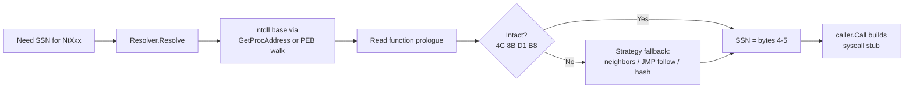
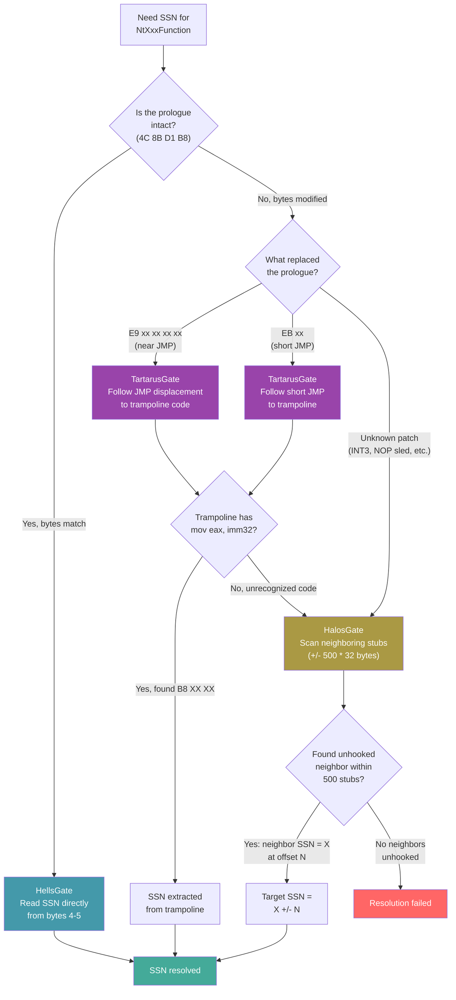
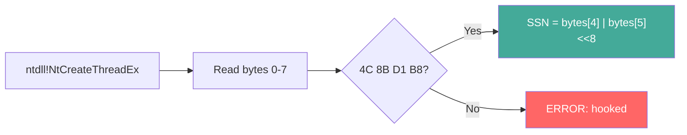
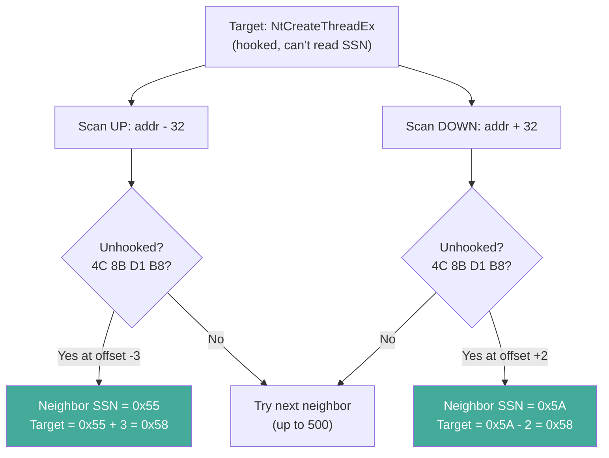
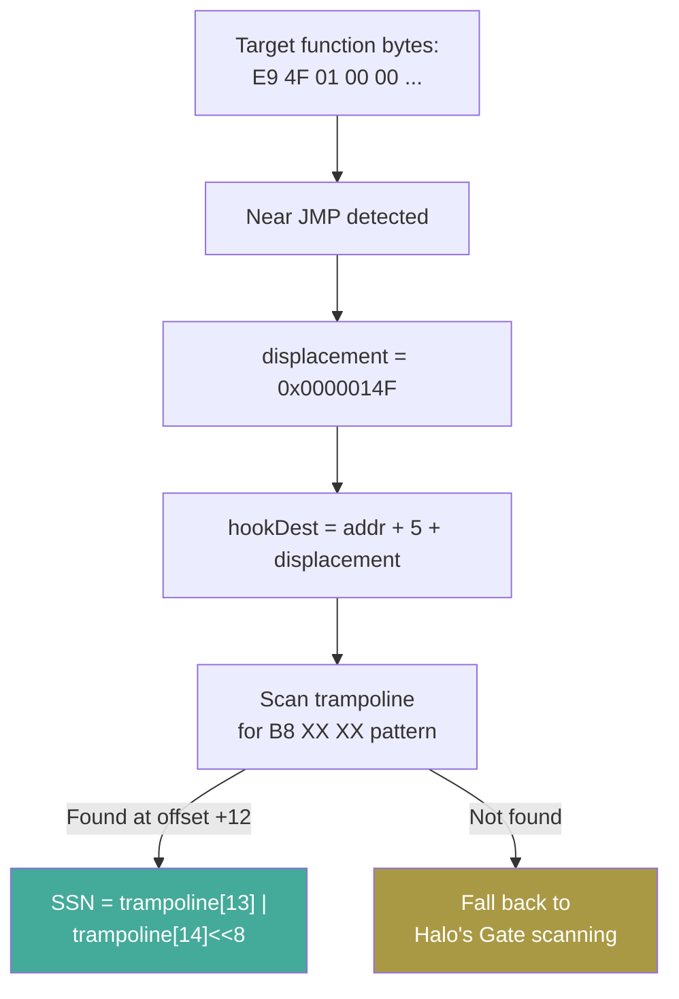
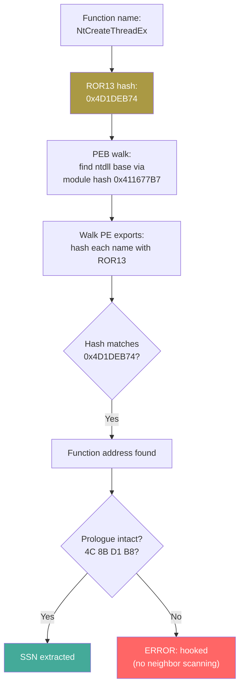

# SSN Resolvers: Hell's Gate, Halo's Gate, Tartarus Gate, HashGate

[<- Back to Syscalls Overview](README.md)

**MITRE ATT&CK:** [T1106 - Native API](https://attack.mitre.org/techniques/T1106/)
**D3FEND:** [D3-SCA - System Call Analysis](https://d3fend.mitre.org/technique/d3f:SystemCallAnalysis/)

---

> **New to maldev syscalls?** Read the [syscalls/README.md
> vocabulary callout](README.md#primer--vocabulary) first
> (syscall, NTAPI, SSN, userland hook, direct/indirect,
> API hashing, gate-family resolvers).

## What SSN resolvers are NOT

> [!IMPORTANT]
> SSN resolvers is **only** the syscall-number-discovery axis
> (concern #2 in [README.md](README.md)). It answers "where does
> the syscall service number come from when the canonical source
> (the unhooked ntdll prologue) is unavailable?".
>
> It does **not** decide:
>
> - **how the syscall fires once the SSN is known** — that's the
>   calling method ([direct-indirect.md](direct-indirect.md)).
>   `HellsGate` is happy to feed an SSN to `MethodWinAPI` — the
>   call still goes through every hook.
> - **how the Nt\* export is identified** — that's
>   [api-hashing.md](api-hashing.md). `HashGate` is the resolver
>   that *uses* api-hashing internally; the rest still need a
>   plaintext name.
>
> Switching from `HellsGate` to `TartarusGate` does not change
> what hooks see; it only changes where the SSN was read. Pair
> the resolver with the calling method that matches your
> stealth target.

## Primer

Every Windows kernel function has a secret number called the SSN (Syscall Service Number). When you want to call the kernel directly (bypassing EDR hooks), you need to know this number. The problem is, these numbers are not documented and change between Windows versions.

**Each NT function has a secret number -- these resolvers figure out the number even when guards try to hide it.** Think of it like a secret menu at a restaurant. Hell's Gate reads the number directly from the menu (if nobody has covered it up). Halo's Gate checks the neighboring items on the menu to figure out what your item's number must be. Tartarus Gate follows the "see other page" redirect that the guards placed over the menu. HashGate uses a codebook to find the menu item without even knowing its name.

---

## How It Works

Every resolver answers the same question — "what SSN does `NtXxx` map to on this host?" — but with different assumptions about how tampered the in-process ntdll is.



- **Hell's Gate** — read `mov eax, imm32` directly from the unhooked prologue. Fastest, fails on any hooked function.
- **Halo's Gate** — target hooked? scan neighbours (±500 stubs × 32 bytes). Since SSNs are sequential in ntdll, an unhooked neighbour N stubs away implies `target_SSN = neighbour_SSN ± N`.
- **Tartarus' Gate** — target patched with `E9 xx xx xx xx` or `EB xx`? follow the JMP into the EDR trampoline; most trampolines restore `mov eax, imm32` before the real `syscall` instruction.
- **Hash-based (HashGate)** — resolve the function address itself via PEB walk + ROR13 export hashing. No `"NtAllocateVirtualMemory"` string anywhere in the binary. Falls back to Hell's Gate for SSN extraction once the address is found.
- **Chain** — compose resolvers (e.g. Tartarus → HashGate → Halo's); first success wins, giving layered resilience without reimplementing the strategies individually.

---

## How Each Resolver Works

### The ntdll Prologue

Every unhooked NT function in ntdll starts with the same byte pattern:

```asm
4C 8B D1          mov r10, rcx       ; save first argument
B8 XX XX 00 00    mov eax, <SSN>     ; load syscall number
...
0F 05             syscall            ; enter kernel
C3                ret
```

The SSN is the two bytes at offset `+4` and `+5`. All resolvers ultimately extract these bytes.

### Decision Tree



---

### Hell's Gate

The simplest resolver. Reads the SSN directly from the unhooked function prologue.



**When to use:** You know ntdll is not hooked (e.g., you loaded a fresh copy from disk, or the target has no EDR).

**Fails when:** Any EDR has patched the function prologue (the most common hooking strategy).

### Halo's Gate

Extends Hell's Gate by exploiting the fact that SSNs are sequential in ntdll. If `NtCreateThreadEx` is hooked but the function 3 stubs above it (`NtCreateFile`, SSN=0x55) is not, then `NtCreateThreadEx`'s SSN is `0x55 + 3`.



**When to use:** EDR hooks your target function but leaves some neighbors unhooked.

**Fails when:** All 1000 neighboring stubs (500 up, 500 down) are hooked. Extremely unlikely in practice.

### Tartarus Gate

Extends Hell's and Halo's Gate by understanding JMP hooks. When an EDR patches a function with `E9 xx xx xx xx` (near JMP) or `EB xx` (short JMP), Tartarus follows the jump to the EDR's trampoline code. The trampoline typically restores the original `mov eax, <SSN>` instruction before executing the syscall, so Tartarus scans the trampoline for the `B8 XX XX` pattern.



**When to use:** Default choice for maximum resilience. Handles unhooked, JMP-hooked, and partially hooked ntdll.

**Fails when:** The trampoline code does not contain a recognizable `mov eax, imm32` AND all neighbors are also hooked.

### HashGate

Resolves the function address via PEB walk + ROR13 export hashing instead of `ntdll.NewProc(name)`. This eliminates string-based resolution entirely -- no `"NtAllocateVirtualMemory"` in the binary.

Once the function address is found via hash, SSN extraction uses the same Hell's Gate prologue check.



**When to use:** When you need string-free resolution. Combine with `Chain()` for hook resilience.

**Fails when:** The function is hooked (no neighbor scanning built in -- use `Chain()` with HalosGate for fallback).

---

## Usage

### Individual Resolvers

```go
import wsyscall "github.com/oioio-space/maldev/win/syscall"

// Hell's Gate -- fast, simple, fails on hooked functions
hg := wsyscall.NewHellsGate()
ssn, err := hg.Resolve("NtCreateThreadEx")

// Halo's Gate -- neighbor scanning fallback
hag := wsyscall.NewHalosGate()
ssn, err := hag.Resolve("NtCreateThreadEx")

// Tartarus Gate -- JMP hook trampoline + neighbor fallback
tg := wsyscall.NewTartarus()
ssn, err := tg.Resolve("NtCreateThreadEx")

// HashGate -- string-free PEB walk resolution
hgr := wsyscall.NewHashGate()
ssn, err := hgr.Resolve("NtCreateThreadEx")
```

### Chain: Compose Resolvers

```go
import wsyscall "github.com/oioio-space/maldev/win/syscall"

// Try Tartarus first (handles JMP hooks), fall back to HashGate,
// then Halo's Gate as last resort
resolver := wsyscall.Chain(
    wsyscall.NewTartarus(),
    wsyscall.NewHashGate(),
    wsyscall.NewHalosGate(),
)

caller := wsyscall.New(wsyscall.MethodIndirect, resolver)
defer caller.Close()

ret, err := caller.Call("NtAllocateVirtualMemory", /* args... */)
```

### With Injection Pipeline

```go
import (
    "context"

    "github.com/oioio-space/maldev/inject"
    wsyscall "github.com/oioio-space/maldev/win/syscall"
)

// Resilient resolver chain for hostile EDR environments
caller := wsyscall.New(wsyscall.MethodIndirect,
    wsyscall.Chain(
        wsyscall.NewTartarus(),
        wsyscall.NewHalosGate(),
    ),
)
defer caller.Close()

pipe := inject.NewPipeline(caller)
err := pipe.Inject(context.Background(), shellcode,
    inject.WithMethod(inject.MethodCreateThread),
)
```

---

## Combined Example: Resolver Resilience Test

```go
package main

import (
    "fmt"

    wsyscall "github.com/oioio-space/maldev/win/syscall"
)

func main() {
    functions := []string{
        "NtAllocateVirtualMemory",
        "NtProtectVirtualMemory",
        "NtCreateThreadEx",
        "NtWriteVirtualMemory",
    }

    resolvers := map[string]wsyscall.SSNResolver{
        "HellsGate":   wsyscall.NewHellsGate(),
        "HalosGate":   wsyscall.NewHalosGate(),
        "TartarusGate": wsyscall.NewTartarus(),
        "HashGate":    wsyscall.NewHashGate(),
    }

    for name, resolver := range resolvers {
        fmt.Printf("\n--- %s ---\n", name)
        for _, fn := range functions {
            ssn, err := resolver.Resolve(fn)
            if err != nil {
                fmt.Printf("  %s: FAILED (%v)\n", fn, err)
            } else {
                fmt.Printf("  %s: SSN=0x%04X\n", fn, ssn)
            }
        }
    }
}
```

---

## Advantages & Limitations

### Advantages

- **Layered resilience**: `Chain()` composes resolvers so the first successful one wins
- **JMP-hook aware**: Tartarus Gate follows EDR trampolines that other resolvers cannot handle
- **String-free option**: HashGate eliminates all plaintext function names
- **Zero external dependencies**: Pure Go + unsafe pointer arithmetic, no CGo or assembly files
- **Thread-safe**: HashGate uses `sync.Once` for lazy initialization; Caller uses `sync.Mutex` for stubs

### Limitations

- **Hell's Gate**: Fails on any hooked function -- too fragile for production use alone
- **Halo's Gate**: Assumes 32-byte stub alignment -- non-standard ntdll layouts break it
- **Tartarus Gate**: Cannot handle inline hooks that do not contain a recognizable `mov eax, imm32`
- **HashGate**: No hook resilience -- combine with Halo's/Tartarus via `Chain()` for robustness
- **All resolvers**: x64 only; SSN offsets and stub layouts differ on x86 and ARM64

---

## API Reference

Package: `github.com/oioio-space/maldev/win/syscall`. Every resolver
implements `SSNResolver` and is plugged into `Caller` via the `r`
parameter of [`syscall.New(method, r)`](direct-indirect.md#newmethod-method-r-ssnresolver-caller).
Resolvers are pure PEB-walk + memory-read code — no syscalls, no
strings on the wire, and no allocations beyond temporary lookup
buffers.

### `SSNResolver` interface

#### `type SSNResolver interface { Resolve(ntFuncName string) (uint16, error) }`

- godoc: returns the System Service Number for the named NT function (without the `Nt` prefix preserved — pass the full `"NtAllocateVirtualMemory"`).
- Description: the seam between Caller and SSN-extraction strategy. Implementations are stateless from the caller's perspective (HashGate caches an ntdll base internally via `sync.Once`, but the cache is per-instance, not global). Compose multiple strategies with `Chain(...)`.
- Parameters: `ntFuncName` — full NT name as it appears in ntdll's export table.
- Returns: SSN (uint16) on success; on failure a wrapped error explaining which extraction step missed (`"prologue hooked or unrecognized"`, `"no unhooked neighbor found within 500 stubs"`, `"HashGate: export 0x%08X not found"`, etc.).
- Side effects: in-process memory reads only.
- OPSEC: silent on success. The error messages on failure are descriptive and would land in the implant's log if not suppressed.
- Required privileges: none.
- Platform: Windows.

### Hell's Gate

#### `NewHellsGate() *HellsGateResolver`

- godoc: returns a Hell's Gate resolver — direct prologue read, no fallback.
- Description: pure constructor returning a zero-value struct (`&HellsGateResolver{}`). No initialisation, no allocations.
- Parameters: none.
- Returns: `*HellsGateResolver`. Never nil.
- Side effects: none.
- OPSEC: silent.
- Required privileges: none.
- Platform: Windows.

#### `(*HellsGateResolver).Resolve(name string) (uint16, error)`

- godoc: read the SSN from the named ntdll function's prologue.
- Description: `ntdll.NewProc(name).Find()` to locate the export, then read 32 bytes at the address. Looks for the canonical x64 prologue `4C 8B D1 B8 XX XX 00 00` (`mov r10, rcx; mov eax, <SSN>`) and extracts the little-endian SSN at offset +4. Returns `"prologue hooked or unrecognized"` if the first four bytes do not match — typical signal of an EDR JMP/CALL hook that overwrote the prologue.
- Parameters: receiver; `name` the NT function (e.g. `"NtAllocateVirtualMemory"`).
- Returns: SSN; wrapped `resolve: %w` from `Find` failure; literal `"prologue hooked or unrecognized"` on hook detection.
- Side effects: 32 bytes of read-only memory dereference at the export address.
- OPSEC: silent. Failure-then-fallback through `Chain` is the visible pattern, not Hell's Gate itself.
- Required privileges: none.
- Platform: Windows + amd64. The 32-byte prologue layout assumed is x64-specific.

### Halo's Gate

#### `NewHalosGate() *HalosGateResolver`

- godoc: returns a Halo's Gate resolver — neighbour-walk fallback when Hell's Gate fails.
- Description: pure constructor.
- Parameters: none.
- Returns: `*HalosGateResolver`. Never nil.
- Side effects: none.
- OPSEC: silent.
- Required privileges: none.
- Platform: Windows.

#### `(*HalosGateResolver).Resolve(name string) (uint16, error)`

- godoc: try Hell's Gate first; on hook, walk ±N neighbour stubs (32 bytes each) up to 500 hops away until an unhooked prologue is found, then offset-arithmetic to derive the target SSN.
- Description: composes a fresh `HellsGateResolver` internally and short-circuits on success. On failure, `proc.Find()` to get the target address, then iterates `offset = 1..500`, checking both `addr - offset*32` (yields `neighborSSN + offset`) and `addr + offset*32` (yields `neighborSSN - offset`, with an underflow guard `if uint16(offset) > neighborSSN { continue }`). The 32-byte stub assumption holds for ntdll's contiguous Nt-stub region only — system DLLs outside that region won't resolve.
- Parameters: receiver; `name` NT function.
- Returns: SSN derived from neighbour; `resolve: %w` from `Find`; `"no unhooked neighbor found within 500 stubs"` if every probe in range was also hooked.
- Side effects: up to 1000 read-only 8-byte memory dereferences in worst case (500 above + 500 below). Allocates nothing.
- OPSEC: silent. The 500-stub window covers ntdll's full Nt* surface on every shipped Windows build (Win11 25H2 has ~400 syscalls); 500 is comfortably above that.
- Required privileges: none.
- Platform: Windows + amd64.

### Tartarus Gate

#### `NewTartarus() *TartarusGateResolver`

- godoc: returns a Tartarus Gate resolver — JMP-hook trampoline reader, falls back to Halo's Gate.
- Description: pure constructor.
- Parameters: none.
- Returns: `*TartarusGateResolver`. Never nil.
- Side effects: none.
- OPSEC: silent.
- Required privileges: none.
- Platform: Windows.

#### `(*TartarusGateResolver).Resolve(name string) (uint16, error)`

- godoc: handle JMP-hooked exports by following the displacement and scanning the trampoline for the original `mov eax, <SSN>`. Falls through to Halo's Gate on miss.
- Description: reads the 32-byte prologue. Three branches: (1) clean prologue (`4C 8B D1 B8`) — return immediately; (2) near-JMP hook (`E9 XX XX XX XX`) — read the rel32 displacement, jump to `addr + 5 + disp`, scan the next 60 bytes for `B8 XX XX` (mov eax, imm32), return the imm16; (3) short-JMP hook (`EB XX`) — read the rel8 displacement, jump to `addr + 2 + disp`, same 60-byte scan. If none match, delegate to a fresh `HalosGateResolver`.
- Parameters: receiver; `name` NT function.
- Returns: SSN extracted from clean prologue / trampoline / neighbour walk; `resolve: %w` from `Find`; whatever Halo's Gate returns on full fallback.
- Side effects: read-only memory reads. Allocates nothing.
- OPSEC: silent. The 60-byte trampoline scan is a heuristic — EDR vendors who emit non-canonical trampoline shapes (e.g., scratch-register save first) will fall through to Halo's Gate.
- Required privileges: none. Reading the EDR trampoline page is read-only — does not require write access.
- Platform: Windows + amd64.

### HashGate (string-free resolver)

#### `NewHashGate() *HashGateResolver`

- godoc: returns a HashGate resolver using the package default ROR13 — equivalent to `NewHashGateWith(nil)`.
- Description: returns `&HashGateResolver{ntdllHash: hashNtdll}`. The `hashNtdll` constant is the precomputed `ROR13("ntdll.dll")` baked into the binary at build. Use `NewHashGateWith` with a custom `HashFunc` to remove this fingerprint.
- Parameters: none.
- Returns: `*HashGateResolver`. Never nil.
- Side effects: none until the first `Resolve` call.
- OPSEC: a binary using `NewHashGate()` carries the well-known ROR13 hash of `"ntdll.dll"` — recognised by `capa` and several public YARA rules. Switch to `NewHashGateWith` for fresh families.
- Required privileges: none.
- Platform: Windows.

#### `NewHashGateWith(fn HashFunc) *HashGateResolver`

- godoc: returns a HashGate resolver using the supplied hash function for both module-name and export-name lookups.
- Description: short-circuits to `NewHashGate()` if `fn == nil`. Otherwise computes `fn("ntdll.dll")` and stores it as `ntdllHash` so the binary no longer carries the canonical ROR13 module-name constant. **The same `fn` must be used by the caller to pre-compute the function-hash constants** — both ends of the lookup must agree on the hash family.
- Parameters: `fn` a `HashFunc` (or nil).
- Returns: `*HashGateResolver`. Never nil.
- Side effects: one `fn("ntdll.dll")` call at construction time.
- OPSEC: per-implant fresh family eliminates the static-analysis fingerprint of canonical ROR13 hash constants.
- Required privileges: none.
- Platform: Windows.

#### `(*HashGateResolver).Resolve(name string) (uint16, error)`

- godoc: PEB-walk → export hash match → prologue read.
- Description: thread-safe lazy init via `sync.Once` — first call walks the PEB by `ntdllHash` (via internal `pebModuleByHashFunc`) and caches the resolved base; subsequent calls reuse the cache. Then hashes `name` (with `r.hashFunc` or ROR13 fallback), walks ntdll's export table by hash to find the function address, and extracts the SSN from the prologue using the same `4C 8B D1 B8` pattern as Hell's Gate. Does NOT chain to Halo's Gate on hook detection — composers wanting that behaviour use `Chain(NewHashGate(), NewHalosGate())`.
- Parameters: receiver; `name` NT function (caller may pre-hash and use `Caller.CallByHash` to avoid the string entirely from outside).
- Returns: SSN; wrapped errors `HashGate: ntdll not found via PEB walk: %w`, `HashGate: export 0x%08X not found: %w`, or literal `"HashGate: prologue hooked"`.
- Side effects: one PEB walk on first call (cached). Per-call: one export-table hash walk + one 32-byte prologue read. Allocates nothing on the hot path.
- OPSEC: completely string-free — no `"NtAllocateVirtualMemory"` or `"ntdll.dll"` constant in `.rdata` when paired with a non-ROR13 family. Memory accesses are local and read-only.
- Required privileges: none.
- Platform: Windows + amd64.

### Composition

#### `Chain(resolvers ...SSNResolver) *ChainResolver`

- godoc: build a resolver that tries each child in order and returns the first success.
- Description: stores the slice as-is. Pass the cheapest-first ordering, e.g. `Chain(NewHellsGate(), NewHashGate(), NewHalosGate(), NewTartarus())` — short-circuits on the first clean prologue read.
- Parameters: variadic resolver list (zero-length is legal — resulting Resolve always errors with `"all resolvers failed"`).
- Returns: `*ChainResolver`. Never nil.
- Side effects: none at construction.
- OPSEC: silent.
- Required privileges: none.
- Platform: Windows.

#### `(*ChainResolver).Resolve(name string) (uint16, error)`

- godoc: try each child resolver in order; first success wins.
- Description: iterates `c.resolvers`, calls `Resolve` on each, returns on first nil-error. Captures the **last** error in the chain (not all of them) and wraps it as `all resolvers failed: %w` if every child failed.
- Parameters: receiver; `name` NT function.
- Returns: first SSN; `all resolvers failed: %w` containing the last child's error if every probe missed.
- Side effects: union of side effects of each invoked child.
- OPSEC: silent on success; chain-failure log line on miss is the only signal.
- Required privileges: none.
- Platform: Windows.

### Hash function plumbing (cross-reference)

`HashFunc` and `HashROR13` are documented in the [direct-indirect §
"Hash function plumbing"](direct-indirect.md#hash-function-plumbing)
section — they are used identically by Caller and HashGateResolver.

## See also

- [Syscalls area README](README.md)
- [`syscalls/api-hashing.md`](api-hashing.md) — HashGate uses these primitives to find Nt* exports
- [`syscalls/direct-indirect.md`](direct-indirect.md) — once the SSN is known, this is how the syscall fires
