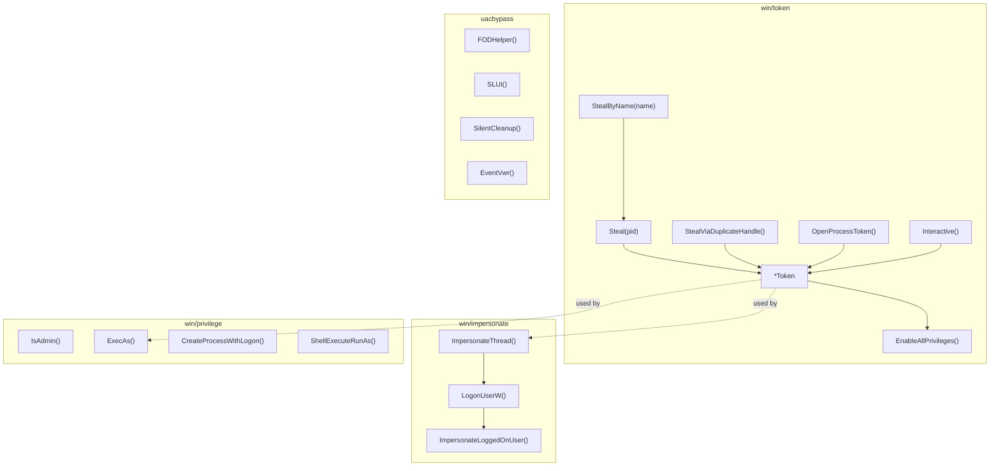

# Token Manipulation

[<- Back to Techniques](../../../docs/)

The `win/token`, `win/impersonate`, `win/privilege`, and `uacbypass` packages provide Windows token manipulation: stealing tokens from other processes, thread impersonation, privilege escalation, and UAC bypass.

---

## Architecture Overview

## Documentation

| Document | Description |
|----------|-------------|
| [Token Theft](token-theft.md) | Steal, StealByName, StealViaDuplicateHandle |
| [Thread Impersonation](impersonation.md) | LogonUserW + ImpersonateLoggedOnUser |
| [Privilege Escalation](privilege-escalation.md) | ExecAs, CreateProcessWithLogon, UAC bypass |

## MITRE ATT&CK

| Technique | ID | Description |
|-----------|-----|-------------|
| Access Token Manipulation | [T1134](https://attack.mitre.org/techniques/T1134/) | Token theft and manipulation |
| Token Impersonation/Theft | [T1134.001](https://attack.mitre.org/techniques/T1134/001/) | Thread impersonation |
| Abuse Elevation Control Mechanism: UAC Bypass | [T1548.002](https://attack.mitre.org/techniques/T1548/002/) | FODHelper, SLUI, SilentCleanup, EventVwr |

## D3FEND Countermeasures

| Countermeasure | ID | Description |
|----------------|-----|-------------|
| Token Authentication and Authorization Normalization | [D3-TAAN](https://d3fend.mitre.org/technique/d3f:TokenAuthenticationandAuthorizationNormalization/) | Monitor token manipulation |
| User Account Profiling | [D3-UAP](https://d3fend.mitre.org/technique/d3f:UserAccountProfiling/) | Detect privilege escalation |
