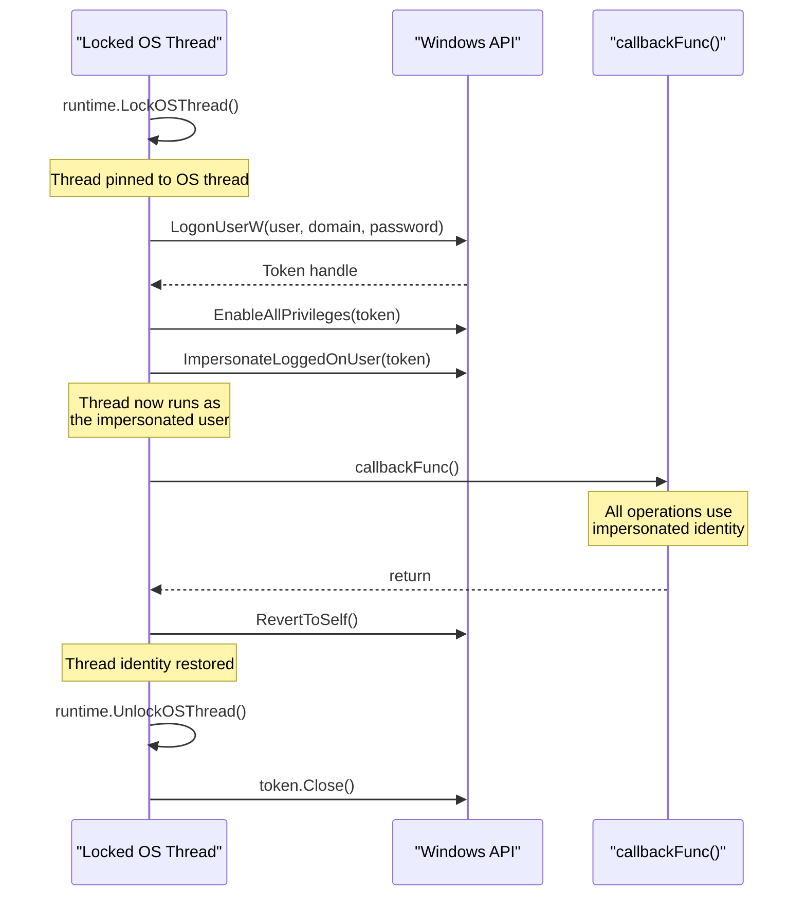

# Thread Impersonation

[<- Back to Tokens Overview](README.md)

**MITRE ATT&CK:** [T1134.001 - Access Token Manipulation: Token Impersonation/Theft](https://attack.mitre.org/techniques/T1134/001/)
**D3FEND:** [D3-TAAN - Token Authentication and Authorization Normalization](https://d3fend.mitre.org/technique/d3f:TokenAuthenticationandAuthorizationNormalization/)

---

## TL;DR

You stole / borrowed another user's token (via [token-theft](token-theft.md)
or `LogonUserW`). To USE that token for an operation (open a
file as them, hit an SMB share with their creds), you attach
it to a thread — that thread now acts as that user until you
revert.

| You want… | Use | Scope |
|---|---|---|
| Run a callback as another user | [`As`](#as) | One callback's lifetime; auto-revert |
| Long-lived impersonation across calls | `ImpersonateLoggedOnUser` + manual revert | Until `RevertToSelf` |
| Per-thread, parallel impersonations | `runtime.LockOSThread` + `As` per goroutine | One per OS thread |

What this DOES achieve:

- Network operations (SMB, WinRM, MSRPC) authenticate as the
  impersonated user — useful for accessing shares your
  current token can't reach.
- File / registry access checks against the impersonated
  token's ACLs.
- Scoped + reversible — the token attaches to ONE thread,
  not the whole process.

What this does NOT achieve:

- **Doesn't change WHO the process is** — Process Hacker /
  Sysmon EID 1 still see your real user. Impersonation is
  per-thread and per-API-call.
- **Goroutine ↔ OS-thread mismatch** — Go's scheduler can
  move your goroutine onto a different OS thread mid-call,
  losing the impersonation. `runtime.LockOSThread` is
  mandatory before `ImpersonateLoggedOnUser`.
- **Doesn't survive `CreateProcess`** — child processes
  inherit the PROCESS token, not the THREAD token. To spawn
  AS the impersonated user, use [`token-theft`](token-theft.md)'s
  `CreateProcessWithToken` path instead.
- **`SeImpersonatePrivilege` required** — most service
  accounts have it; standard user does not. Check before
  trying.

---

## Primer

Token theft gives you a copy of someone else's badge. Thread impersonation goes further -- it lets a specific thread in your process temporarily wear that badge to perform actions as that user, then revert back to your original identity.

**Temporarily wearing someone else's uniform for a specific task.** You log in as another user (with their credentials), impersonate their identity on a locked OS thread, do the work, then call `RevertToSelf()` to become yourself again. The impersonation is scoped to a single thread and automatically cleaned up.

---

## How It Works

### Impersonation Flow



### Why LockOSThread is Required

```mermaid
flowchart TD
    subgraph "Without LockOSThread (BROKEN)"
        A1["goroutine calls\nImpersonateLoggedOnUser"] --> A2["Go scheduler moves\ngoroutine to OS Thread 2"]
        A2 --> A3["OS Thread 1 still impersonating\nOS Thread 2 is NOT impersonating"]
        A3 --> A4["Operations use WRONG identity"]
    end

    subgraph "With LockOSThread (CORRECT)"
        B1["goroutine calls\nruntime.LockOSThread()"] --> B2["goroutine calls\nImpersonateLoggedOnUser"]
        B2 --> B3["Go scheduler CANNOT\nmove this goroutine"]
        B3 --> B4["All operations on\nimpersonated OS thread"]
        B4 --> B5["RevertToSelf()"]
        B5 --> B6["runtime.UnlockOSThread()"]
    end

    style A4 fill:#f66,color:#fff
    style B4 fill:#4a9,color:#fff
```



---

## Usage

### Basic Thread Impersonation

```go
import "github.com/oioio-space/maldev/win/impersonate"

err := impersonate.ImpersonateThread(
    false,           // not domain-joined
    ".",             // local machine
    "admin",         // username
    "Password123!",  // password
    func() error {
        // Everything in this callback runs as "admin"
        user, domain, _ := impersonate.ThreadEffectiveTokenOwner()
        fmt.Printf("Running as: %s\\%s\n", domain, user)

        // Perform privileged operations here
        return nil
    },
)
```

### Domain Impersonation

```go
err := impersonate.ImpersonateThread(
    true,                // domain-joined
    "CORP",              // domain name
    "svc_backup",        // domain user
    "BackupP@ss2024!",   // password
    func() error {
        // Running as CORP\svc_backup
        // Access network shares, domain resources, etc.
        return nil
    },
)
```

### Low-Level: LogonUserW + ImpersonateLoggedOnUser

```go
import (
    "runtime"
    "github.com/oioio-space/maldev/win/impersonate"
    "github.com/oioio-space/maldev/win/token"
    "golang.org/x/sys/windows"
)

runtime.LockOSThread()
defer runtime.UnlockOSThread()

// Log in as another user
t, err := impersonate.LogonUserW(
    "admin", ".", "Password123!",
    impersonate.LOGON32_LOGON_INTERACTIVE,
    impersonate.LOGON32_PROVIDER_DEFAULT,
)
if err != nil {
    log.Fatal(err)
}

wt := token.New(t, token.Impersonation)
defer wt.Close()

// Enable privileges on the token
wt.EnableAllPrivileges()

// Impersonate on this thread
impersonate.ImpersonateLoggedOnUser(wt.Token())
defer windows.RevertToSelf()

// Perform actions as the impersonated user
user, domain, _ := impersonate.ThreadEffectiveTokenOwner()
fmt.Printf("Impersonating: %s\\%s\n", domain, user)
```

---

## Combined Example: Impersonate + Access Protected Resource

```go
package main

import (
    "fmt"
    "os"

    "github.com/oioio-space/maldev/win/impersonate"
)

func main() {
    // Check current identity
    user, domain, _ := impersonate.ThreadEffectiveTokenOwner()
    fmt.Printf("Before: %s\\%s\n", domain, user)

    // Impersonate a service account to read a protected file
    err := impersonate.ImpersonateThread(
        true,              // domain account
        "CORP",
        "svc_fileserver",
        "FileServ!2024",
        func() error {
            // Running as CORP\svc_fileserver
            user, domain, _ := impersonate.ThreadEffectiveTokenOwner()
            fmt.Printf("During: %s\\%s\n", domain, user)

            // Read a file only accessible to svc_fileserver
            data, err := os.ReadFile(`\\fileserver\share$\sensitive.dat`)
            if err != nil {
                return err
            }
            fmt.Printf("Read %d bytes from protected share\n", len(data))
            return nil
        },
    )
    if err != nil {
        fmt.Println("Impersonation failed:", err)
    }

    // Back to original identity
    user, domain, _ = impersonate.ThreadEffectiveTokenOwner()
    fmt.Printf("After: %s\\%s\n", domain, user)
}
```

---

## Advantages & Limitations

### Advantages

- **Scoped impersonation**: `ImpersonateThread` handles LockOSThread + RevertToSelf automatically
- **Privilege escalation**: `EnableAllPrivileges` called on the token before impersonation
- **Domain support**: Works with both local and domain accounts
- **errgroup integration**: Uses `golang.org/x/sync/errgroup` for clean error propagation
- **Thread safety**: `runtime.LockOSThread()` ensures impersonation stays on the correct OS thread

### Limitations

- **Requires credentials**: Needs plaintext username and password (not a token)
- **Logon type limitations**: `LOGON32_LOGON_INTERACTIVE` requires "Allow log on locally" right
- **Network logon restrictions**: Local accounts cannot access network resources via type 2 logon
- **Detectable**: `LogonUserW` creates logon events (Event ID 4624) in the Security log
- **Single thread**: Only the locked OS thread is impersonated -- other goroutines run as the original user

---

## Composable Elevation

The `impersonate` package provides composable elevation primitives that chain
together: `ImpersonateByPID` is the building block, `GetSystem` uses it to
reach SYSTEM via winlogon.exe, and `GetTrustedInstaller` composes `GetSystem`
with the TrustedInstaller service to reach the highest privilege level.

All three follow the callback pattern -- the elevated identity is scoped to the
callback and automatically reverted when it returns.

### ImpersonateByPID

Steal and impersonate the token of any process by PID. Requires
SeDebugPrivilege for cross-session processes.

```go
import "github.com/oioio-space/maldev/win/impersonate"

// Impersonate the token of PID 1234
err := impersonate.ImpersonateByPID(1234, func() error {
    user, domain, _ := impersonate.ThreadEffectiveTokenOwner()
    fmt.Printf("Running as: %s\\%s\n", domain, user)
    return nil
})
```

### GetSystem

Elevate to NT AUTHORITY\SYSTEM by stealing the winlogon.exe token.
Requires admin + SeDebugPrivilege.

```go
err := impersonate.GetSystem(func() error {
    user, domain, _ := impersonate.ThreadEffectiveTokenOwner()
    fmt.Printf("Running as: %s\\%s\n", domain, user)
    // NT AUTHORITY\SYSTEM — full kernel-level access
    return nil
})
```

### GetTrustedInstaller

Elevate to NT SERVICE\TrustedInstaller -- the highest privilege level on
Windows. Internally composes `GetSystem` (to open the TI service process)
with `ImpersonateByPID` (to steal the TI token). Requires admin +
SeDebugPrivilege.

```go
err := impersonate.GetTrustedInstaller(func() error {
    user, _, _ := impersonate.ThreadEffectiveTokenOwner()
    fmt.Printf("Running as: %s\n", user) // TrustedInstaller

    // Modify protected system files, registry keys, etc.
    return nil
})
```

### Composition Example

```go
// Chain: admin -> SYSTEM -> TrustedInstaller -> back to admin
// All within a single function call
err := impersonate.GetTrustedInstaller(func() error {
    // Delete a protected system file
    return os.Remove(`C:\Windows\System32\protected.dll`)
})
// Thread has reverted to original identity here
```

---

## API Reference

Package: `github.com/oioio-space/maldev/win/impersonate`. All callbacks
run on a locked OS thread (`runtime.LockOSThread` + deferred
`UnlockOSThread`); the thread reverts to self via
`windows.RevertToSelf` when the callback returns. Errors from
`callbackFunc` propagate verbatim.

### `ImpersonateThread(isInDomain bool, domain, username, password string, callbackFunc func() error) error`

- godoc: run `callbackFunc` under the credentials of the named user.
- Description: calls `LogonUserW` with `LOGON32_LOGON_INTERACTIVE` + `LOGON32_PROVIDER_DEFAULT`, wraps the resulting handle in a `token.Token` (impersonation type), enables every available privilege on it, then runs `runImpersonated`. When `isInDomain == false` the local SAM is targeted (`domain` is forced to `"."`).
- Parameters: `isInDomain` selects the SAM (`false` ⇒ local). `domain`/`username`/`password` are the cleartext credentials. `callbackFunc` runs under the impersonated identity.
- Returns: error from `LogonUserW`, `EnableAllPrivileges`, or `callbackFunc`.
- Side effects: spawns a goroutine pinned to one OS thread; closes the duplicated token after the callback. No persistent state.
- OPSEC: `LogonUserW` produces a 4624 logon event (Type 2 — Interactive) on the local DC/SAM each call. Audit-Logon-success policies pick it up. Hot path on a locked-down host.
- Required privileges: unprivileged for local accounts; matching credentials for domain accounts. Network reachability to a DC required when `isInDomain == true`.
- Platform: Windows. Stub build returns "not implemented".

### `ImpersonateToken(tok *token.Token, callbackFunc func() error) error`

- godoc: run `callbackFunc` under an already-stolen or duplicated token.
- Description: thin shim over `runImpersonated` taking the wrapped `token.Token` handle. Use when you already have a duplicated impersonation token from `token.Steal`, `token.StealByName`, or `token.Interactive` — sidesteps the cleartext-credential requirement of `ImpersonateThread`.
- Parameters: `tok` must wrap a non-zero impersonation token (from the `token` package). `callbackFunc` runs under that identity.
- Returns: error from `ImpersonateLoggedOnUser` or `callbackFunc`.
- Side effects: same as `runImpersonated`; does not close `tok`.
- OPSEC: silent — no LogonUserW, no logon event. The 4624 (or 4672 for SeDebug) was emitted earlier by whoever produced `tok`.
- Required privileges: depends on the source token. Local impersonation generally requires `SeImpersonatePrivilege` (held by SYSTEM, services, and elevated admins).
- Platform: Windows.

### `ImpersonateByPID(pid uint32, fn func() error) error`

- godoc: impersonate the named process and run `fn` under its identity.
- Description: calls `token.Steal(pid)` to duplicate the target's primary token into an impersonation token, then `runImpersonated`. Closes the stolen handle on return.
- Parameters: `pid` of the target (any session); `fn` runs under that identity.
- Returns: wrapped error `steal token from PID %d: %w` on `token.Steal` failure; otherwise the callback's error.
- Side effects: `OpenProcess(PROCESS_QUERY_LIMITED_INFORMATION)` against the target.
- OPSEC: opening protected processes (PPL/PP) returns Access Denied; lsass/csrss/services with PPL set are off-limits without driver-side help. Non-PPL system services are fine.
- Required privileges: `SeDebugPrivilege` for cross-session or elevated targets; otherwise unprivileged for same-user targets.
- Platform: Windows.

### `GetSystem(fn func() error) error`

- godoc: run `fn` under `NT AUTHORITY\SYSTEM` by stealing winlogon.exe's token.
- Description: locates the first `winlogon.exe` PID via `process/enum.FindByName`, then delegates to `ImpersonateByPID`. winlogon is unprotected and runs as SYSTEM — the canonical donor.
- Parameters: `fn` runs as SYSTEM.
- Returns: wrapped `find winlogon: %w` if the process can't be located; otherwise propagates `ImpersonateByPID`.
- Side effects: enumerates the full process snapshot once.
- OPSEC: `OpenProcess` against winlogon is a strong indicator on EDR baselines (Sysmon Event 10 with GrantedAccess containing token-related rights). Highly correlated with privilege-escalation playbooks.
- Required privileges: admin + `SeDebugPrivilege`. Fails silently from medium-IL.
- Platform: Windows.

### `GetTrustedInstaller(fn func() error) error`

- godoc: run `fn` under `NT SERVICE\TrustedInstaller` — strictly above SYSTEM in the ACL hierarchy.
- Description: nests two impersonations — first elevates to SYSTEM via `GetSystem` (required to open the TI process), then starts the `TrustedInstaller` service via SCM, polls `QueryServiceStatusEx` for `SERVICE_RUNNING`, and finally `ImpersonateByPID` on the TI service PID. The service must already be installed (default on every Windows SKU).
- Parameters: `fn` runs as TrustedInstaller (effective TokenUser remains S-1-5-18 SYSTEM, but the token Groups gain `S-1-5-80-956008885-3418522649-1831038044-1853292631-2271478464` — use `ThreadEffectiveTokenHasGroup` to verify).
- Returns: nested wrapped errors from `GetSystem` / `startAndFindTI` / `ImpersonateByPID`. The polling loop waits up to 10 s and returns `"TrustedInstaller service did not start within 10s"` if the SCM never reports RUNNING.
- Side effects: starts the service if stopped (it auto-stops after a few minutes idle) and leaves it running. SCM logon event on the start.
- OPSEC: TI impersonation lets an attacker bypass file-system ACLs that even SYSTEM cannot (e.g., `Windows\System32\WindowsApps`). The pattern of `OpenProcess(winlogon)` → `StartService(TrustedInstaller)` → `OpenProcess(TI)` is heavily flagged.
- Required privileges: admin + `SeDebugPrivilege`.
- Platform: Windows.

### `RunAsTrustedInstaller(cmd string, args ...string) (*exec.Cmd, error)`

- godoc: spawn `cmd args...` as a child of the TrustedInstaller service process.
- Description: calls `startAndFindTI` to ensure TI is running, then opens it with `PROCESS_CREATE_PROCESS` and uses `SysProcAttr.ParentProcess` to PPID-spoof the new process under the TI handle. Window is hidden (`HideWindow: true`). The returned `*exec.Cmd` is already started — caller must invoke `Wait`.
- Parameters: `cmd` is the executable path; `args` are passed verbatim.
- Returns: started `*exec.Cmd` (stdin/stdout/stderr unset by default); wrapped `start command: %w` or `open TrustedInstaller process: %w` on failure.
- Side effects: starts the TI service if stopped; spawns a child process inheriting TI's privileges.
- OPSEC: a child of `TrustedInstaller.exe` is anomalous — TI has a tiny canonical descendant set (mostly `WindowsUpdate`/`MoUsoCoreWorker`). Any other child process is a high-fidelity detection for this exact technique.
- Required privileges: admin + `SeDebugPrivilege` (needed to `OpenProcess(TI, PROCESS_CREATE_PROCESS)`).
- Platform: Windows.

### `LogonUserW(username, domain, password string, logonType LogonType, logonProvider LogonProvider) (windows.Token, error)`

- godoc: thin wrapper over `advapi32!LogonUserW`. Returns the resulting Windows token.
- Description: validates a credential pair against the local SAM or a DC and issues a primary token of the requested logon type. Underlies `ImpersonateThread` but is exported for callers who want to keep the token for later (e.g., `CreateProcessAsUserW`).
- Parameters: `username`/`domain`/`password` cleartext (UTF-8, internally widened); `logonType` selects the logon kind (see constants below); `logonProvider` is normally `LOGON32_PROVIDER_DEFAULT`.
- Returns: a `windows.Token` (caller closes via `windows.Token.Close`); on failure `windows.Token(windows.InvalidHandle)` plus a `*os.SyscallError` wrapping the `LastError`.
- Side effects: emits a 4624 (success) or 4625 (failure) logon event with the chosen type.
- OPSEC: `LOGON32_LOGON_NEW_CREDENTIALS` (9) is the stealthiest — credentials are not validated locally, only used outbound for network auth, so 4624 fires with TargetUserName == caller. Use it for over-the-wire credential injection without a noisy local logon. `LOGON32_LOGON_INTERACTIVE` (2) is the loudest.
- Required privileges: unprivileged for any account whose credentials are valid; `SeTcbPrivilege` (TCB) historically required pre-Vista, no longer needed for cleartext logons.
- Platform: Windows.

### `ImpersonateLoggedOnUser(t windows.Token) error`

- godoc: thin wrapper over `advapi32!ImpersonateLoggedOnUser`.
- Description: attaches the token to the current thread's impersonation slot. The thread inherits `t`'s identity until `windows.RevertToSelf` runs. Building block under all the higher-level helpers — exported so callers can compose their own thread-pinning policy.
- Parameters: `t` an impersonation-grade token (primary tokens are auto-promoted on impersonation level lookup).
- Returns: `*os.SyscallError("ImpersonateLoggedOnUser", lastErr)` on failure; nil on success.
- Side effects: mutates the calling thread's impersonation token. Caller is responsible for `runtime.LockOSThread` + `windows.RevertToSelf`.
- OPSEC: silent in event logs (no 4624). `SeImpersonatePrivilege` lookup is invisible.
- Required privileges: `SeImpersonatePrivilege` for tokens above the caller's IL/group set.
- Platform: Windows.

### `ThreadEffectiveTokenOwner() (user, domain string, err error)`

- godoc: returns the user/domain of the current thread's effective token.
- Description: reads `GetCurrentThreadEffectiveToken` then `GetTokenUser` then `LookupAccountSidW`. The "effective" token is the impersonation token if one is attached, otherwise the process token. Used to verify an impersonation actually took effect.
- Parameters: none.
- Returns: localised `user`/`domain` strings (e.g. `"Système"` / `"AUTORITE NT"` on fr-FR). Empty strings + non-nil error on failure.
- Side effects: one LSA RPC for the SID-to-name lookup.
- OPSEC: `LookupAccountSidW` round-trips to LSA; not stealthy on systems with LSA telemetry.
- Required privileges: unprivileged (reads own thread).
- Platform: Windows.

### `ThreadEffectiveTokenSID() (string, error)`

- godoc: returns the SID string of the current thread's effective token.
- Description: same path as `ThreadEffectiveTokenOwner` but stops at `Sid.String()` — no LSA lookup. Locale-independent. Use this in tests asserting "we got SYSTEM" (compare against `"S-1-5-18"`) instead of comparing localized strings.
- Parameters: none.
- Returns: SID string (e.g. `"S-1-5-18"` for SYSTEM, `"S-1-5-19"` for LocalService).
- Side effects: none.
- OPSEC: silent — no LSA traffic.
- Required privileges: unprivileged.
- Platform: Windows.

### `ThreadEffectiveTokenHasGroup(sid string) (bool, error)`

- godoc: reports whether the effective token's Groups list contains `sid`.
- Description: needed to distinguish service-impersonation contexts where `TokenUser` stays `S-1-5-18` (SYSTEM) but the token has picked up an additional service SID. Concrete case: after `GetTrustedInstaller`, `ThreadEffectiveTokenSID` still returns `"S-1-5-18"` — the only way to confirm TI elevation is to check for the TI service SID in Groups.
- Parameters: `sid` — string SID to search for (e.g. `"S-1-5-80-956008885-..."` for TrustedInstaller).
- Returns: `true` if the group is present; `false` otherwise; non-nil error if `sid` fails to parse or the token's Groups can't be read.
- Side effects: parses `sid` via `windows.StringToSid`. No explicit `LocalFree` — see in-source comment: explicit free has been observed to crash on Win10/11 builds (likely double-free with x/sys/windows finalizer); the trivial leak is acceptable for short-lived processes.
- OPSEC: silent.
- Required privileges: unprivileged.
- Platform: Windows.

### Logon type and provider constants

```go
type LogonType uint32
const (
    LOGON32_LOGON_INTERACTIVE     LogonType = 2  // local desktop logon — emits noisy 4624 type 2
    LOGON32_LOGON_NETWORK         LogonType = 3  // SMB/RPC-style credential check, no token cached
    LOGON32_LOGON_BATCH           LogonType = 4  // scheduled-task style
    LOGON32_LOGON_SERVICE         LogonType = 5  // service-account style
    LOGON32_LOGON_NEW_CREDENTIALS LogonType = 9  // stealthiest: cred only used outbound, no local validation
)

type LogonProvider uint32
const (
    LOGON32_PROVIDER_DEFAULT LogonProvider = 0  // NTLM/Negotiate as appropriate
)
```

OPSEC summary: prefer `LOGON32_LOGON_NEW_CREDENTIALS` for outbound-credential scenarios (it doesn't validate against the local SAM and keeps the local 4624 footprint to a no-op type-9). For genuine impersonation of a local user, type 2 is the only choice and accept the audit footprint.

## See also

- [Tokens area README](README.md)
- [`tokens/token-theft.md`](token-theft.md) — supplies the stolen handle this primitive impersonates with
- [`tokens/privilege-escalation.md`](privilege-escalation.md) — once impersonated, adjust privileges on the new context
