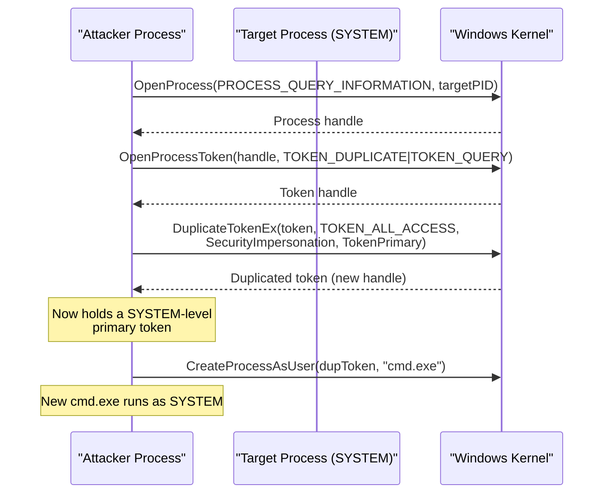
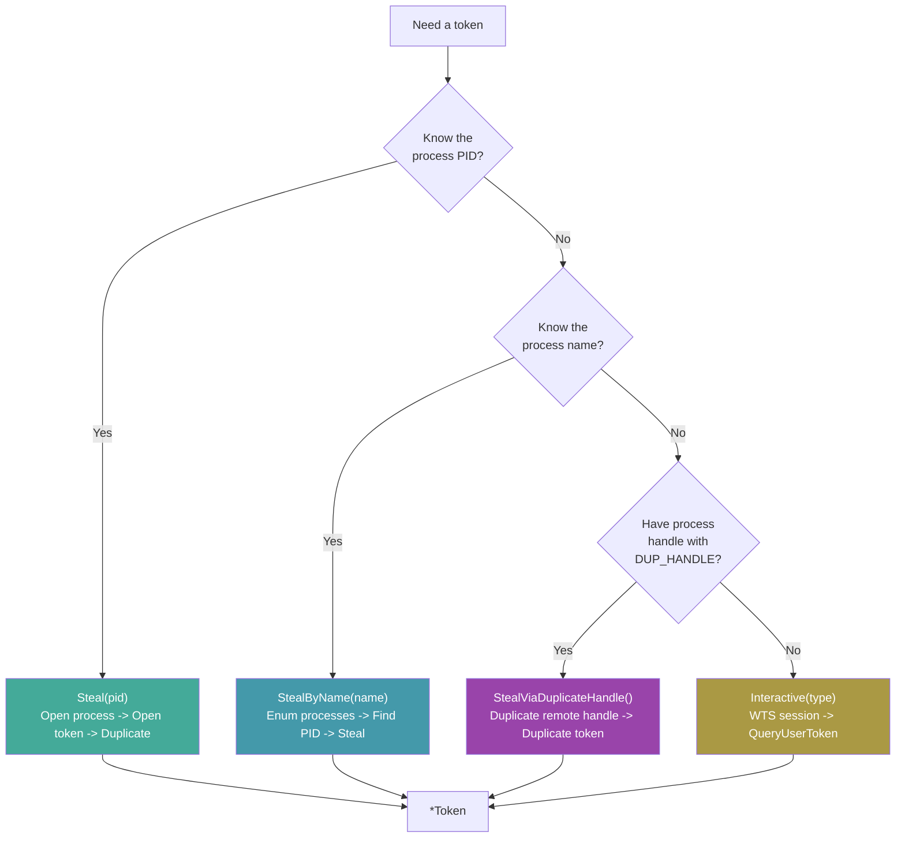
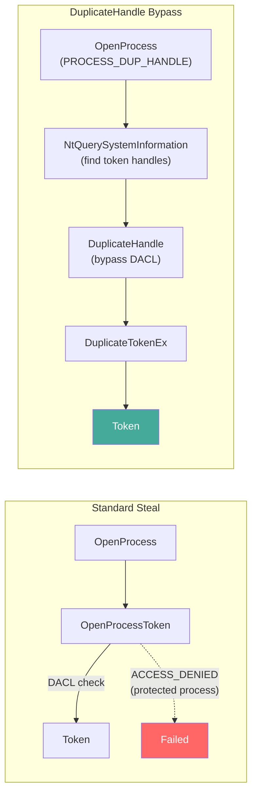

# Token Stealing

[<- Back to Tokens Overview](README.md)

**MITRE ATT&CK:** [T1134 - Access Token Manipulation](https://attack.mitre.org/techniques/T1134/)
**D3FEND:** [D3-TAAN - Token Authentication and Authorization Normalization](https://d3fend.mitre.org/technique/d3f:TokenAuthenticationandAuthorizationNormalization/)

---

## TL;DR

You're admin (or have `SeDebugPrivilege`) and want to act as
SYSTEM (or as another user). Steal their token, use it to
spawn a process as them.

| You want to… | Use | Result |
|---|---|---|
| Get a SYSTEM token from `winlogon.exe` / `lsass.exe` | [`StealFromProcess`](#stealfromprocess) | Token handle ready for impersonation or process spawn |
| Spawn a process AS that user | [`CreateProcessWithToken`](#createprocesswithtoken) | New process running with the stolen token |
| Just impersonate on the current thread | Pair with [`tokens/impersonation`](impersonation.md) | Per-thread; reverts when done |

What this DOES achieve:

- SYSTEM-level access from any admin starting point. Once
  you have a SYSTEM token + `CreateProcessWithToken`, you can
  spawn an implant that runs as SYSTEM with no UAC prompt.
- Original process unaffected — duplication, not transfer.
- Composes with [`tokens/impersonation`](impersonation.md) for
  per-thread use.

What this does NOT achieve:

- **Needs `SeDebugPrivilege`** — admin token has it disabled
  by default; enable via `process/session.EnableSeDebugPrivilege`
  first. Standard user can't steal high-priv tokens.
- **Loud** — `OpenProcess(PROCESS_QUERY_INFORMATION | PROCESS_DUP_HANDLE)`
  on `lsass.exe` is the textbook EDR trigger for credential
  access. Pair with [`evasion/preset.Stealth`](../evasion/preset.md)
  to silence ETW first.
- **Doesn't bypass kernel callbacks** — `PsSetCreateProcessNotify`
  fires when you spawn the new process. EDR sees a
  high-integrity process spawned by your medium-integrity
  one — anomaly.
- **Per-process, not per-domain** — token theft = local
  identity transfer. For domain access, the stolen token
  needs network logon credentials inside it (interactive
  logons usually do; service tokens often don't).

---

## Primer

Every process on Windows runs under a security token that defines who it is and what it can do. A SYSTEM process has a powerful token; a regular user process has a limited one.

**Stealing someone's employee badge to access restricted areas.** Token theft duplicates the security token from a high-privilege process (like `lsass.exe` or `winlogon.exe`) and uses it to create new processes or perform actions with that identity. The original process is unaffected -- you have a copy of its badge.

---

## How It Works

### Token Theft Flow



### Three Theft Methods



### DuplicateHandle Bypass

The `StealViaDuplicateHandle` technique bypasses the token's DACL by duplicating a handle from the remote process's handle table, rather than opening the token directly:



---

## Usage

### Steal by PID

```go
import "github.com/oioio-space/maldev/win/token"

// Steal SYSTEM token from lsass.exe (PID 680)
tok, err := token.Steal(680)
if err != nil {
    log.Fatal(err)
}
defer tok.Close()

// Check the identity
details, _ := tok.UserDetails()
fmt.Println(details.Username) // "SYSTEM"
```

### Steal by Process Name

```go
// Find and steal token from winlogon.exe
tok, err := token.StealByName("winlogon.exe")
if err != nil {
    log.Fatal(err)
}
defer tok.Close()

// Check integrity level
level, _ := tok.IntegrityLevel()
fmt.Println(level) // "System"
```

### Steal via DuplicateHandle

```go
import (
    "golang.org/x/sys/windows"
    "github.com/oioio-space/maldev/win/ntapi"
    "github.com/oioio-space/maldev/win/token"
)

// Open process with PROCESS_DUP_HANDLE
hProcess, _ := windows.OpenProcess(
    windows.PROCESS_DUP_HANDLE, false, targetPID,
)
defer windows.CloseHandle(hProcess)

// Find token handle in remote process via NtQuerySystemInformation
// (remoteTokenHandle discovered via ntapi.FindHandleByType)
var remoteTokenHandle uintptr = 0x1234

tok, err := token.StealViaDuplicateHandle(hProcess, remoteTokenHandle)
if err != nil {
    log.Fatal(err)
}
defer tok.Close()
```

### Token Privilege Management

```go
tok, _ := token.Steal(targetPID)
defer tok.Close()

// Enable all privileges
tok.EnableAllPrivileges()

// Enable specific privilege
tok.EnablePrivilege("SeDebugPrivilege")

// List all privileges
privs, _ := tok.Privileges()
for _, p := range privs {
    fmt.Println(p) // "SeDebugPrivilege: Enabled"
}

// Check integrity level
level, _ := tok.IntegrityLevel()
fmt.Println(level) // "High", "System", etc.
```

---

## Combined Example: Token Theft + Process Creation

```go
package main

import (
    "fmt"

    "github.com/oioio-space/maldev/win/privilege"
    "github.com/oioio-space/maldev/win/token"
)

func main() {
    // Check if we are admin
    isAdmin, isElevated, _ := privilege.IsAdmin()
    fmt.Printf("Admin: %v, Elevated: %v\n", isAdmin, isElevated)

    // Steal SYSTEM token from winlogon.exe
    tok, err := token.StealByName("winlogon.exe")
    if err != nil {
        fmt.Println("Token theft failed:", err)
        return
    }
    defer tok.Close()

    // Enable SeDebugPrivilege on the stolen token
    tok.EnablePrivilege("SeDebugPrivilege")

    // Verify identity
    details, _ := tok.UserDetails()
    fmt.Printf("Stolen identity: %s\\%s\n", details.Domain, details.Username)

    level, _ := tok.IntegrityLevel()
    fmt.Println("Integrity:", level)

    // Use the token to list all privileges
    privs, _ := tok.Privileges()
    for _, p := range privs {
        if p.Enabled {
            fmt.Println("  [+]", p.Name)
        }
    }
}
```

---

## Advantages & Limitations

### Advantages

- **Three theft methods**: Direct PID, by name, and DuplicateHandle bypass cover most scenarios
- **Full privilege management**: Enable, disable, remove individual or all privileges
- **DuplicateHandle bypass**: Circumvents token DACL restrictions on protected processes
- **Token introspection**: UserDetails, IntegrityLevel, Privileges, LinkedToken
- **Detach for lifetime management**: `tok.Detach()` transfers handle ownership to caller

### Limitations

- **SeDebugPrivilege required**: Stealing from SYSTEM processes requires debug privilege
- **Process must be accessible**: Cannot steal from PPL (Protected Process Light) without kernel exploit
- **Token is a copy**: Changes to the stolen token do not affect the original process
- **Detectable**: OpenProcess + OpenProcessToken is logged by ETW and most EDR products
- **Session 0 isolation**: SYSTEM tokens from Session 0 cannot interact with the user desktop

---

## API Reference

Package: `github.com/oioio-space/maldev/win/token`. Every constructor
returns a `*Token` that owns the underlying handle — caller must
`defer tok.Close()` (or `Detach()` to transfer ownership). Methods
that touch the token return `ErrTokenClosed` once `Close` has run.

### Constructors

#### `Steal(pid int) (*Token, error)`

- godoc: duplicate the primary token from a target process.
- Description: `OpenProcess(PROCESS_QUERY_INFORMATION)` then `OpenProcessToken(TOKEN_DUPLICATE|TOKEN_QUERY)` then `DuplicateTokenEx(TOKEN_ALL_ACCESS, SecurityImpersonation, TokenPrimary)`. Closes the source handles before returning. The standard post-exploitation token-theft path.
- Parameters: `pid` of the donor process (int — implicitly cast to uint32 for OpenProcess).
- Returns: `*Token` of type `Primary`; wrapped errors `open process: %w`, `OpenProcessToken: %w`, or `DuplicateTokenEx: %w`.
- Side effects: opens a transient handle on the target, briefly owning a TOKEN_ALL_ACCESS reference.
- OPSEC: triggers ETW `Microsoft-Windows-Kernel-Process` and Sysmon Event 10 with `GrantedAccess` containing token-related rights. EDRs flag access to lsass/winlogon strongly.
- Required privileges: unprivileged for same-user targets; `SeDebugPrivilege` for cross-session/elevated targets. Fails on PPL targets regardless.
- Platform: Windows.

#### `StealByName(processName string) (*Token, error)`

- godoc: convenience wrapper — find first match by name then `Steal`.
- Description: calls `process/enum.FindByName(processName)`, picks index 0, delegates to `Steal`. Layer-1 → Layer-2 import is an accepted exception (see in-source NOTE).
- Parameters: `processName` exact image-name match (e.g. `"winlogon.exe"`).
- Returns: `*Token` (Primary) on success; sentinel error `"target process not found"` if zero matches; otherwise the underlying `Steal` error.
- Side effects: full process snapshot via `CreateToolhelp32Snapshot`.
- OPSEC: snapshot enumeration is benign on its own but the subsequent OpenProcess inherits Steal's footprint.
- Required privileges: same as `Steal`.
- Platform: Windows.

#### `StealViaDuplicateHandle(hProcess windows.Handle, remoteTokenHandle uintptr) (*Token, error)`

- godoc: bypass token DACL by duplicating the handle out of the remote process's table.
- Description: `DuplicateHandle(hProcess, remoteTokenHandle, currentProcess, ...)` then re-`DuplicateTokenEx` to a primary token. Sidesteps the token's own DACL (which can deny `TOKEN_DUPLICATE` even to admin) because the handle table read is governed by `PROCESS_DUP_HANDLE`, not the token's ACL. `remoteTokenHandle` is discovered via `ntapi.FindHandleByType("Token")`.
- Parameters: `hProcess` opened with `PROCESS_DUP_HANDLE` (typically a side-effect of `PROCESS_ALL_ACCESS`); `remoteTokenHandle` the handle value inside the remote process's table.
- Returns: `*Token` (Primary); wrapped errors `DuplicateHandle: %w` or `DuplicateTokenEx: %w`.
- Side effects: duplicates the local handle long enough to re-duplicate as a primary token; the intermediate is closed via `defer windows.CloseHandle`.
- OPSEC: more subtle than `Steal` — no `OpenProcessToken` event, but `DuplicateHandle` source = remote PID is logged by ETW kernel-handle providers. Used in PPL/protected-token-DACL bypass write-ups.
- Required privileges: `PROCESS_DUP_HANDLE` on the target, typically gained after `SeDebugPrivilege` + `OpenProcess(PROCESS_ALL_ACCESS)`.
- Platform: Windows.

#### `OpenProcessToken(pid int, typ Type) (*Token, error)`

- godoc: open a process token and duplicate it as the requested `Type`.
- Description: `OpenProcess(PROCESS_QUERY_INFORMATION)` (or `CurrentProcess()` when `pid==0`) then `OpenProcessToken(TOKEN_ALL_ACCESS)` then duplicate per `typ`: Primary ⇒ `SecurityDelegation/TokenPrimary`; Impersonation ⇒ `SecurityImpersonation/TokenImpersonation`; Linked ⇒ duplicate then `GetLinkedToken`. Lower-level than `Steal` — used when the caller wants the impersonation or linked variant.
- Parameters: `pid` (0 ⇒ self); `typ` selects the duplicated token's level (`Primary`, `Impersonation`, `Linked`).
- Returns: `*Token` of the requested type; wrapped error `error while DuplicateTokenEx: %w` or `error while getting LinkedToken: %w`.
- Side effects: same as `Steal`. The intermediate `windows.Token` is closed via `defer`.
- OPSEC: same as `Steal`.
- Required privileges: same as `Steal`. `Linked` mode requires the token to actually have a linked elevated companion (true for split-token UAC users, false for SYSTEM).
- Platform: Windows.

#### `Interactive(typ Type) (*Token, error)`

- godoc: returns the interactive desktop user's token via WTS APIs.
- Description: `WTSEnumerateSessions` to find the first `WTSActive` session, then `WTSQueryUserToken(sessionID)`, then duplicate per `typ` as in `OpenProcessToken`. Returns `ErrNoActiveSession` if no `WTSActive` session exists (RDP-disconnected hosts), `ErrInvalidDuplicatedToken` if the duplicate yields `InvalidHandle`, `ErrOnlyPrimaryImpersonationTokenAllowed` for unsupported `typ` values.
- Parameters: `typ` ∈ {`Primary`, `Impersonation`, `Linked`}.
- Returns: `*Token` on success; sentinel errors above; wrapped `error while DuplicateTokenEx: %w` etc.
- Side effects: WTS RPC to the local SCM. The interactive token is closed via `defer` after duplication.
- OPSEC: WTS APIs are SYSTEM-only and are called by legitimate session-management code; the call itself is unremarkable. The use of the resulting token (e.g., spawning a process in the user's session) is what's anomalous.
- Required privileges: SYSTEM (`WTSQueryUserToken` requires `SeTcbPrivilege`).
- Platform: Windows.

#### `New(t windows.Token, typ Type) *Token`

- godoc: wrap an existing `windows.Token` so the package's manipulation methods are accessible.
- Description: pure struct literal — does not duplicate or take ownership. Used when the caller already holds a token from another path and wants the methods (Privileges, Enable*, IntegrityLevel, etc.).
- Parameters: `t` an open token handle; `typ` a hint for downstream consumers (no semantic effect inside the wrapper).
- Returns: `*Token` (never nil, never errors).
- Side effects: none.
- OPSEC: silent.
- Required privileges: none.
- Platform: Windows.

#### `EnableAll(t windows.Token) error`

- godoc: convenience — enable every privilege on a raw `windows.Token` without taking ownership.
- Description: wraps `t` via `New(t, Primary)` and calls `EnableAllPrivileges`. Deliberately does **not** call `Close` on the wrapper — the caller still owns the underlying handle.
- Parameters: `t` raw token handle the caller continues to own.
- Returns: error from `EnableAllPrivileges`.
- Side effects: as `EnableAllPrivileges`.
- OPSEC: same as `EnableAllPrivileges` — `AdjustTokenPrivileges` is benign on its own but pairs noisily with prior `OpenProcess(lsass)` etc.
- Required privileges: token must have the privileges in its allowed set (i.e., the donor process must already hold them).
- Platform: Windows.

### Identity / introspection methods

#### `(*Token).Token() windows.Token`

- godoc: returns the wrapped raw token handle.
- Description: pure getter. Use when feeding the handle to APIs that take `windows.Token` directly (e.g., `CreateProcessAsUserW`, `ImpersonateLoggedOnUser`).
- Parameters: receiver.
- Returns: the underlying handle (zero after `Close`).
- Side effects: none.
- OPSEC: silent.
- Required privileges: none.
- Platform: Windows.

#### `(*Token).Close()`

- godoc: close the underlying handle.
- Description: `windows.Close(handle)` then zeroes the internal field so future method calls return `ErrTokenClosed`. Idempotent — second call is a no-op (closing a zero handle is harmless).
- Parameters: receiver.
- Returns: nothing (errors swallowed — handle close is best-effort).
- Side effects: releases the kernel handle.
- OPSEC: silent.
- Required privileges: none.
- Platform: Windows.

#### `(*Token).Detach() windows.Token`

- godoc: transfer ownership of the underlying handle to the caller.
- Description: returns the handle and zeroes the internal field so subsequent `Close` becomes a no-op. Use when you want the wrapper to stop tracking the handle (e.g., handing it to a long-lived structure that owns its own lifetime).
- Parameters: receiver.
- Returns: the handle (caller is now responsible for closing it).
- Side effects: turns the wrapper into a closed shell.
- OPSEC: silent.
- Required privileges: none.
- Platform: Windows.

#### `(*Token).UserDetails() (UserDetail, error)`

- godoc: resolve the token's user, domain, profile directory, and environment block.
- Description: `GetTokenUser` → `LookupAccountSidW` → `GetUserProfileDirectory` → `Environ(false)`. Returns the assembled `UserDetail` struct. Single call surfaces everything the operator typically wants to log after a steal.
- Parameters: receiver.
- Returns: `UserDetail{Username, Domain, AccountType, UserProfileDir, Environ}`; first error from any of the four lookups.
- Side effects: LSA RPC (LookupAccount) + profile-dir read + environment block enumeration. Allocates an `[]string` per env var.
- OPSEC: `LookupAccountSidW` round-trips to LSA.
- Required privileges: token must permit `TOKEN_QUERY`.
- Platform: Windows.

#### `(*Token).IntegrityLevel() (string, error)`

- godoc: returns one of `"Low"` / `"Medium"` / `"High"` / `"System"` / `"Unknown"`.
- Description: `GetTokenInformation(TokenIntegrityLevel)` → `Tokenmandatorylabel` → `SID.String()`, mapped against the canonical IL SIDs (`S-1-16-4096/8192/12288/16384`).
- Parameters: receiver.
- Returns: IL string; `ErrTokenClosed` if Close ran; `GetTokenInformation` error otherwise.
- Side effects: two `GetTokenInformation` calls (size query + read).
- OPSEC: silent.
- Required privileges: `TOKEN_QUERY`.
- Platform: Windows.

#### `(*Token).LinkedToken() (*Token, error)`

- godoc: returns the linked elevated token if the wrapped token is a split-token medium-IL token.
- Description: `GetLinkedToken` on the underlying handle. The returned wrapper has `typ = Linked`.
- Parameters: receiver.
- Returns: linked `*Token` on success; `windows.ERROR_NO_SUCH_LOGON_SESSION` family error if no linked token exists (e.g., the wrapped token is already SYSTEM, or the user is not a split-token admin).
- Side effects: opens a new kernel handle for the linked token.
- OPSEC: silent — `GetLinkedToken` is an in-process query.
- Required privileges: `TOKEN_QUERY`.
- Platform: Windows.

#### `(*Token).Privileges() ([]Privilege, error)`

- godoc: enumerate every privilege on the token with its current state.
- Description: `GetTokenInformation(TokenPrivileges)` (size + read) → binary-decode the `TOKEN_PRIVILEGES` blob (LUID + attributes per entry) → `LookupPrivilegeNameW` + `LookupPrivilegeDisplayNameW` for each LUID. Each `Privilege` carries `EnabledByDefault`, `UsedForAccess`, `Enabled`, `Removed` flags derived from the attribute bitmask.
- Parameters: receiver.
- Returns: ordered `[]Privilege` (matches the kernel's order); `ErrTokenClosed` if closed; wrapped `cannot read number of privileges: %w` / `cannot read LUID from buffer: %w` / `cannot get privilege info based on the LUID: %w` on parse failures.
- Side effects: two `GetTokenInformation` calls + 2N LSA-side `LookupPrivilege*` calls.
- OPSEC: privilege enumeration is benign in isolation; pairs with subsequent `AdjustTokenPrivileges` to form a high-fidelity escalation chain.
- Required privileges: `TOKEN_QUERY`.
- Platform: Windows.

### Privilege manipulation methods

All five `*All*` and three single-name methods funnel through
`modifyTokenPrivileges` → `modifyTokenPrivilege` → `AdjustTokenPrivileges`.
The bulk forms aggregate per-privilege errors into a single `errors.New`
with newline-separated messages; the single-name forms return the raw
wrapped error.

#### `(*Token).EnableAllPrivileges() error`

- godoc: enable every non-removed currently-disabled privilege.
- Description: enumerates via `Privileges()`, filters `!Removed && !Enabled`, batches the names through `modifyTokenPrivileges(PrivEnable)`. No-op (returns nil) if nothing is eligible.
- Parameters: receiver.
- Returns: nil on success or no-op; `ErrTokenClosed`; multi-line error string if any individual `AdjustTokenPrivileges` call fails.
- Side effects: one `AdjustTokenPrivileges` per privilege (not batched in a single TOKEN_PRIVILEGES array — each name is processed individually inside `modifyTokenPrivileges`).
- OPSEC: `AdjustTokenPrivileges` is silent on success but the *attempt* is observable via Sysmon Event 13 / ETW Audit-Privilege-Use when paired with `SeDebugPrivilege`.
- Required privileges: the privileges must already be present in the token's allowed set (only their state changes).
- Platform: Windows.

#### `(*Token).DisableAllPrivileges() error`

- godoc: disable every currently-enabled privilege.
- Description: mirror of `EnableAllPrivileges` — filters `!Removed && Enabled`, calls `modifyTokenPrivileges(PrivDisable)`. Use to neuter a stolen token before handing it to less-trusted code, or before spawning a sandbox process.
- Parameters: receiver.
- Returns: nil on no-op; otherwise per-privilege error aggregation.
- Side effects: as above.
- OPSEC: as above.
- Required privileges: holds the privileges (cannot disable what isn't there).
- Platform: Windows.

#### `(*Token).RemoveAllPrivileges() error`

- godoc: remove (not just disable) every non-removed privilege from the token.
- Description: filters `!Removed`, calls `modifyTokenPrivileges(PrivRemove)`. Removal is irreversible for the lifetime of the token handle — `AdjustTokenPrivileges` with `SE_PRIVILEGE_REMOVED` permanently strips the privilege. Useful for sandbox-hardening a duplicate.
- Parameters: receiver.
- Returns: as above.
- Side effects: irreversible privilege removal on this handle (the donor process retains its privileges).
- OPSEC: stripping privileges from a stolen token is unusual on offensive paths; more commonly used by legitimate sandbox builders.
- Required privileges: holds the privileges.
- Platform: Windows.

#### `(*Token).EnablePrivileges(privs []string) error`

- godoc: enable a named set of privileges in one batch.
- Description: thin wrapper for `modifyTokenPrivileges(privs, PrivEnable)`. Returns `ErrNoPrivilegesSpecified` for empty input.
- Parameters: receiver; `privs` slice of canonical privilege names (e.g. `[]string{"SeDebugPrivilege", "SeImpersonatePrivilege"}`).
- Returns: nil on success; aggregated error string listing the failures.
- Side effects: one `LookupPrivilegeValue` + one `AdjustTokenPrivileges` per name.
- OPSEC: as `EnableAllPrivileges`.
- Required privileges: each name must be present in the token's allowed set.
- Platform: Windows.

#### `(*Token).DisablePrivileges(privs []string) error`

- godoc: disable a named set of privileges in one batch.
- Description: as `EnablePrivileges` with `PrivDisable` mode. The internal `AdjustTokenPrivileges` call uses attribute `0` (zero == disabled) for this mode — the switch in `modifyTokenPrivilege` only sets the attribute for Enable and Remove.
- Parameters / Returns / Side effects / OPSEC: as `EnablePrivileges`.
- Required privileges: holds the privileges.
- Platform: Windows.

#### `(*Token).RemovePrivileges(privs []string) error`

- godoc: remove a named set of privileges in one batch.
- Description: as `EnablePrivileges` with `PrivRemove` mode. Irreversible on this handle.
- Parameters / Returns / Side effects: as `EnablePrivileges`. Side effect adds: irreversible removal.
- OPSEC: as `EnablePrivileges`.
- Required privileges: holds the privileges.
- Platform: Windows.

#### `(*Token).EnablePrivilege(priv string) error`

- godoc: enable a single privilege.
- Description: `modifyTokenPrivilege(priv, PrivEnable)` — `LookupPrivilegeValueW` to resolve LUID, then `AdjustTokenPrivileges` with `SE_PRIVILEGE_ENABLED`. Returns the raw wrapped error (not the multi-line aggregated form).
- Parameters: receiver; `priv` canonical name.
- Returns: nil on success; `ErrTokenClosed`; `LookupPrivilegeValueW failed: %w` or `AdjustTokenPrivileges failed: %w`.
- Side effects: as `EnablePrivileges`.
- OPSEC: as `EnableAllPrivileges`.
- Required privileges: privilege must be present in the allowed set.
- Platform: Windows.

#### `(*Token).DisablePrivilege(priv string) error`

- godoc: disable a single privilege.
- Description: as `EnablePrivilege` with `PrivDisable` mode (attribute = 0).
- Parameters / Returns / Side effects / OPSEC: as `EnablePrivilege`.
- Required privileges: privilege held.
- Platform: Windows.

#### `(*Token).RemovePrivilege(priv string) error`

- godoc: remove a single privilege from the token.
- Description: as `EnablePrivilege` with `PrivRemove` mode (`SE_PRIVILEGE_REMOVED`). Irreversible on this handle.
- Parameters / Returns / Side effects: as `EnablePrivilege`. Side effect adds: irreversible removal.
- OPSEC: as `EnablePrivilege`.
- Required privileges: privilege held.
- Platform: Windows.

### Types and sentinel errors

```go
type Type int
const (
    Primary       Type = iota + 1  // primary token — for CreateProcessAsUserW
    Impersonation                  // impersonation token — for SetThreadToken
    Linked                         // linked elevated token (split-token UAC)
)

type UserDetail struct {
    Username       string
    Domain         string
    AccountType    uint32  // SID_NAME_USE (e.g. 1 == User)
    UserProfileDir string
    Environ        []string
}
func (UserDetail) String() string

type Privilege struct {
    Name             string  // e.g. "SeDebugPrivilege"
    Description      string  // localized display name
    Enabled          bool
    EnabledByDefault bool
    Removed          bool
    UsedForAccess    bool
}
func (Privilege) String() string  // e.g. "SeDebugPrivilege: Enabled"

var (
    ErrNoActiveSession                      = errors.New("no active session found")
    ErrInvalidDuplicatedToken               = errors.New("invalid duplicated token")
    ErrOnlyPrimaryImpersonationTokenAllowed = errors.New("only primary or impersonation token types allowed")
    ErrNoPrivilegesSpecified                = errors.New("no privileges specified")
    ErrTokenClosed                          = errors.New("token has been closed")
)
```

`Type` is iota-based with an unexported `tokenUnknown = 0` sentinel —
the public values start at 1 so the zero value of an unset `Type` is
detectably wrong.

## See also

- [Tokens area README](README.md)
- [`tokens/impersonation.md`](impersonation.md) — consume the stolen handle to run code as the target
- [`tokens/privilege-escalation.md`](privilege-escalation.md) — adjust privileges before / after impersonation
