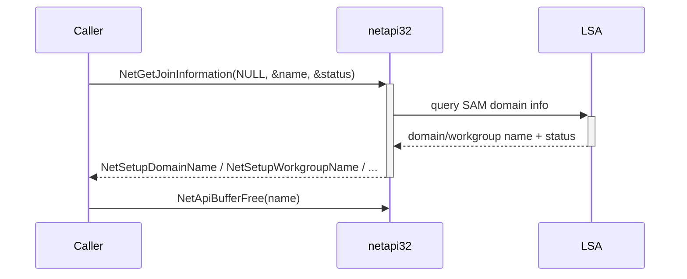

# Domain-membership fingerprint

[← win techniques](README.md) · [docs/index](../../index.md)

## TL;DR

`domain.Name()` returns the local host's NetBIOS domain or workgroup
name plus a [`JoinStatus`] enum. One `NetGetJoinInformation`
round-trip — no LDAP, no DC contact, no privilege check. Use it to
gate domain-targeted post-exploitation flows.

> [!NOTE]
> NetBIOS name only. For the FQDN, query LDAP via
> [`recon/network`](../recon/network.md) or read the
> `Domain.UserName` from a Kerberos PAC.

## Primer

Two questions a post-ex chain needs answered before lateral movement
is worth attempting:

1. Is this host part of an Active Directory domain? (Otherwise
   AD-targeted credentials and DC enumeration are dead-ends.)
2. What is the domain name to seed those queries with?

`NetGetJoinInformation` answers both in a single call to the local
LSA over RPC — no network traffic leaves the host, no admin token
required. Mirror of what `whoami /upn` and `dsregcmd /status` do.

## How it works



Implementation:

1. Call `syscall.NetGetJoinInformation` (golang.org/x/sys/windows
   wrapping `netapi32!NetGetJoinInformation`).
2. Convert the returned `*uint16` to Go string.
3. Free the netapi-owned buffer with `NetApiBufferFree`.
4. Return `(name, JoinStatus, error)`.

## API Reference

Package: `win/domain` ([pkg.go.dev](https://pkg.go.dev/github.com/oioio-space/maldev/win/domain))

### `type JoinStatus uint32`

- godoc: typed enum mirroring `NETSETUP_JOIN_STATUS`. Values map 1:1 with the netapi32 codes returned by `NetGetJoinInformation`.
- Description: usable as a switch discriminant to decide whether to walk a domain-trust chain (`StatusDomain`), enumerate workgroup-only data (`StatusWorkgroup`), or skip recon entirely (`StatusUnjoined` / `StatusUnknown`).
- Required privileges: none.
- Platform: Windows (the type still exists on the stub build with no constants populated).

### Constants

- `StatusUnknown` — `NetSetupUnknownStatus`. The netapi32 call returned a status the package doesn't know about, or the host is in an unusual state (image being prepared / first-boot).
- `StatusUnjoined` — `NetSetupUnjoined`. Standalone workstation; not in any domain or workgroup.
- `StatusWorkgroup` — `NetSetupWorkgroupName`. Member of a workgroup (the returned name is the workgroup name).
- `StatusDomain` — `NetSetupDomainName`. Member of an Active Directory domain (the returned name is the NetBIOS domain).

### `(JoinStatus).String() string`

- godoc: human-readable label for the status enum.
- Description: returns `"Unknown" / "Unjoined" / "Workgroup" / "Domain"` for the four canonical values; `"JoinStatus(<n>)"` for unknown numeric values (defensive).
- Parameters: receiver only.
- Returns: ASCII label.
- Side effects: none.
- OPSEC: pure local computation.
- Required privileges: none.
- Platform: any (the method is defined on a portable enum type).

### `Name() (string, JoinStatus, error)`

- godoc: returns the host's join name and status by calling `netapi32!NetGetJoinInformation`.
- Description: combined fingerprint of "what is this host attached to" — answers the workgroup-vs-domain question in one round-trip. Operators chain this with `win/version.Windows()` to build a cheap host-profile dossier.
- Parameters: none.
- Returns: `name` (NetBIOS domain or workgroup; empty on `StatusUnknown` / `StatusUnjoined`); `status` (one of the four `Status*` constants); `error` — surfaces only when the netapi32 call itself fails (e.g., `RPC_S_SERVER_UNAVAILABLE` on stripped-down OS images). On normal Windows hosts this never errors.
- Side effects: none (the netapi32-allocated buffer is freed internally before return). One transient RPC to the local LSA.
- OPSEC: silent. `NetGetJoinInformation` is in every default Windows binary's import path; user-mode RPC to local LSA generates no Sysmon event ID.
- Required privileges: none (the call works from any IL — even AppContainer / Low IL).
- Platform: Windows. Returns `("", StatusUnknown, ErrNotImplemented)` on the non-Windows stub build.

## Examples

### Simple — bail on workgroup

```go
name, status, err := domain.Name()
if err != nil || status != domain.StatusDomain {
    return // host is not domain-joined; abort domain-targeted ops
}
log.Printf("operating in domain %q", name)
```

### Composed — gate kerberoasting

```go
import (
    "github.com/oioio-space/maldev/win/domain"
    "github.com/oioio-space/maldev/credentials/kerberoast" // hypothetical
)

func TryKerberoast(targetSPN string) error {
    _, status, _ := domain.Name()
    if status != domain.StatusDomain {
        return errors.New("kerberoast: not domain-joined")
    }
    return kerberoast.Roast(targetSPN)
}
```

### Advanced — combine with version + sandbox gates

```go
import (
    "github.com/oioio-space/maldev/win/domain"
    "github.com/oioio-space/maldev/win/version"
    "github.com/oioio-space/maldev/recon/sandbox"
)

func ShouldExpand() bool {
    if sandbox.IsLikely() {
        return false // bail in analysis envs
    }
    if !version.AtLeast(version.WINDOWS_10_1809) {
        return false // tooling assumes 1809+ APIs
    }
    _, status, _ := domain.Name()
    return status == domain.StatusDomain
}
```

## OPSEC & Detection

| Vector | Visibility | Mitigation |
|---|---|---|
| `NetGetJoinInformation` RPC | Not logged by default | None needed |
| Process integrity | Any user can call | None |
| Network traffic | Local LSA only — no DC contact | — |

This call is invisible to Sysmon, ETW Microsoft-Windows-Security
provider, and AMSI. The detection floor is "did the implant exist"
— this primitive adds no incremental signal.

## MITRE ATT&CK

- **T1082 (System Information Discovery)** — domain-membership probe
  is a host-fingerprint primitive.
- **T1016 (System Network Configuration Discovery)** — when paired
  with [`recon/network`](../recon/network.md) for DC discovery.

## Limitations

- NetBIOS name only — for FQDN use LDAP search (`(objectClass=domain)`)
  via [`recon/network`](../recon/network.md).
- Cached at machine boot — does not reflect a join/unjoin that has
  not been followed by reboot.
- No domain-trust enumeration — single-domain answer.

## See also

- [`win/version`](version.md) — companion host fingerprint
- [`recon/sandbox`](../recon/sandbox.md) — gate on environment shape
- [`recon/network`](../recon/network.md) — LDAP / DNS expansion of the domain answer
