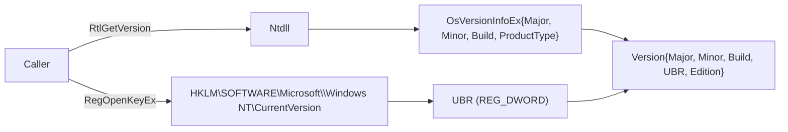

# Windows version & build probe

[← win techniques](README.md) · [docs/index](../../index.md)

## TL;DR

`version.Current()` returns the real running Windows version
including the **UBR** (Update Build Revision — the patch number
inside a build) by reading `RtlGetVersion` (kernel-side, manifest
shim free) plus `HKLM\SOFTWARE\Microsoft\Windows NT\CurrentVersion`.
Used to gate technique selection — many syscall SSN tables, UAC
shims, and kernel exploits are build-specific.

> [!IMPORTANT]
> `GetVersionEx` returns the **manifest-declared** compatibility
> target, not the real OS version. On any process without an explicit
> manifest declaring Win10+ support, `GetVersionEx` reports 6.2 (Win 8).
> Always use `version.Current()` instead.

## Primer

Windows version is more nuanced than `Major.Minor.Build`:

- **Major.Minor.Build** — kernel branch (e.g., 10.0.19045 = Win10 22H2).
- **UBR** — monthly patch level inside a build (19045.5189 = January 2025
  cumulative).
- **Edition** — Pro / Enterprise / Server. Affects feature gates
  (Server-only WTSEnumerateSessions session 0).
- **HVCI / VBS posture** — gates BYOVD: HVCI-on hosts refuse the
  vulnerable-driver block-list before driver load.

For maldev technique selection the build + UBR are usually enough.
Token-stealing techniques don't change between minor builds, but
syscall SSN tables do, and kernel exploits like CVE-2024-30088 are
gated on a UBR cut-off.

## How it works



Implementation:

1. `version.Current()` calls `RtlGetVersion` directly via
   `golang.org/x/sys/windows`. The function reads
   `KUSER_SHARED_DATA.NtProductType / NtMajorVersion / NtMinorVersion /
   NtBuildNumber` — **no manifest shim**.
2. `version.readUBR()` opens
   `HKLM\SOFTWARE\Microsoft\Windows NT\CurrentVersion` and reads the
   `UBR` REG_DWORD value.
3. `version.Windows()` returns an [`Info`] struct combining both,
   plus a human-readable `Edition` string ("Windows 10 22H2",
   "Windows Server 2022").
4. `version.AtLeast(target *Version)` is the comparison operator
   used by callers.

## API Reference

Package: `win/version` ([pkg.go.dev](https://pkg.go.dev/github.com/oioio-space/maldev/win/version))

### `type Version windows.OsVersionInfoEx`

- godoc: thin alias over `golang.org/x/sys/windows.OsVersionInfoEx` — the OSVERSIONINFOEXW that `RtlGetVersion` fills in.
- Description: zero-value usable; the package's pre-defined `WINDOWS_*` constants are typed `*Version` literals callers compare against. Use `Current()` to fetch the running host's value.
- Required privileges: none.
- Platform: Windows.

### `Current() *Version`

- godoc: snapshot of the running host's OSVERSIONINFOEXW.
- Description: calls `RtlGetVersion` (ntdll) — the spoof-resistant reading that bypasses the manifested-compatibility lies returned by `kernel32!GetVersionEx`. Result is computed once per process and cached internally.
- Parameters: none.
- Returns: never nil. On impossibly old kernels (where `RtlGetVersion` is unavailable) falls back to a zero `Version{}`.
- Side effects: one syscall on the first call; subsequent calls are pure cache reads.
- OPSEC: silent. `RtlGetVersion` is in every binary's startup import resolution (compatibility layer), so the call doesn't stand out.
- Required privileges: none.
- Platform: Windows. Stub build returns nil.

### `(*Version).String() string`

- godoc: human-readable rendering — e.g. `"Windows 10 19045"`.
- Description: synthesises a label from `Major.Minor.Build` and the workstation/server flag. Uses the package's known-version table for friendly names; falls back to numeric on unknown builds.
- Parameters: receiver.
- Returns: ASCII string suitable for logs and debug prints.
- Side effects: none.
- OPSEC: pure formatting.
- Required privileges: none.
- Platform: Windows.

### `(*Version).IsWorkStation() bool`

- godoc: reports whether the host is a workstation SKU (vs. server).
- Description: tests `WProductType == VER_NT_WORKSTATION`. Useful gating for techniques that only make sense on a desktop OS (UAC bypasses, user-targeted phishing).
- Parameters: receiver.
- Returns: `true` for workstation SKUs (Win 7/8/10/11), `false` for server SKUs.
- Side effects: none.
- OPSEC: pure local read.
- Required privileges: none.
- Platform: Windows.

### `(*Version).IsLower(v *Version) bool`

- godoc: strict less-than comparison on `Major.Minor.Build.Revision` (UBR-aware).
- Description: returns true if the receiver's build tuple sorts strictly before `v`. Use for "skip technique on hosts older than X".
- Parameters: `v` — target to compare against. nil is undefined.
- Returns: bool.
- Side effects: none.
- OPSEC: pure comparison.
- Required privileges: none.
- Platform: Windows.

### `(*Version).IsEqual(v *Version) bool`

- godoc: equality on `Major.Minor.Build.Revision`.
- Description: matches exact build tuples. Most callers want `IsAtLeast` instead — equality breaks on every monthly patch.
- Parameters: `v`.
- Returns: bool.
- Side effects: none.
- OPSEC: pure comparison.
- Required privileges: none.
- Platform: Windows.

### `(*Version).IsAtLeast(v *Version) bool`

- godoc: `>=` comparison on `Major.Minor.Build.Revision`.
- Description: the canonical version-gate primitive. UBR-aware, so a 22H2-with-November-2023-patches host correctly compares above one with September-2023 patches.
- Parameters: `v` — minimum required.
- Returns: bool.
- Side effects: none.
- OPSEC: pure comparison.
- Required privileges: none.
- Platform: Windows.

### `AtLeast(v *Version) bool`

- godoc: package-level convenience — `Current().IsAtLeast(v)` minus the UBR field.
- Description: compares `Major.Minor.Build` only (UBR not consulted). Use the receiver-typed `IsAtLeast` for UBR-aware comparison, or call `Windows()` to get the full tuple.
- Parameters: `v` — minimum required version.
- Returns: bool.
- Side effects: lazy-init of the cached `Current()` reading on first call.
- OPSEC: silent.
- Required privileges: none.
- Platform: Windows.

### `type Info struct`

- godoc: rich-format snapshot used by version-gating helpers and CVE checkers.
- Description: fields:
  - `Major`, `Minor`, `Build` — the standard tuple.
  - `Revision` — UBR (Update Build Revision), the monthly-patch counter inside a build. Read from `HKLM\SOFTWARE\Microsoft\Windows NT\CurrentVersion\UBR`.
  - `Vulnerable` — populated by CVE checkers (e.g. `CVE202430088`); true when the host is in the vulnerability window.
  - `Edition` — friendly name (e.g. `"Windows 10 22H2"`); set by CVE checkers from their lookup table.
- Required privileges: none for population by `Windows()`.
- Platform: Windows.

### `Windows() (*Info, error)`

- godoc: full host fingerprint — `Major.Minor.Build.UBR` + workstation/server flag.
- Description: combines `Current()` (for the version triple) with a registry read for UBR. The result is suitable for logs, telemetry, and CVE gating.
- Parameters: none.
- Returns: `*Info` populated with the four-field tuple. `error` on registry read failure (very rare; UBR has been present since Win10 1507).
- Side effects: one registry read per call (no caching at the `Windows()` layer; if you call it in a tight loop, cache the result yourself).
- OPSEC: silent. Registry reads from `HKLM\SOFTWARE\Microsoft\Windows NT\CurrentVersion` are made by every shell process at logon — the access doesn't stand out.
- Required privileges: none. Reading UBR works from any IL.
- Platform: Windows.

### `CVE202430088() (*Info, error)`

- godoc: returns an `*Info` with `Vulnerable=true` when the running build is in the CVE-2024-30088 window.
- Description: window covers Win10 1507–22H2, Win11 21H2–23H2, Server 2016/2019/2022/2022 23H2 prior to the June 2024 patch tuesday. Used by `privesc/cve202430088` as a pre-flight gate before attempting exploitation.
- Parameters: none.
- Returns: `*Info` with `Vulnerable` and `Edition` populated. `error` only on registry-read failure for UBR.
- Side effects: same as `Windows()` (one registry read).
- OPSEC: silent.
- Required privileges: none.
- Platform: Windows.

### Constants

The package ships a curated table of pinned version targets — usable as the `*Version` argument to `IsLower` / `IsEqual` / `IsAtLeast` / `AtLeast`. Coverage spans the supported Windows lineage:

- Client (workstation): `WINDOWS_7`, `WINDOWS_8`, `WINDOWS_8_1`, `WINDOWS_10_1507` … `WINDOWS_10_22H2`, `WINDOWS_11_21H2` … `WINDOWS_11_24H2`.
- Server: `WINDOWS_SERVER_2008` (and 2008 R2), `WINDOWS_SERVER_2012` (and 2012 R2), `WINDOWS_SERVER_2016`, `WINDOWS_SERVER_2019`, `WINDOWS_SERVER_2022`, `WINDOWS_SERVER_2022_23H2`.

See the package source for the exhaustive list and the exact `Major.Minor.Build` triples each constant pins.

## Examples

### Simple — gate on Win10 1809+

```go
v := version.Current()
if !version.AtLeast(version.WINDOWS_10_1809) {
    return errors.New("technique requires Win10 1809 or later")
}
log.Printf("running on %s build %d.%d", v, v.BuildNumber, /* ubr */ 0)
```

### Composed — UBR-aware patch gate

```go
info, err := version.Windows()
if err != nil {
    return err
}
const minPatchUBR = 5189 // 22H2 January 2025 CU
if info.Build == 19045 && info.Revision < minPatchUBR {
    log.Println("host below required patch level")
}
```

### Advanced — pre-flight a kernel exploit

```go
info, err := version.CVE202430088()
if err != nil {
    return err
}
if !info.Vulnerable {
    return errors.New("host patched")
}
log.Printf("vulnerable: %s build %d.%d", info.Edition, info.Build, info.Revision)
return cve202430088.Run(ctx)
```

## OPSEC & Detection

| Vector | Visibility | Mitigation |
|---|---|---|
| `RtlGetVersion` ntdll call | Not logged | None needed |
| Registry read of CurrentVersion | Not logged at default audit | None |
| Process behaviour | Identical to `winver.exe` | — |

`RtlGetVersion` and the CurrentVersion registry key are read by
practically every Windows program at startup. No incremental signal.

## MITRE ATT&CK

- **T1082 (System Information Discovery)**

## Limitations

- Edition string is hard-coded against a known build → SKU table.
  New SKUs (e.g., Server vNext) appear as "unknown" until the table
  is bumped.
- UBR read requires HKLM read access — rare to be denied in
  user-mode, but possible on hardened OOBE images.
- No HVCI / VBS detection — call
  [`recon/sandbox`](../recon/sandbox.md) helpers if VBS posture
  matters for technique selection.

## See also

- [`win/domain`](domain.md) — companion host fingerprint
- [`win/syscall`](../syscalls/direct-indirect.md) — build-gated SSN tables
- [`privesc/cve202430088`](../privesc/cve202430088.md) — version-gated kernel exploit
